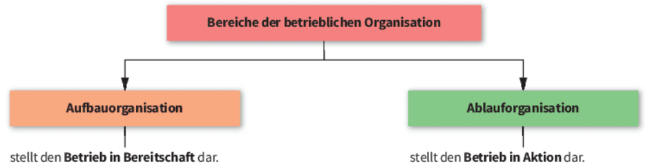
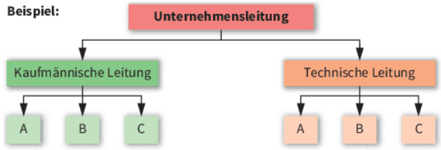
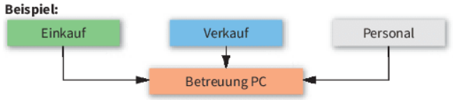
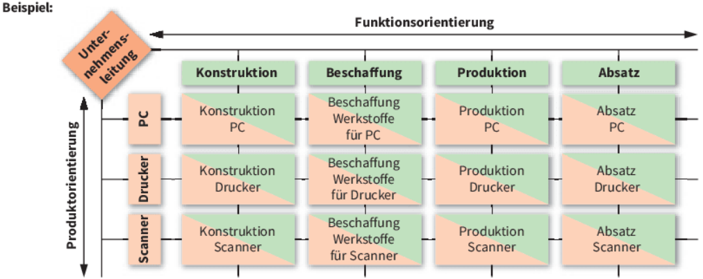
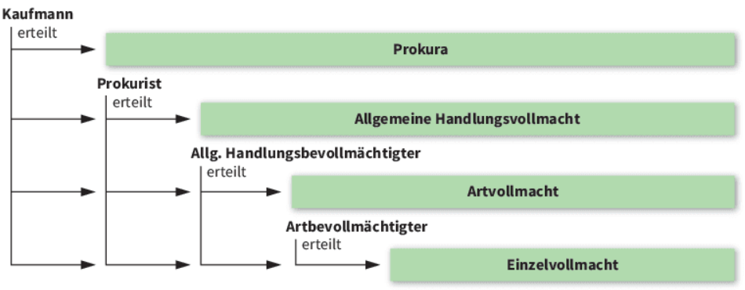

# LF1.2.3- Aufbauorganisation und betriebliche Hierarchien

**Als** Mitarbeiter

**möchte ich** die Aufbauorganisation und die Hierarchiestruktur meines Betriebs verstehen,

**damit** ich weiß, wer für welche Aufgaben zuständig ist, wie die Weisungswege verlaufen und wo meine eigene Position im Unternehmen verortet ist.

# Celebration Criteria

- Wir können den Unterschied zwischen Aufbau- und Ablauforganisation erklären.  
- Wir können die Elemente eines Organigramms (Stelle, Abteilung, Instanz) identifizieren und interpretieren.  
- Wir können die grundlegenden Merkmale eines Einlinien- und eines Matrixsystems beschreiben.  
- Wir können die Unterschiede zwischen Prokura und Handlungsvollmacht erklären und deren jeweilige Befugnisse auf Fallbeispiele anwenden.

 

# Wissens-Briefing

## Aufbau- vs. Ablauforganisation

Die Organisation eines Unternehmens lässt sich in zwei grundlegende Bereiche gliedern :  

- **Aufbauorganisation:** Sie beschreibt die **statische Struktur** des Unternehmens. Sie legt fest, wie das Unternehmen in organisatorische Einheiten (z.B. Abteilungen) gegliedert ist und regelt die Aufgaben, Kompetenzen und Verantwortlichkeiten. Sie beantwortet die Frage: "Wer ist wer und wer ist wem unterstellt?". Das klassische Werkzeug zur Darstellung ist das Organigramm.
- **Ablauforganisation:** Sie beschreibt die **dynamischen Prozesse** im Unternehmen. Sie regelt die zeitliche und räumliche Abfolge von Arbeitsschritten. Sie beantwortet die Frage: "Wer macht was, wann, wo und womit?". Werkzeuge hierfür sind z.B. Flussdiagramme oder Prozessmodelle (siehe Story LF1.2.3).

## Elemente der Aufbauorganisation

Die Aufbauorganisation besteht aus mehreren Bausteinen :  

- **Stelle:** Die kleinste organisatorische Einheit, die einen bestimmten Aufgabenkomplex umfasst. Sie wird in der Regel von einer Person besetzt.
- **Instanz:** Eine Stelle mit Leitungs- und Weisungsbefugnis gegenüber anderen Stellen.
- **Abteilung:** Die Zusammenfassung mehrerer Stellen unter der Leitung einer Instanz.
- **Stabstelle:** Eine beratende und unterstützende Stelle, die einer Instanz zugeordnet ist, aber keine Weisungsbefugnis gegenüber den Linienabteilungen hat (z.B. Rechtsabteilung, IT-Sicherheitsbeauftragter).

## Visualisierung durch Organigramme

Ein **Organigramm** ist die grafische Darstellung der Aufbauorganisation. Es zeigt die Hierarchieebenen, die Abteilungen und die formalen Weisungs- und Kommunikationswege. Je nach Struktur unterscheidet man verschiedene Leitungssysteme :  

- **Einliniensystem:** Jede Stelle erhält nur von einer einzigen, direkt übergeordneten Instanz Anweisungen. Dies schafft klare Zuständigkeiten und vermeidet Kompetenzkonflikte, kann aber zu langen Dienstwegen und einer Überlastung der Führungskräfte führen.
- **Mehrliniensystem:** Stellen können von mehreren übergeordneten Instanzen Anweisungen erhalten (z.B. nach dem Funktionsmeisterprinzip). Dies ermöglicht eine hohe Spezialisierung der Führung, birgt aber die Gefahr von Kompetenzüberschneidungen und widersprüchlichen Anweisungen.
- **Matrixorganisation:** Eine moderne Form des Mehrliniensystems, die oft im Projektmanagement eingesetzt wird. Mitarbeiter sind sowohl einer fachlichen Abteilung (z.B. Softwareentwicklung) als auch einem Projektleiter unterstellt. Dies fördert die interdisziplinäre Zusammenarbeit, erfordert aber eine hohe Kommunikations- und Kooperationsbereitschaft.

## Führungsstile und Managementkonzepte

Die Art und Weise, wie Instanzen ihre Leitungsfunktion ausüben, wird als Führungsstil bezeichnet. Man unterscheidet grob zwischen **autoritären Stilen** (Entscheidung liegt allein bei der Führungskraft) und **kooperativen/demokratischen Stilen** (Mitarbeiter werden in Entscheidungsprozesse einbezogen). Moderne Unternehmen, insbesondere in der kreativen IT-Branche, setzen vermehrt auf kooperative Ansätze, um die Motivation und das Innovationspotenzial der Mitarbeiter zu nutzen. Dazu passen **"Management by..."-Konzepte**, wie z.B. **Management by Objectives (MbO)**, bei dem Führungskraft und Mitarbeiter gemeinsam Ziele vereinbaren und der Mitarbeiter den Weg zur Zielerreichung weitgehend selbst gestalten kann.  

## Vertretungsmacht: Prokura und Handlungsvollmacht

In im Handelsregister eingetragenen Unternehmen können Mitarbeitern besondere Vertretungsvollmachten erteilt werden, die ihnen erlauben, im Namen des Unternehmens rechtsverbindliche Geschäfte abzuschließen. Die wichtigsten Formen sind die Prokura und die Handlungsvollmacht, die sich in Umfang und Erteilung stark unterscheiden.

- **Prokura (§§ 48-53 HGB):** Dies ist die weitreichendste handelsrechtliche Vollmacht. Sie ermächtigt zu allen Arten von gerichtlichen und außergerichtlichen Geschäften, die der Betrieb irgendeines Handelsgewerbes mit sich bringt. Sie muss vom Inhaber oder Geschäftsführer ausdrücklich erteilt und ins Handelsregister eingetragen werden. Prokuristen zeichnen mit dem Zusatz "ppa." (per procura). Bestimmte Grundlagengeschäfte (z.B. Verkauf des Unternehmens, Erteilung weiterer Prokuren) sind jedoch ausgeschlossen.  
- **Handlungsvollmacht (§§ 54-58 HGB):** Diese ist weniger umfassend als die Prokura und wird nicht ins Handelsregister eingetragen. Sie kann formlos (auch mündlich) erteilt werden und bezieht sich nur auf Geschäfte, die ein _bestimmtes_ Handelsgewerbe _gewöhnlich_ mit sich bringt. Man unterscheidet drei Arten:
    1.  **Einzelvollmacht:** Berechtigt zur Vornahme eines einzelnen, bestimmten Geschäfts (Zeichnung: "i. A." - im Auftrag).
    2.  **Artvollmacht:** Berechtigt zur Vornahme einer bestimmten Art von Geschäften (z.B. Einkauf, Kassenführung) (Zeichnung: "i. V." - in Vollmacht).
    3.  **Allgemeine Handlungsvollmacht:** Berechtigt zu allen gewöhnlichen Geschäften des betreffenden Handelsgewerbes (Zeichnung: "i. V.").

| Merkmal | Prokura | Handlungsvollmacht |
| --- | --- | --- |
| Umfang | Alle gewöhnlichen **und außergewöhnlichen** Geschäfte | Nur **gewöhnliche** Geschäfte des jeweiligen Gewerbes |
| Erteilung | Nur durch Inhaber/Geschäftsführer, ausdrücklich | Formlos (mündlich, schriftlich, durch Duldung) |
| Handelsregister | **Eintragungspflicht** | Keine Eintragung |
| Beschränkbarkeit | Im Außenverhältnis (gegenüber Dritten) **nicht** beschränkbar | Im Außenverhältnis beschränkbar, wenn dem Dritten bekannt |
| Besondere Befugnisse | Verkauf von Grundstücken, Aufnahme von Darlehen nur mit **besonderer Ermächtigung** | Verkauf von Grundstücken, Aufnahme von Darlehen **nicht erlaubt** |
| Zeichnung | **ppa.** (per procura) | **i. V.** (in Vollmacht) oder **i. A.** (im Auftrag) |

# Aufgaben

1.  **Organigramm-Analyse (Gruppe):** Suchen Sie online nach einem Organigramm eines großen, bekannten Unternehmens (z.B. Volkswagen AG, Deutsche Telekom). Analysieren Sie die Struktur: Ist sie nach Funktionen (Einkauf, Produktion...) oder Produkten (PKW, LKW...) gegliedert? Identifizieren Sie eine mögliche Stabstelle.  
    
2.  **Mein Platz im Unternehmen (Einzeln):** Skizzieren Sie ein einfaches Organigramm für Ihren eigenen Ausbildungsbetrieb oder zumindest für Ihre Abteilung und die angrenzenden Bereiche. Zeichnen Sie Ihre eigene Position ein und verorten Sie Ihren direkten Vorgesetzten.  
     [Skizze - Philipp](https://affine.ideenschmiede.hamburg/workspace/4def35ef-4587-45fc-bfd4-73b2ac3b4e32/PvWtOmLG4VbEdnUON_UT7?mode=edgeless&elementIds=xhXmGCfTqk)  
     
3.  **Fallbeispiele zur Vollmacht (Paare):** Entscheiden und begründen Sie, welche Vollmacht (Prokura, Handlungsvollmacht oder keine) für die folgenden Aktionen nötig ist:
    - Ein Abteilungsleiter kauft Büromaterial für 200 €. → _Keine notwendig_
    - Die Leiterin der Personalabteilung stellt einen neuen Entwickler ein. → _(Allgemeine oder Art) Handlungsvollmacht_
    - Ein Vertriebsmitarbeiter nimmt im Namen der Firma einen Kredit über 500.000 € auf. → _Prokura_ oder Inhaber/Geschäftsführer

# Quellen & Vertiefung

- Rheinwerk: IT-Handbuch für Fachinformatiker\*innen, S. 839
- https://de.wikipedia.org/wiki/Organigramm
- https://de.wikipedia.org/wiki/Prokura
- https://de.wikipedia.org/wiki/Handlungsvollmacht