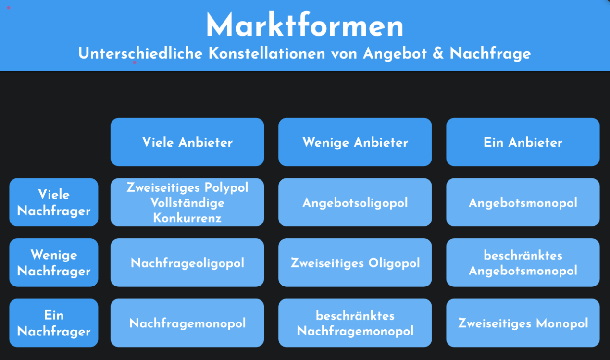

# LF1.2.5- Das Unternehmen im Marktumfeld

Als strategisch denkende/r Mitarbeiter/in

möchte ich das wirtschaftliche Umfeld meines Unternehmens verstehen,

damit ich Entscheidungen und Herausforderungen im Kontext von Wettbewerb und Konjunktur einordnen kann.

# Celebration Criteria

- Wir können die Marktform (Monopol, Oligopol, Polypol), in der unser Unternehmen agiert, bestimmen und begründen.
- Wir können die Begriffe "Lieferant" und "Kunde" definieren und für unser Unternehmen jeweils zwei Beispiele nennen.
- Wir können die vier Phasen eines Konjunkturzyklus benennen und deren potenzielle Auswirkungen auf ein IT-Unternehmen beschreiben.

# Wissens-Briefing

## Marktformen

Kein Unternehmen agiert im luftleeren Raum. Es ist Teil eines **Marktes** und wird von verschiedenen externen Akteuren und Kräften beeinflusst. Die **Marktform** beschreibt die Anzahl der Anbieter und Nachfrager und bestimmt so die Intensität des Wettbewerbs:

- **Monopol:** Ein Anbieter, viele Nachfrager (z.B. früher die Deutsche Post für Briefe). Der Anbieter hat eine hohe Marktmacht.
- **Oligopol:** Wenige Anbieter, viele Nachfrager. Dies ist in vielen Branchen der Fall (z.B. Mobilfunkanbieter, Mineralölkonzerne). Es herrscht ein intensiver Wettbewerb.
- **Polypol:** Viele Anbieter, viele Nachfrager (z.B. Gastronomie, Handwerker). Der Wettbewerb ist sehr hoch, die Marktmacht des Einzelnen gering.

Die wichtigsten Partner eines Unternehmens auf dem Markt sind:

- **Lieferanten:** Stellen die für die eigene Leistungserstellung notwendigen Ressourcen, Vorprodukte oder Dienstleistungen bereit (z.B. Hardware-Hersteller, Software-Anbieter, Stromversorger).
- **Kunden:** Kaufen und nutzen die Produkte oder Dienstleistungen des Unternehmens. Sie können Privatpersonen (B2C - Business-to-Consumer) oder andere Unternehmen (B2B - Business-to-Business) sein.

## Konjunkturphasen

Die gesamtwirtschaftliche Lage, die **Konjunktur**, beeinflusst ebenfalls alle Unternehmen. Sie verläuft in Zyklen mit vier Phasen:

1.  **Aufschwung (Expansion):** Steigende Nachfrage, Investitionen und Beschäftigung. Positive Stimmung.
2.  **Hochkonjunktur (Boom):** Voll ausgelastete Kapazitäten, hohe Nachfrage, steigende Preise und Löhne. Gefahr der Überhitzung.
3.  **Abschwung (Rezession):** Sinkende Nachfrage, abnehmende Investitionen, Kurzarbeit und Entlassungen. Pessimistische Stimmung.
4.  **Tiefphase (Depression):** Geringe Produktion, hohe Arbeitslosigkeit.

IT-Dienstleister sind oft konjunkturabhängig: Im Aufschwung investieren Firmen in neue IT-Projekte, im Abschwung werden Budgets gekürzt.  

# Aufgaben

1.  **Marktanalyse (Gruppe):** Analysieren Sie den Markt, auf dem Ihr Ausbildungsbetrieb tätig ist. Bestimmen Sie die Marktform (Polypol, Oligopol) und begründen Sie Ihre Entscheidung. Recherchieren Sie zwei direkte Wettbewerber, zwei wichtige Lieferanten (z.B. für Hardware/Software) und zwei typische Kunden. Visualisieren Sie dieses Marktumfeld auf einem [**Whiteboard.**](https://affine.ideenschmiede.hamburg/workspace/4def35ef-4587-45fc-bfd4-73b2ac3b4e32/jugObRvRrzpjBp9iAFznp?mode=edgeless&blockIds=3rGTRqOpud) **← Link**  
     **Dualis Institut GmbH**  
     \- **Marktform**: Nachfrageoligopol  
    \- **Wettbewerber**: Private Akademien/ Institute  
    \- **Lieferanten**: Hardware & Software Anbieter (Microsoft), Lernmittel Verlage  
    \- **Typische Kunden**: Agentur Für Arbeit, Unternehmen, Einzelpersonen
2.  **Konjunktur-Szenarien (Paare):** Diskutieren Sie die Auswirkungen der Konjunkturphasen "Boom" und "Rezession" auf die "Innovatec Solutions GmbH". Welche Abteilung wäre jeweils am stärksten betroffen? Welche Maßnahmen könnte die Geschäftsführung ergreifen?
    - _Szenario Boom:_ Viele neue Projektanfragen, aber Fachkräftemangel.
        - Personalabteilung: Schwierigkeiten entsprechendes Personal zu finden
        - Mögliche allgemeine Überlastung  
            _Maßnahmen:_
        - Löhne erhöhen und Anreize schaffen
        - Arbeitsprozessoptimierung  
            
    - _Szenario Rezession:_ Kunden kündigen Wartungsverträge und stoppen Projekte.
        - Sorgenvolle Stimmung
        - Arbeitsstellen nicht mehr sicher
        - Investitionspotenziale sinken  
            _Maßnahmen:_
        - Alternativen suchen/Horizont erweitern
        - Smarte Investitionen  
             
3.  **Kunden-ABC (Einzeln):** Fragen Sie (falls möglich) Ihren Ausbilder oder überlegen Sie selbst: Welche Kunden sind für Ihr Unternehmen am wichtigsten (A-Kunden), welche sind "normal" (B-Kunden) und welche sind eher klein (C-Kunden)? Ordnen Sie die in Aufgabe 1 recherchierten Kunden in dieses Schema ein.  
     **A-Kunden:** Einzelpersonen (Auszubildende → ohne Nachfrage vermutlich keine Aufträge/Bewilligung)  
    **B-Kunden:** Arbeitsagenturen (Finanzierung der Umschulungen → Geldgeber)**C-Kunden:** Keine; u.U. kleinere Vermittlungsagenturen oder Personen, die privat finanzieren  
    

# Quellen & Vertiefung

- Rheinwerk: IT-Handbuch für Fachinformatiker\*innen, S. 841-842
- https://de.wikipedia.org/wiki/Marktform
- https://de.wikipedia.org/wiki/Konjunktur