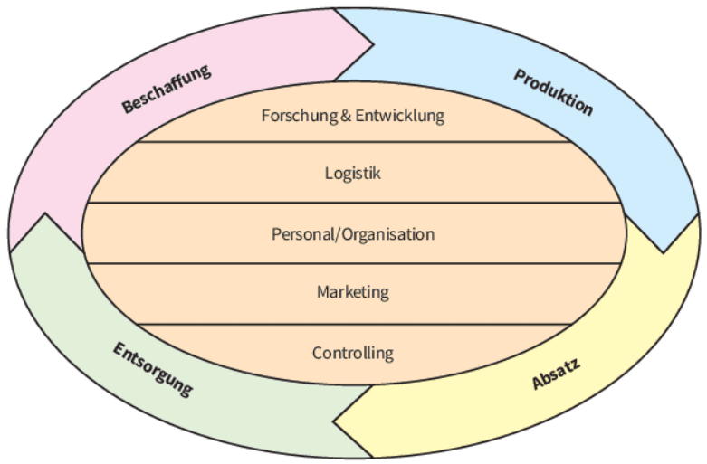
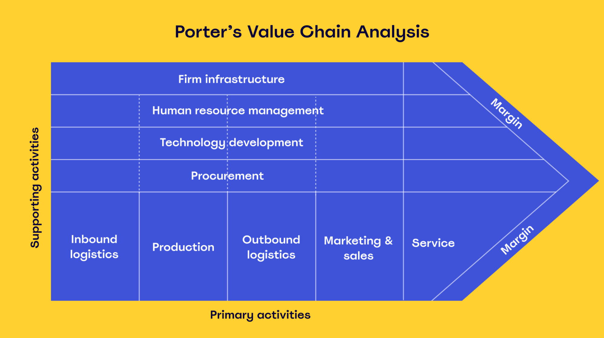

# LF1.3.1- Die Wertschöpfungskette als strategisches Werkzeug

**Als** Strategieberater

**möchte ich** das Konzept der Wertschöpfungskette nach Porter verstehen und anwenden,

**damit** ich die internen Prozesse eines Unternehmens analysieren und Quellen für Kosten- oder Differenzierungsvorteile aufdecken kann.

# Celebration Criteria

- Wir können die primären und sekundären Aktivitäten der Wertschöpfungskette korrekt identifizieren und voneinander abgrenzen.
- Wir können die Wertschöpfungskette eines Unternehmens (am Beispiel UrbanVolt) visualisieren und analysieren.
- Wir können konkrete Ansatzpunkte zur Effizienzsteigerung und zur Schaffung von Wettbewerbsvorteilen entlang der Wertschöpfungskette ableiten.

# Wissens-Briefing

## Grundlagen der unternehmerischen Wertschöpfung

Unternehmerische Wertschöpfung ist ein zentraler Indikator für die wirtschaftliche Leistungsfähigkeit eines Unternehmens. Sie lässt sich definieren als die Differenz zwischen der vom Unternehmen erbrachten Gesamtleistung (z.B. Umsatzerlöse) und den von externen Dritten bezogenen Vorleistungen (z.B. Material, externe Dienstleistungen). Während dieser traditionelle Blick die Wertschöpfung als reines Ergebnis betrachtet, revolutionierte der Ökonom **Michael E. Porter** die strategische Analyse, indem er den Fokus von der reinen Wertschöpfungssumme auf die **_gesamte Kette der wertschaffenden Aktivitäten_** verlagerte. Sein Ansatz gliedert ein Unternehmen in strategisch relevante Tätigkeiten auf, um zu verstehen, **_wie_ und _wo_ der Wert für den Kunden geschaffen** wird. Das Ziel ist es, ein marktfähiges Produkt mit einem Mehrwert zu schaffen, für den der Kunde bereit ist zu zahlen, und dadurch eine erhöhte Gewinnmarge zu realisieren.

## Das Modell der Wertschöpfungskette (Value Chain) nach Michael E. Porter

Die Wertschöpfungskette, auch als Value Chain bekannt, ist ein Managementkonzept, das alle betrieblichen Prozesse von der Beschaffung der Rohstoffe über die Produktion bis hin zum Vertrieb und Kundenservice grafisch darstellt und analysierbar macht. Sie dient dazu, die Quellen von Wettbewerbsvorteilen zu identifizieren. Ein Unternehmen kann einen Wettbewerbsvorteil auf zwei Wegen erzielen: Entweder führt es seine Wertaktivitäten kostengünstiger aus als die Konkurrenz (**Kostenführerschaft**) oder es führt sie auf eine einzigartige Weise aus, die einen höheren Wert für den Kunden schafft und höhere Preise rechtfertigt (**Differenzierung**).

Das Modell unterteilt die Unternehmensaktivitäten in zwei Hauptkategorien: primäre und unterstützende Aktivitäten.  

### Primäraktivitäten (Primary Activities)

Primäraktivitäten sind jene Tätigkeiten, die einen **direkten Beitrag** zur physischen Erstellung, zum Verkauf, zur Auslieferung und zum Service des Produkts leisten. Sie bilden den Kern des Wertschöpfungsprozesses.

- **Eingangslogistik (Inbound Logistics):** Umfasst alle Aktivitäten, die mit dem Empfang, der Lagerung und der internen Verteilung von Inputs verbunden sind. Für die UrbanVolt GmbH wären dies beispielsweise die Annahme und Qualitätsprüfung von Fahrradrahmen aus Asien, die Lagerung von Batterien und Antriebssystemen von Zulieferern wie Bosch oder Shimano sowie die Verwaltung des Materialbestands.  
- **Operationen/Produktion (Operations):** Bezeichnet die Umwandlung der Inputs in das fertige Endprodukt. Bei UrbanVolt umfasst dies die Montage der E-Bikes, die Lackierung, die Installation der Elektronik und die finale Qualitätskontrolle jedes einzelnen Fahrrads.  
- **Ausgangslogistik (Outbound Logistics):** Beinhaltet Aktivitäten, die das fertige Produkt zum Kunden bringen. Dazu gehören die Verpackung der E-Bikes, die Lagerung im Fertigwarenlager und die Distribution an das Händlernetzwerk oder direkt an Endkunden über den Online-Shop.  
- **Marketing & Vertrieb (Marketing & Sales):** Umfasst alle Maßnahmen, die Kunden dazu bewegen, das Produkt zu kaufen. Für UrbanVolt sind dies der Aufbau einer starken, nachhaltigkeitsorientierten Marke, Online-Marketing-Kampagnen, die Pflege der Beziehungen zum Fachhandel und die Preisgestaltung. Effektives Marketing kann die Zahlungsbereitschaft der Kunden erheblich steigern. Ein T-Shirt einer bekannten Sportmarke erzielt oft einen deutlich höheren Preis als ein qualitativ identisches No-Name-Produkt, allein aufgrund des Markenwerts.  
- **Kundenservice (Service):** Beinhaltet alle Aktivitäten, die den Wert des Produkts nach dem Kauf erhalten oder steigern. Beispiele hierfür sind Garantieleistungen, ein Reparaturservice über zertifizierte Partnerwerkstätten, die Bereitstellung von Ersatzteilen und eine Kunden-Hotline für technische Fragen.

 

### Unterstützende Aktivitäten (Support Activities)

Diese Aktivitäten unterstützen die primären Aktivitäten und ermöglichen deren Durchführung. Sie schaffen nicht direkt Wert für den Endkunden, sind aber für die Effizienz und Effektivität des Gesamtprozesses unerlässlich.  

- **Unternehmensinfrastruktur (Firm Infrastructure):** Umfasst Funktionen wie allgemeines Management, strategische Planung, Finanz- und Rechnungswesen, Rechtsabteilung und Qualitätsmanagement. Eine effektive Führung und Planung ist das Rückgrat des gesamten Unternehmens.  
- **Personalwirtschaft (Human Resource Management):** Beinhaltet die Rekrutierung, Einstellung, Schulung, Entwicklung und Vergütung aller Mitarbeiter. Hochqualifizierte und motivierte Ingenieure und Monteure sind für UrbanVolt ein entscheidender Erfolgsfaktor.  
- **Technologieentwicklung (Technology Development):** Bezieht sich auf Forschung und Entwicklung (F&E), Produktdesign und Prozessoptimierung. Bei UrbanVolt wäre dies die Entwicklung leichterer Rahmen, die Integration smarter Technologien (z.B. GPS-Tracking) oder die Verbesserung der Effizienz der Antriebssysteme.  
- **Beschaffung (Procurement):** Dies ist die Funktion des Einkaufs der in der Wertschöpfungskette verwendeten Inputs, nicht die Inputs selbst. Es umfasst die Auswahl von Lieferanten, die Verhandlung von Verträgen und den Einkauf von Rohstoffen, Maschinen und Büroausstattung.

 

## Anwendung und strategische Implikationen

Die Analyse der Wertschöpfungskette hilft, Schwachstellen und Kostentreiber zu identifizieren und Optimierungspotenziale aufzudecken. Beispielsweise könnte eine Analyse bei UrbanVolt ergeben, dass die Lagerkosten in der Eingangslogistik zu hoch sind, was zu einer Umstellung auf ein Just-in-Time-Liefersystem führen könnte.  

Darüber hinaus ist die Wertschöpfungskette nicht nur ein Instrument zur internen Analyse, sondern auch ein mächtiges Werkzeug zur Gestaltung des gesamten Geschäftsmodells. Die strategische Frage lautet nicht mehr nur: "Wie können wir jede Aktivität optimieren?", sondern vielmehr: "Welche Aktivitäten _müssen_ wir selbst durchführen, um unseren einzigartigen Wert zu schaffen, und welche können Partner besser, schneller oder günstiger erledigen?". Erfolgreiche Unternehmen wie Red Bull (Fokus auf Marketing & Vertrieb), Flixbus (Fokus auf Plattform & Marke) oder Airbnb (reine Vermittlung) zeigen, dass strategisches Outsourcing von nicht-wertschaffenden Kernaktivitäten ein Schlüssel zum Erfolg sein kann. Die Analyse der Wertschöpfungskette liefert somit die entscheidende Grundlage für die strategische Entscheidung, welche Teile des Geschäftsmodells intern abgebildet und welche an Schlüsselpartner ausgelagert werden.    

# Aufgaben

1.  **Visualisierung:** Erstellen Sie in einem Kollaborationstool (z.B. Miro, Mural) eine detaillierte Wertschöpfungskette für die "UrbanVolt GmbH". Identifizieren und platzieren Sie mindestens 10-15 spezifische Tätigkeiten des Unternehmens innerhalb der primären und unterstützenden Aktivitäten.
2.  **Analyse der Kernkompetenzen:** Diskutieren Sie in der Gruppe: Welche Aktivitäten in der von Ihnen erstellten Wertschöpfungskette sind die wahrscheinlichsten Quellen für den bisherigen Erfolg und den Wettbewerbsvorteil von UrbanVolt (z.B. Technologieentwicklung, Markenaufbau im Marketing)? Begründen Sie Ihre Auswahl.
3.  **Optimierungspotenziale:** Identifizieren Sie drei Aktivitäten in der Wertschöpfungskette, die potenzielle Schwachstellen oder hohe Kosten verursachen könnten. Entwickeln Sie für jede dieser Aktivitäten einen konkreten Vorschlag zur Optimierung oder zur Kostensenkung. Präsentieren Sie Ihre Ergebnisse in einer kurzen Pitch-Präsentation (max. 5 Minuten).

# Quellen & Vertiefung

- https://www.ifm-bonn.org/fileadmin/data/redaktion/publikationen/ifm_materialien/dokumente/IfM-Materialien-252_2016.pdf
- https://de.scribd.com/doc/14675705/wertschopfungskette
- https://www.marketinginstitut.biz/blog/wertschoepfungskette/
- https://bsh-ag.de/it-wissensdatenbank/wertschoepfungskette/
- https://gruenderplattform.de/unternehmen-gruenden/wertschoepfungskette
- https://www.zendesk.de/blog/value-chain-analysis/
- https://www.ibm.com/de-de/think/topics/value-chain-analysis
- https://www.zendesk.de/blog/value-chain/
- https://www.slideteam.net/blog/die-10-besten-vorlagen-zur-wertschopfungskettenanalyse-mit-beispielen-und-mustern?lang=German