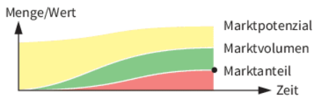

# LF1.3.2- Analyse des Marktumfelds und der Wettbewerbskräfte

**Als** Strategieberater

**möchte ich** die Instrumente PESTEL, Porter's Five Forces und SWOT-Analyse verstehen,

**damit** ich das externe Umfeld eines Unternehmens systematisch analysieren und dessen strategische Positionierung bewerten kann.

# Celebration Criteria

- Wir können die Unterschiede und das Zusammenspiel von PESTEL-, Five Forces- und SWOT-Analyse erklären.
- Wir können für das Szenario der "UrbanVolt GmbH" eine PESTEL-Analyse und eine Five Forces-Analyse durchführen.
- Wir können die Ergebnisse der externen Analysen in die Chancen und Risiken einer SWOT-Matrix für UrbanVolt überführen.

# Wissens-Briefing

## Die Notwendigkeit der Marktanalyse

Eine systematische Marktanalyse ist die Grundlage für jede fundierte strategische Entscheidung. Sie hilft Unternehmen, Markttrends, Kundenpräferenzen, Wettbewerbsdynamiken und das weitere Umfeld zu verstehen, um Chancen zu identifizieren und Risiken proaktiv zu managen. Anstatt nur auf Veränderungen zu reagieren, können Unternehmen so ihre Strategie vorausschauend gestalten. Für diese Analyse existieren mehrere etablierte Modelle, die in einer logischen Kaskade von einer breiten Makro-Perspektive zu einer spezifischen Unternehmenssicht führen.

## PESTEL-Analyse: Das Makroumfeld verstehen

Die PESTEL-Analyse (manchmal auch PEST-Analyse) ist ein strategisches Instrument zur Untersuchung des Makroumfelds eines Unternehmens. Sie hilft, die externen, nicht kontrollierbaren Kräfte zu identifizieren, die den gesamten Markt und damit auch das Unternehmen beeinflussen. Das Akronym steht für sechs Einflussbereiche:  

- **P – Political (Politische Faktoren):** Staatliche Eingriffe, politische Stabilität, Steuerpolitik, Handelsbeschränkungen und Subventionen. Für UrbanVolt relevant wären z.B. EU-weite Förderprogramme für E-Mobilität, Fahrrad-Infrastrukturprogramme in Städten oder Handelszölle auf importierte Komponenten.  
- **E – Economic (Wirtschaftliche Faktoren):** Wirtschaftswachstum, Inflationsraten, Zinssätze, Wechselkurse und die verfügbare Kaufkraft der Konsumenten. Eine hohe Inflation könnte die Produktionskosten für UrbanVolt erhöhen und gleichzeitig die Nachfrage der Kunden dämpfen.  
- **S – Social (Soziokulturelle Faktoren):** Demografische Entwicklungen, Lebensstile, Werte und das Konsumverhalten. Ein wachsendes Gesundheits- und Umweltbewusstsein sowie der Trend zur Urbanisierung sind starke Treiber für den E-Bike-Markt und somit eine Chance für UrbanVolt.  
- **T – Technological (Technologische Faktoren):** Technologische Fortschritte, Innovationen, Automatisierung und F&E-Aktivitäten. Fortschritte in der Batterietechnologie (höhere Reichweite, geringeres Gewicht) oder die Entwicklung von "Connected Bike"-Lösungen sind entscheidende technologische Trends.  
- **E – Environmental (Ökologische Faktoren):** Umweltauflagen, Klimawandel, Nachhaltigkeitstrends und die Verfügbarkeit von Ressourcen. Strengere Vorschriften für das Recycling von Batterien oder der Kundenwunsch nach einer nachweislich nachhaltigen Lieferkette sind wichtige ökologische Faktoren.  
- **L – Legal (Rechtliche Faktoren):** Gesetze und Vorschriften, z.B. im Arbeitsrecht, Verbraucherschutz, Produkthaftung und Kartellrecht. Eine neue EU-Batterieverordnung oder veränderte Sicherheitsstandards für E-Bikes wären relevante rechtliche Rahmenbedingungen für UrbanVolt.

 

## Porter's Five Forces: Die Branchenstruktur analysieren

Während die PESTEL-Analyse das breite Umfeld betrachtet, fokussiert das von Michael Porter entwickelte Five-Forces-Modell auf die spezifische Branche, in der ein Unternehmen tätig ist. Es analysiert fünf Wettbewerbskräfte, die die Attraktivität und Profitabilität einer Branche bestimmen.  

- **Bedrohung durch neue Wettbewerber (Threat of New Entrants):** Wie einfach oder schwierig ist es für neue Unternehmen, in den Markt einzutreten? Hohe Eintrittsbarrieren (z.B. hohe Investitionskosten, starke Marken, Patente) schützen die etablierten Unternehmen. Im E-Bike-Markt könnten die Barrieren moderat sein, da neue Start-ups mit Direktvertriebsmodellen schnell Marktanteile gewinnen können.  
- **Verhandlungsstärke der Lieferanten (Bargaining Power of Suppliers):** Wie viel Macht haben die Zulieferer? Wenn es nur wenige Anbieter für kritische Komponenten gibt (z.B. hochwertige Antriebssysteme oder Batterien), ist deren Verhandlungsmacht hoch, was die Kosten für Hersteller wie UrbanVolt treibt.  
- **Verhandlungsstärke der Abnehmer (Bargaining Power of Buyers):** Wie viel Macht haben die Kunden oder Händler? Große Fahrradhandelsketten könnten hohe Rabatte fordern. Informierte Endkunden, die Preise online vergleichen, erhöhen ebenfalls den Druck auf die Margen.  
- **Bedrohung durch Substitute (Threat of Substitute Products or Services):** Welche Alternativen gibt es zum Produkt? Für ein E-Bike sind Substitute der öffentliche Nahverkehr, Car-Sharing-Dienste, E-Scooter oder auch konventionelle Fahrräder.  
- **Rivalität unter bestehenden Wettbewerbern (Rivalry Among Existing Competitors):** Wie intensiv ist der Wettbewerb zwischen den bereits im Markt aktiven Unternehmen? Ein Markt mit vielen ähnlich starken Wettbewerbern und geringem Wachstum führt oft zu intensivem Preis- und Innovationswettbewerb.

 

## SWOT-Analyse: Die Synthese von Innen und Außen

Die SWOT-Analyse ist ein strategisches Werkzeug, das die Ergebnisse der internen und externen Analyse zusammenführt. Sie stellt die internen  

**S**trengths (Stärken) und **W**eaknesses (Schwächen) eines Unternehmens den externen **O**pportunities (Chancen) und **T**hreats (Risiken) gegenüber.  

Der entscheidende Punkt ist die logische Verknüpfung: Die Stärken und Schwächen werden idealerweise aus der detaillierten Analyse der Wertschöpfungskette (siehe Lern-Story 1.3.1) abgeleitet. Die Chancen und Risiken ergeben sich direkt aus den Erkenntnissen der PESTEL-Analyse (Makroumfeld) und der Five-Forces-Analyse (Branchenumfeld). Die SWOT-Analyse bildet somit den Kulminationspunkt, an dem ein Unternehmen seine interne Leistungsfähigkeit mit den externen Gegebenheiten abgleicht, um eine passende Strategie zu formulieren.  

| Modell | Analysefokus | Scope | Zentrale Fragestellung |
| --- | --- | --- | --- |
| PESTEL-Analyse | Makroumfeld | Rein extern | Welche übergeordneten politischen, wirtschaftlichen, sozialen, technologischen, ökologischen und rechtlichen Kräfte beeinflussen unseren Markt? |
| Porter's Five Forces | Branchenstruktur & Wettbewerb | Rein extern | Wie attraktiv ist unsere Branche und woher kommt der Wettbewerbsdruck, der die Profitabilität beeinflusst? |
| SWOT-Analyse | Unternehmenspositionierung | Intern & Extern | Wie können wir unsere internen Stärken nutzen, um externe Chancen zu ergreifen, und wie müssen wir unsere Schwächen managen, um externe Risiken abzuwehren? |

# Aufgaben

1.  **PESTEL-Analyse:** Führen Sie in der Gruppe eine PESTEL-Analyse für den europäischen E-Bike-Markt durch. Nutzen Sie für die Recherche die Laptops (Windows/Ubuntu). Sammeln Sie für jeden der sechs Faktoren mindestens zwei relevante Trends oder Entwicklungen und dokumentieren Sie diese in einem geteilten Dokument.
2.  **Five Forces-Analyse:** Analysieren Sie die Wettbewerbskräfte in der E-Bike-Branche aus Sicht der "UrbanVolt GmbH". Bewerten Sie die Intensität jeder der fünf Kräfte (z.B. auf einer Skala von 1-5, wobei 5 für eine hohe Bedrohung/Macht steht) und begründen Sie Ihre Bewertung kurz.
3.  **SWOT-Synthese:** Erstellen Sie eine SWOT-Matrix für UrbanVolt. Übertragen Sie die wichtigsten Erkenntnisse aus Ihrer PESTEL- und Five Forces-Analyse in die Felder "Chancen" und "Risiken". Füllen Sie die Felder "Stärken" und "Schwächen" mit den Ergebnissen aus der Wertschöpfungskettenanalyse (Aufgabe 1.3.1).

# Quellen & Vertiefung

- https://leveliconsulting.com/2024/12/23/top-5-market-analysis-techniques-for-strategic-growth/
- https://csw.agency/marktanalyse-methoden-2025/
- https://mpra.ub.uni-muenchen.de/72507/1/MPRA_paper_72507.pdf
- https://www.investopedia.com/ask/answers/041015/whats-difference-between-porters-5-forces-and-swot-analysis.asp
- https://www.nibusinessinfo.co.uk/content/swot-pestle-and-other-models-strategic-analysis
- [https://pressbooks.atlanticoer-relatlantique.ca/businessinforesearchguide/chapter/**unknown**-16/](https://pressbooks.atlanticoer-relatlantique.ca/businessinforesearchguide/chapter/unknown-16/)