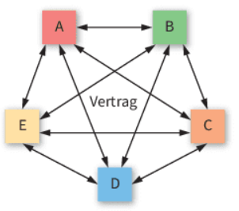

# LF1.3.3- Kartellrecht- Die Spielregeln des fairen Wettbewerbs

**Als** verantwortungsbewusster Manager

**möchte ich** die Grundlagen des deutschen und europäischen Kartellrechts kennen,

**damit** ich wettbewerbswidriges Verhalten erkennen, vermeiden und die damit verbundenen Risiken für mein Unternehmen minimieren kann.

# Celebration Criteria

- Wir können die Definition eines Kartells und die wichtigsten verbotenen Verhaltensweisen (z.B. Preisabsprachen, Marktaufteilung) erläutern.
- Wir können die zentralen Rechtsgrundlagen (GWB, AEUV) und die zuständigen Behörden (Bundeskartellamt, EU-Kommission) benennen.
- Wir können potenzielle kartellrechtliche Risiken im Szenario der "UrbanVolt GmbH" identifizieren und bewerten.

# Wissens-Briefing

## Was ist ein Kartell?

Ein Kartell ist eine Vereinbarung oder eine aufeinander abgestimmte Verhaltensweise zwischen zwei oder mehr rechtlich selbstständigen Unternehmen, die normalerweise Wettbewerber sind. Das Ziel eines solchen Zusammenschlusses ist es, den Wettbewerb zu verhindern, einzuschränken oder zu verfälschen. Durch solche Absprachen versuchen die beteiligten Unternehmen, eine quasi-monopolistische Stellung zu erlangen, um Preise künstlich hochzuhalten, die Produktqualität zu senken oder Innovationen zu bremsen. Dies schadet der Gesamtwirtschaft und insbesondere den Verbrauchern.

## Arten von verbotenen Absprachen

Obwohl es viele Formen von Kartellen gibt, gelten einige als besonders schädlich ("Hardcore-Kartelle"). Dazu gehören:  

- **Preiskartelle:** Unternehmen sprechen ihre Verkaufspreise oder Preiserhöhungen ab.  
- **Gebietskartelle:** Wettbewerber teilen den Markt geografisch unter sich auf, sodass jeder in seinem Gebiet ohne Konkurrenz agieren kann.  
- **Produktions- oder Quotenkartelle:** Unternehmen vereinbaren, ihre Produktionsmengen zu beschränken, um das Angebot künstlich zu verknappen und die Preise zu treiben.  
- **Submissionskartelle:** Bei öffentlichen oder privaten Ausschreibungen sprechen Bieter ihre Angebote ab, um sicherzustellen, dass ein vorher bestimmtes Unternehmen den Zuschlag zu einem überhöhten Preis erhält.

 

Neben diesen horizontalen Absprachen zwischen direkten Wettbewerbern sind auch **vertikale Absprachen** zwischen Unternehmen auf unterschiedlichen Marktstufen (z.B. Hersteller und Händler) verboten. Ein klassisches Beispiel ist die **vertikale Preisbindung**, bei der ein Hersteller wie UrbanVolt seinen Händlern vorschreibt, die E-Bikes nicht unter einem bestimmten Mindestpreis zu verkaufen. Unverbindliche Preisempfehlungen (UVP) sind zwar erlaubt, doch jeglicher Druck zur Einhaltung ist illegal.  

## Rechtliche Grundlagen

Der Schutz des freien Wettbewerbs ist sowohl auf nationaler als auch auf europäischer Ebene gesetzlich verankert.

- **Deutsches Recht:** Die zentrale Norm ist das **Gesetz gegen Wettbewerbsbeschränkungen (GWB)**.
    
    - **§ 1 GWB** verbietet grundsätzlich alle Vereinbarungen und abgestimmten Verhaltensweisen, die eine Wettbewerbsbeschränkung bezwecken oder bewirken.  
    - **§§ 18-21 GWB** verbieten den Missbrauch einer marktbeherrschenden Stellung, z.B. durch überhöhte Preise oder die Verdrängung von Wettbewerbern.
    
     
- **Europäisches Recht:** Die Grundlage bildet der **Vertrag über die Arbeitsweise der Europäischen Union (AEUV)**. Die Regelungen sind inhaltlich weitgehend identisch mit dem GWB.  
    - **Artikel 101 AEUV** verbietet wettbewerbsbeschränkende Vereinbarungen zwischen Unternehmen (Kartellverbot).  
    - **Artikel 102 AEUV** verbietet den Missbrauch einer marktbeherrschenden Stellung.

 

Das europäische Recht kommt zur Anwendung, wenn die Praktiken den Handel zwischen den EU-Mitgliedstaaten beeinträchtigen können.  

## Zuständigkeit, Verfolgung und Sanktionen

Die Durchsetzung des Kartellrechts obliegt spezialisierten Behörden:

- **Bundeskartellamt (BKartA):** Zuständig für Fälle mit Auswirkungen auf das gesamte Bundesgebiet.  
- **Landeskartellbehörden:** Zuständig, wenn die Auswirkungen auf ein einzelnes Bundesland beschränkt sind.  
- **Europäische Kommission (Generaldirektion Wettbewerb):** Verfolgt Fälle mit grenzüberschreitender Bedeutung in der EU, typischerweise wenn mehr als drei Mitgliedstaaten betroffen sind.  Diese Behörden arbeiten im **European Competition Network (ECN)** eng zusammen.

 

Bei Verstößen drohen empfindliche Strafen:

- **Geldbußen:** Unternehmen können mit Bußgeldern von bis zu 10 % ihres weltweiten Gesamtkonzernumsatzes des Vorjahres belegt werden.  
- **Schadensersatz:** Geschädigte Kunden oder Wettbewerber können auf Schadensersatz klagen.  
- **Nichtigkeit:** Die kartellrechtswidrigen Vereinbarungen sind von Anfang an rechtlich unwirksam.

 

Bekannte Fälle wie das LKW-Kartell (Strafe: 3,8 Mrd. Euro) , das Kaffeekartell (159 Mio. Euro) oder jüngere Verfahren gegen Automobilhersteller und Technologiekonzerne verdeutlichen die enorme finanzielle Dimension der Sanktionen.  

Für ein mittelständisches Unternehmen wie die UrbanVolt GmbH ist das Kartellrecht kein abstraktes Thema für Großkonzerne, sondern hat direkte operative Relevanz. Die Gestaltung von Vertriebsverträgen, Preislisten für Händler, Rabattsystemen oder Kooperationen mit anderen Unternehmen muss stets auf Konformität mit dem Kartellrecht geprüft werden. Schon eine unbedachte Äußerung auf einer Messe gegenüber einem Wettbewerber über zukünftige Preispläne kann als Teil einer illegalen Absprache gewertet werden. Proaktive Compliance-Maßnahmen sind daher unerlässlich, um das Unternehmen vor massiven finanziellen und reputativen Schäden zu schützen.

# Aufgaben

1.  **Risiko-Brainstorming:** Diskutieren Sie in der Gruppe, welche alltäglichen Geschäftssituationen für die "UrbanVolt GmbH" ein kartellrechtliches Risiko darstellen könnten. Betrachten Sie dabei die Beziehungen zu Wettbewerbern, zu Lieferanten und zu Fahrradhändlern. Erstellen Sie eine Mindmap der potenziellen Risikobereiche in einem Kollaborationstool.
2.  **Fallanalyse "Händlervertrag":** Sie erhalten einen fiktiven Entwurf eines neuen Händlervertrags für UrbanVolt. Der Vertrag enthält folgende Klauseln:
    
    1.  Der Händler verpflichtet sich, die E-Bikes nicht unter dem von UrbanVolt festgelegten Mindestverkaufspreis anzubieten.
    2.  Dem Händler wird das exklusive Verkaufsrecht für sein Postleitzahlengebiet zugesichert.
    3.  Der Online-Verkauf über die Händler-Website ist nur mit ausdrücklicher Genehmigung von UrbanVolt gestattet.
    
    Analysieren Sie jede Klausel auf ihre kartellrechtliche Zulässigkeit. Begründen Sie Ihre Einschätzung unter Bezugnahme auf die gelernten Prinzipien (§ 1 GWB / Art. 101 AEUV).
3.  **Compliance-Empfehlung:** Erarbeiten Sie drei konkrete Empfehlungen für die Geschäftsführung von UrbanVolt, um Kartellrechtsverstöße im Unternehmen proaktiv zu vermeiden (Compliance-Maßnahmen).

# Quellen & Vertiefung

- https://www.osborneclarke.com/de/insights/kartellrecht-deutschland-einfach-erklaert-teil-1
- https://www.ratgeberrecht.eu/aktuell/gebietsabsprachen-und-kartellrecht-ein-leitfaden/
- https://www.bundeskartellamt.de/SharedDocs/Publikation/DE/Broschueren/Informationsbrosch%C3%BCre%20-%20Erfolgreiche%20Kartellverfolgung.pdf?__blob=publicationFile&v=9
- https://www.docurex.com/was-ist-ein-kartell/
- https://de.wikipedia.org/wiki/Wirtschaftskartell
- https://www.bundeswirtschaftsministerium.de/Redaktion/DE/Downloads/I/informationen-zum-nationalen-kartell-und-wettbewerbsrecht.pdf?__blob=publicationFile&v=4
- https://www.bundeskartellamt.de/DE/Infothek_Service/RechtsgrundlagenUndMaterialien/Bundeskartellamt/rechtsgrundlagen_Bundeskartellamt_node.html
- https://www.stmwi.bayern.de/wirtschaft/aufsicht-und-recht/landeskartellbehoerde/
- https://www.kartellrechtler.de/EU-Kartellrecht/eu-kartellrecht.html
- https://www.bundeskartellamt.de/DE/Aufgaben/Kartelle/Kartellverfahren/Kartellverfahren_node.html
- 

https://www.youtube.com/watch?v=eXiSNvKGUu4

- https://www.spiegel.de/wirtschaft/unternehmen/vw-bmw-renault-und-co-eu-verhaengt-458-millionen-strafe-gegen-autobauer-a-341dad0c-60ee-42cb-b14f-9051fbc7f934
- https://www.auto-motor-und-sport.de/verkehr/auto-recycling-kartell-eu-verhaengt-millionen-strafen/
- https://www.qz-online.de/a/news/die-10-groessten-wirtschaftskartelle-300396
- https://www.bundeskartellamt.de/DE/Infothek_Service/Schule_Lernen/Fallbeispiele/fallbeispiele_node.html
- https://www.preplounge.com/de/case-interview-basics/die-wertschoepfungskette