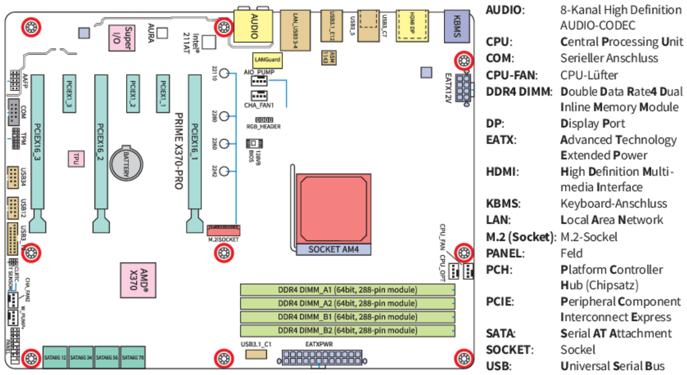

# LF2.2.10- Die Schaltzentrale - Mainboards & Formfaktoren

Als sorgfältiger PC-Architekt

möchte ich die Aufgaben und Standards von Mainboards verstehen,

um die passende Hauptplatine für Desktops, Laptops oder Server auswählen zu können.

# Celebration Criteria:

- Wir können die Hauptaufgabe eines Mainboards als verbindende Plattform erklären.
- Wir können die gängigen **Formfaktoren (ATX, Micro-ATX, Mini-ITX)** unterscheiden.
- Wir können die spezifischen Anforderungen an Mainboards in **Desktops**, **Laptops** und **Servern** erläutern.

# Wissens-Briefing

## Was ist ein Mainboard?

Das **Mainboard** (auch Hauptplatine genannt) ist das zentrale Nervensystem eines Computers. Es ist eine große Leiterplatte, auf der alle wesentlichen Komponenten wie die CPU, der RAM und die Erweiterungskarten (z.B. Grafikkarte) Platz finden und über das **Bussystem** und den **Chipsatz** miteinander kommunizieren. Es stellt außerdem die internen und externen Anschlüsse zur Verfügung und versorgt die Komponenten mit Strom.

## Vergleich der Mainboard-Formfaktoren

| Formfaktor | Typische Maße (ca.) | Merkmale | Typische Einsatzzwecke |
| --- | --- | --- | --- |
| **ATX** | 305 x 244 mm | Der "Standard" für die meisten Desktop-PCs; bietet viele Erweiterungsslots (PCIe) und Anschlüsse. | Gaming-PCs, Workstations, Standard-Office-PCs. |
| **Micro-ATX** | 244 x 244 mm | Eine kürzere, quadratische Version des ATX-Standards; weniger PCIe-Slots, passt aber in kompaktere Gehäuse. | Günstige Office-PCs, kompakte Gaming-Systeme. |
| **Mini-ITX** | 170 x 170 mm | Sehr kleiner Formfaktor mit meist nur einem PCIe-Slot für eine Grafikkarte und begrenzten Anschlüssen. | Sehr kleine Media-Center-PCs (HTPCs), portable Gaming-PCs, spezialisierte Embedded-Systeme. |

## Rolle des Mainboards in verschiedenen Systemen

- **Desktop:** Bietet maximale Flexibilität und Erweiterbarkeit durch standardisierte Formfaktoten und viele Steckplätze. Der Fokus liegt auf der Balance zwischen Preis, Leistung und Features.
- **Laptop:** Das Mainboard ist eine hochintegrierte, herstellerspezifische Platine, auf der viele Komponenten (CPU, oft auch RAM und SSD) fest verlötet sind, um Platz und Energie zu sparen. Erweiterbarkeit ist stark limitiert.
- **Server:** Server-Mainboards sind auf maximale Stabilität, Zuverlässigkeit und Konnektivität ausgelegt. Merkmale sind oft mehrere CPU-Sockel, sehr viele RAM-Bänke für RDIMMs, erweiterte Management-Funktionen (BMC) und eine große Anzahl an PCIe- und Speicher-Anschlüssen.

# Aufgaben

1.  Öffnet einen PC-Konfigurator eines Online-Shops. Wählt nacheinander ein ATX-, ein Micro-ATX- und ein Mini-ITX-Mainboard aus. Vergleicht die Anzahl der RAM-Steckplätze und der langen PCIe-x16-Slots.
2.  Sucht nach einem Bild eines Laptop-Mainboards. Identifiziert Bereiche, die wahrscheinlich für CPU, RAM und SSD vorgesehen sind. Erklärt, warum dieses Design nicht in einen Standard-PC-Gehäuse passen würde.
3.  Recherchiert, was ein "BMC-Chip" (Baseboard Management Controller) auf einem Server-Mainboard ist. Fasst seine Hauptfunktion in zwei Sätzen zusammen und erklärt, warum dieses Feature für Server so wichtig ist.

# Quellen & Vertiefung

- **Rheinwerk IT-Handbuch:** Kapitel 4.1.4 "Bussysteme und Schnittstellen", Seiten 214 ff. (Chipsatz); Kapitel 4.2.1 "Das Mainboard vorbereiten", Seiten 263 ff. (Formfaktoren).
- **Wikipedia:** [Hauptplatine](https://de.wikipedia.org/wiki/Hauptplatine), [ATX-Format](https://de.wikipedia.org/wiki/ATX-Format)