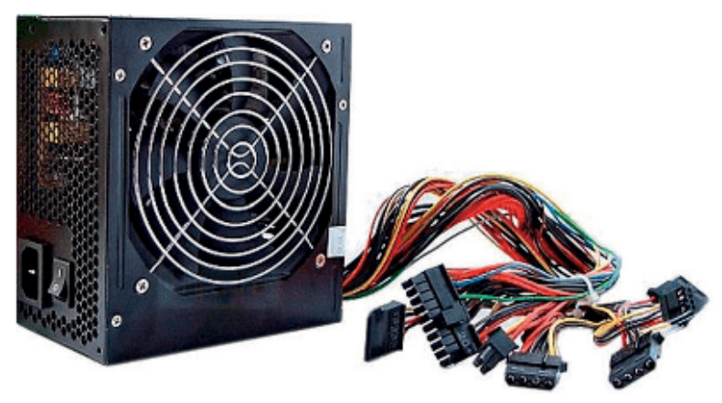
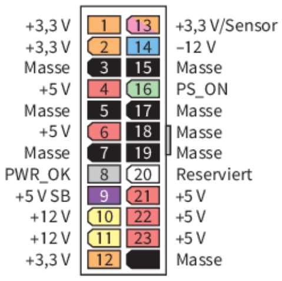
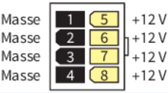
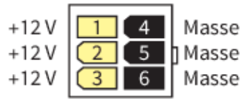
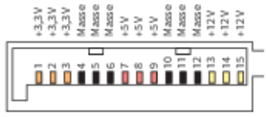
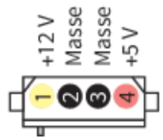
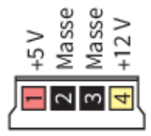

# LF2.2.11- Die Lebensader - Netzteile & Stromversorgung

Als verantwortungsbewusster Systembauer

möchte ich die Funktion, Standards und Kenngrößen von Netzteilen verstehen,

um für jedes System – vom Office-PC bis zum Server – eine sichere, effiziente und passende Stromversorgung auszuwählen.

# Celebration Criteria:

- Wir können die grundlegende Aufgabe eines Netzteils und die Begriffe **Nennleistung** und **Wirkungsgrad** erklären.
- Wir können die Bauformen für **Desktops (ATX, SFX, TFX)**, **Server (EPS, redundant)** und **Laptops (extern)** unterscheiden.
- Wir können die wichtigsten Netzteilstecker (z.B. 24-Pin ATX, 8-Pin EPS, PCIe) identifizieren und ihrem Zweck zuordnen.
- Wir können die Bedeutung der **80 Plus-Zertifizierung** für Effizienz und Umwelt erläutern.

# Wissens-Briefing

## Zweck und Funktion eines Netzteils

Das Netzteil (PSU - Power Supply Unit) ist das Herz des Stromkreislaufs im PC. Seine Hauptaufgabe ist es, die **230V Wechselspannung (AC)** aus der Steckdose in die von den PC-Komponenten benötigten, niedrigen **Gleichspannungen (DC)** umzuwandeln.

## Typische Angaben auf einem Netzteil

- **Nennleistung (Watt):** Gibt die maximale Gesamtleistung an, die das Netzteil über alle Spannungsschienen hinweg dauerhaft liefern kann. Entscheidend ist hierbei vor allem die Leistung auf der **+12V-Schiene**, da diese die Hauptverbraucher (CPU, GPU) versorgt.
- **Wirkungsgrad (%):** Beschreibt, wie effizient die Umwandlung von AC zu DC erfolgt. Ein Wirkungsgrad von 90% bedeutet, dass bei 100W Leistungsaufnahme aus der Steckdose 90W an die PC-Komponenten abgegeben und 10W als Abwärme verloren gehen.

## Wichtige Steckertypen und ihre Spannungsschienen

| Stecker | Pins | Versorgte Spannung(en) | Zweck |
| --- | --- | --- | --- |
| ATX-Stecker   | 20+4 Pin | +3,3V, +5,5V, -12V, + %VSB | Hauptstromversorgung für das Mainboard |
| EPS/CPU-Stecker   | 4+4 Pin | +12V | Zusätzliche Stromversorgung für die CPU. |
| PCIe/VGA-Stecker   | 6+2 Pin | +12V | Zusätzliche Stromversorgung für leistungsstarke Grafikkarten. |
| SATA-Stecker   | 15 Pin | +3,3V, +5V, +12V | Stromversorgung für moderne HDDs, SSDs und optische Laufwerke. |
| Molex-Stecker (hist.)   | 4 Pin. | +5V, +12V | Stromversorgung für ältere Laufwerke, Lüfter und Zubehör. |
| Floppy-Stecker (hist.)   | 4 Pin | +5V, +12V | Stromversorgung für Diskettenlaufwerke. |

## Vergleich der Netzteil-Formfaktoren und -Typen

| Formfaktor / Typ | Merkmale | Typische Einsatzzwecke |
| --- | --- | --- |
| ATX | Standard-Formfaktor für dir meisten internen Netzteile. | Standard-PCs, Workstations, Gaming-PCs. |
| SFX / TFX | Kleine Formfaktoren (small / thin form factor) | Sehr kompakte Mini-ITX oder Slimline-Systeme. |
| EPS | Basiert auf ATX, aber mit stärkeren 12V-Schienen für CPUs. | Server, High-End-Workstations. |
| Laptop (extern) | Externes “Ziegelstein”-Netzteil | Alle Laptops und viele Mini-PCs. |
| Server (redundant) | Mehrere hot-swap-fähige Netzteile in einem Gehäuse. | Unternehmensserver, Rechenzentren. |

## 80 Plus Effizienz-Zertifizierung

| Zertifikat | 20% Last | 50% Last | 100% Last |
| --- | --- | --- | --- |
| 80 Plus Bronze | 82% | 85% | 82% |
| 80 Plus Gold | 87% | 90% | 87% |
| 80 Plus Titanium | 92% | 94% | 90% |

# Aufgaben

1.  Nutzt einen Online-"Power Supply Calculator", um den geschätzten Leistungsbedarf für eure Konfiguration aus Epic 1 zu ermitteln. Wählt ein Netzteil mit passender Nennleistung und begründet eure Wahl.
2.  Sucht ein Bild eines modularen ATX-Netzteils mit all seinen Kabeln. Beschriftet den 24-Pin ATX-, den 8-Pin EPS- und einen 6+2 Pin PCIe-Stecker und erklärt, welche Komponente jeweils versorgt wird.
3.  Vergleicht zwei 750-Watt-Netzteile ("80 Plus Bronze" vs. "80 Plus Titanium"). Berechnet die ungefähre Stromersparnis pro Jahr bei einer angenommenen täglichen Nutzung von 4 Stunden unter 50% Last und einem Strompreis von 30 Cent/kWh.

# Quellen & Vertiefung

- **Rheinwerk IT-Handbuch:** Kapitel 4.1.8 "Netzteile", Seiten 258 ff.
- **Wikipedia:** [Netzteil (Computer)](https://www.google.com/search?q=https://de.wikipedia.org/wiki/Netzteil_%28Computer%29), [80_Plus](https://www.google.com/search?q=https://de.wikipedia.org/wiki/80_Plus)