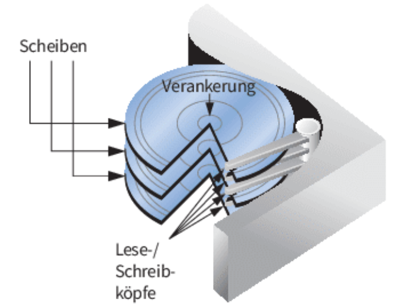
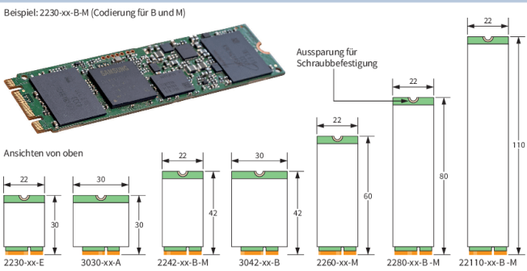

# LF2.2.4- Das Langzeitgedächtnis - Arten von Festspeichern

**Als** zukunftsorientierter Systemplaner

**möchte ich** die verschiedenen Arten von Festspeichern und ihre Eigenschaften verstehen,

**um** für jedes Gerät – vom IoT-Sensor bis zum High-Performance-Server – die passende Speichertechnologie auszuwählen.

# Celebration Criteria

- Wir können den technologischen Unterschied zwischen magnetomechanischem Speicher (HDD) und Flash-basiertem Speicher (SSD, UFS, eMMC) erklären.
- Wir können die typischen Einsatzbereiche und Formfaktoren für HDD, SSD, UFS, eMMC und die verschiedenen SD-Karten-Standards benennen.
- Wir können begründen, warum ein Server andere Speichertechnologien benötigt als ein Smartphone oder eine Kamera.

# Wissens-Briefing

## Grundlegende Speichertechnologien

- **HDD (Hard Disk Drive):** Ein **magnetomechanisches** Speichermedium. Daten werden durch Magnetisierung auf rotierenden Scheiben (Plattern) gespeichert, die von einem beweglichen Schreib-Lese-Kopf ausgelesen werden. **Analogie:** Ein Plattenspieler, bei dem ein Arm die Rillen einer Platte abtastet.  
    
- **Flash-Speicher:** Ein rein **elektronischer**, nicht-flüchtiger Speicher. Daten werden in Speicherzellen (Floating-Gate-Transistoren) gespeichert, ohne dass bewegliche Teile benötigt werden. Dies ist die Basistechnologie für alle modernen Festspeicher.
- **SSD (Solid State Drive):** Eine konkrete Anwendung von Flash-Speicher in einem Gehäuse, das eine Festplatte ersetzt oder ergänzt. Eine SSD ist im Grunde eine Platine mit vielen Flash-Speicherchips und einem Controller.

## Vergleich der Festspeicher-Technologien

| Technologie | Typische Formfaktoren | Aktueller Standard / Protokoll | Max. Übertragungsrate (aktuell) | Typische Einsatzzwecke |
| --- | --- | --- | --- | --- |
| Hard Disk Drive (HDD) | 3,5 Zoll, 2,5 Zoll | SATA-3 / SAS-4 | ca. 250 MB/s | **Server/NAS:** Große, günstige Datenspeicher. |
| Solid State Drive (SSD) | 2,5 Zoll, M.2, U.2 | NVMe 2.0 (PCIe 5.0) | ca. 14.0000 MB/s | **Alle Bereiche:** Als schnelles Systemlaufwerk. |
| Universal Flash Storage (UFS) | BGA (fest verlötet) | UFS 4.0 | ca. 4.600 MB/s | **Smartphones und Tablets** (Mittel-/Oberklasse). |
| eMMC | BGA (fest verlötet) | eMMC 5.1 | ca. 400 MB/s | **Günstige Smartphones, Tablets, Laptops**. |
| SD-Karte (UHS) | SD, microSD | UHS-II | ca. 312 MB/s | **Kameras, Drohnen, mobile Konsolen**. |
| SD Express | SD, microSD | SD Express 9.1 | ca. 3.900 MB/s | **High-End-Kameras (8K-Video)**. |

# Aufgaben

1.  Zerlegt (falls möglich) eine alte 2,5-Zoll-Laptop-Festplatte und identifiziert die Hauptkomponenten.
2.  Vergleicht die Startzeit eines PCs, der von einer HDD bootet, mit der eines PCs, der von einer SSD bootet.
3.  Erstellt eine Kaufempfehlung: Welche Speicherart, welchen Formfaktor und welche Größe empfiehlt ihr für einen Gaming-PC und einen NAS?

# Quellen & Vertiefung

- **Rheinwerk IT-Handbuch:** Kapitel 4.1.5 "Massenspeicher", Seiten 224 ff.
- **Wikipedia:** [Festplattenlaufwerk](https://de.wikipedia.org/wiki/Festplattenlaufwerk), [Solid-State-Drive](https://de.wikipedia.org/wiki/Solid-State-Drive)