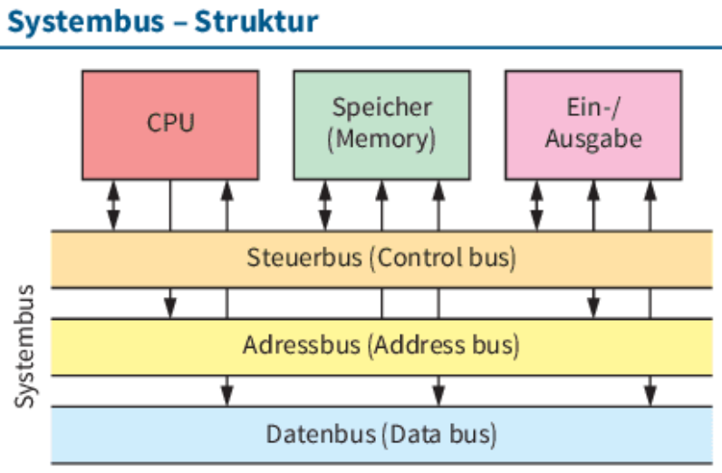
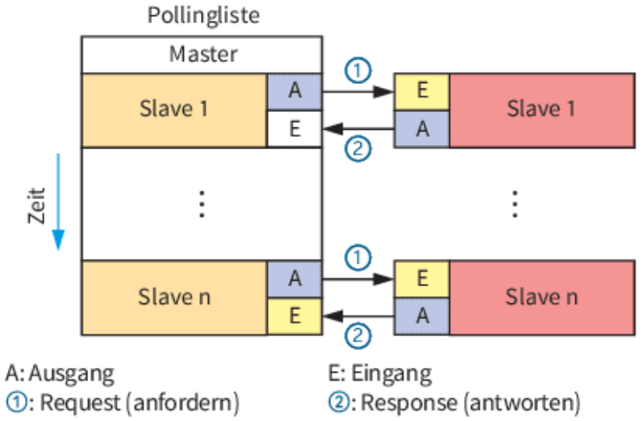

# LF2.2.6- Das Nervensystem - Was ist ein Bussystem-

Als **wissbegieriger Auszubildender**  
möchte ich **die fundamentalen Prinzipien der Datenübertragung im Computer verstehen**,  
um **nachvollziehen zu können, wie die verschiedenen Komponenten miteinander kommunizieren**.

# Celebration Criteria

- Wir können den Zweck eines Bussystems und die Funktion von **Daten-, Adress- und Steuerbus** erklären.
- Wir können die Grundbegriffe der Bus-Kommunikation wie **Master/Slave** und **Initiator/Target** zuordnen.
- Wir können die Verwendungsarten **Systembus, Speicherbus und Peripheriebus** unterscheiden.
- Wir können technische Konzepte wie **Multiplexing** und die Notwendigkeit der **Terminierung** bei schnellen Bussen erläutern.

# Wissens-Briefing

## Was ist ein Bussystem?

Ein Bussystem ist die zentrale Datenautobahn in einem Computer, die alle Komponenten miteinander verbindet. Es ist ein System aus Leitungen und zugehörigen Steuerprotokollen.

## Logischer Aufbau

Ein Bus gliedert sich klassischerweise in drei Teile:

+++ columnContainer +++
+++ column xs:12 md:8 lg:8 +++
- **Datenbus**: Überträgt die eigentlichen Nutzdaten (z.B. Programmbefehle, Rechenergebnisse). Seine Breite (z.B. 64-Bit) bestimmt, wie viele Daten gleichzeitig übertragen werden können.
- **Adressbus**: Überträgt die Speicheradressen, um festzulegen, von wo Daten gelesen oder wohin sie geschrieben werden sollen. Seine Breite bestimmt den maximal adressierbaren Speicher.
- **Steuerbus**: Überträgt Steuer- und Statussignale, die den gesamten Datentransfer koordinieren (z.B. Lese-/Schreibbefehle, Taktsignale, Interrupts).
+++ end:column +++

+++ column xs:12 md:4 lg:4 +++

+++ end:column +++
+++ end:columnContainer +++

## Grundbegriffe

- **Master/Slave:** Ein Master (z.B. die CPU) kann den Bus steuern und Lese-/Schreibvorgänge initiieren. Ein Slave (z.B. eine Netzwerkkarte) kann nur auf Anfragen des Masters reagieren.
- **Seriell vs. Parallel:** Parallele Busse übertragen viele Bits gleichzeitig über viele Leitungen, sind aber bei hohen Geschwindigkeiten störanfällig. Serielle Busse übertragen die Bits nacheinander mit extrem hoher Frequenz, was heute zu höheren Gesamtdatenraten führt.

## Busstrukturen

- **Multiplexing:** Ein Verfahren, bei dem dieselben Leitungen abwechselnd für verschiedene Zwecke genutzt werden (z.B. als Adress- und als Datenbus), um die Anzahl der benötigten Leitungen zu reduzieren.
- **Terminierung:** Bei schnellen Bussystemen müssen die Leitungsenden mit Abschlusswiderständen (Terminatoren) versehen werden, um Signalreflexionen zu verhindern, die die Datenübertragung stören würden.

# Aufgaben

1.  Skizziert auf einem Online-Whiteboard das Zusammenspiel von CPU und RAM. Zeichnet die drei Bus-Arten (Daten-, Adress-, Steuerbus) ein und beschriftet, welche Art von Information über welche Leitung fließt, wenn die CPU einen Wert aus dem RAM liest.
2.  Erklärt die Analogie: Ein Adressbus ist wie die Hausnummer auf einem Brief, der Datenbus ist der Inhalt des Briefes und der Steuerbus ist der Postbote, der den Brief zustellt und eine Empfangsbestätigung verlangt.
3.  Recherchiert, warum bei langen, schnellen Datenkabeln (z.B. SCSI früher, Ethernet heute) eine Terminierung so wichtig ist. Was würde ohne sie passieren?

# Quellen & Vertiefung

- **Rheinwerk IT-Handbuch:** Kapitel 4.1.4 "Bussysteme und Schnittstellen", Seiten 214 ff.
- **Wikipedia:** [Bus (Datenverarbeitung)](https://de.wikipedia.org/wiki/Bus_%28Datenverarbeitung%29), [Adressbus](https://de.wikipedia.org/wiki/Adressbus), [Steuerbus](https://de.wikipedia.org/wiki/Steuerbus)