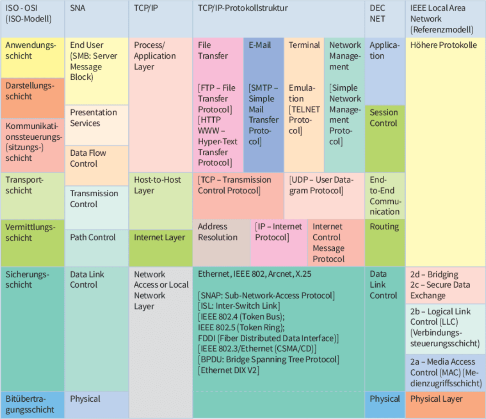
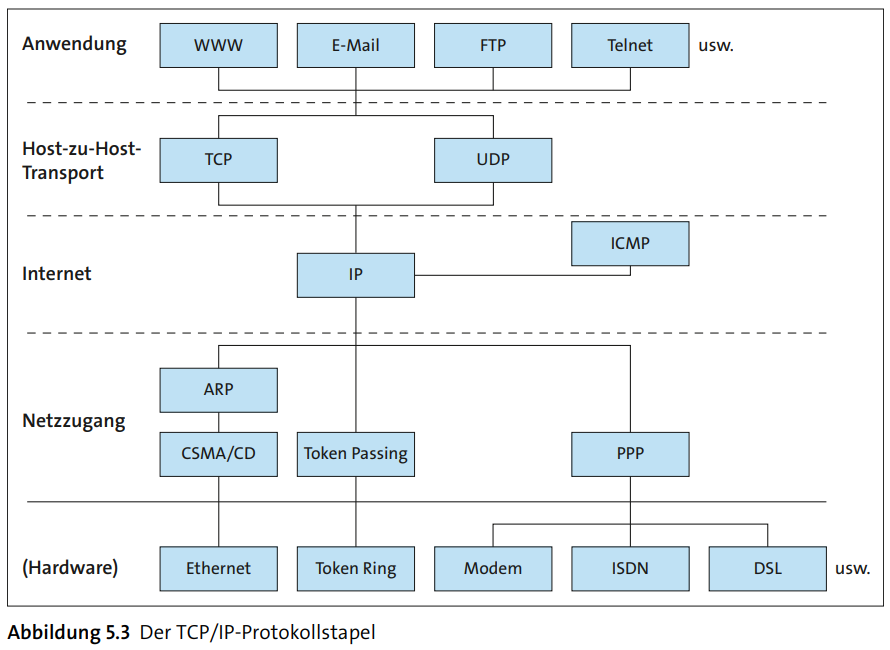
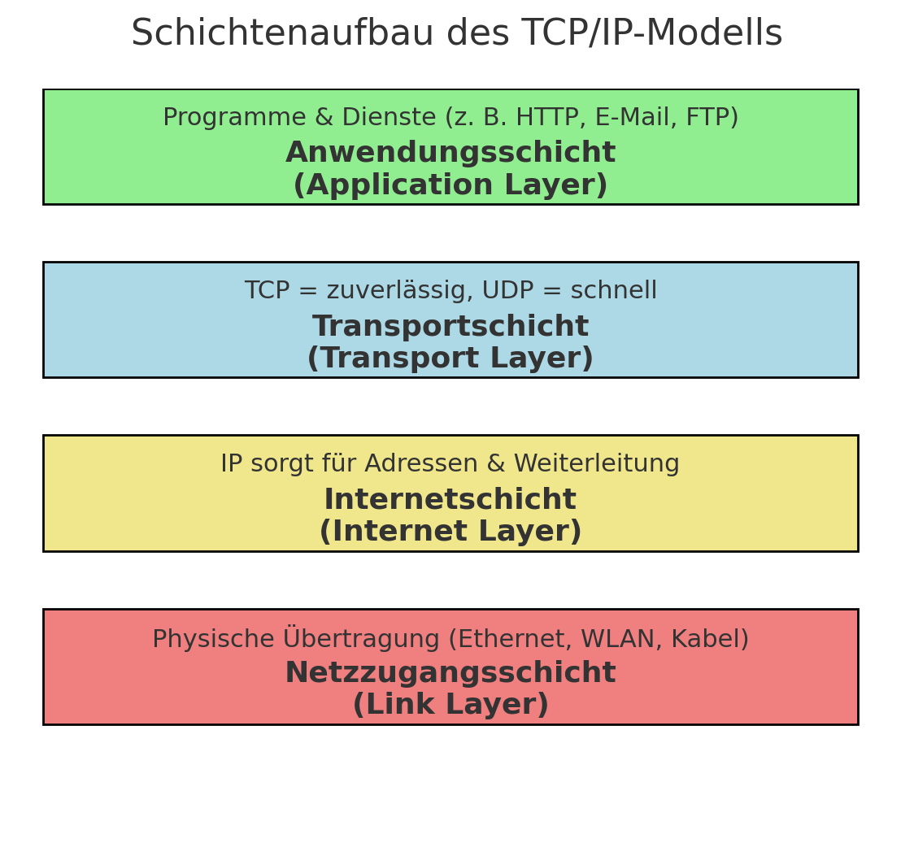
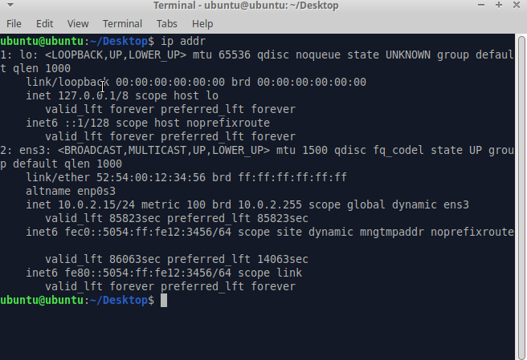

# LF3.1.3- Wie Daten reisen - Ethernet & TCP-IP

Als angehender Netzwerk-Administrator

möchte ich die grundlegenden Standards Ethernet und TCP/IP verstehen,

damit ich nachvollziehen kann, wie Daten physisch und logisch durch ein Netzwerk transportiert werden.

# Celebration Criteria

- Wir können den Zweck von Ethernet als Standard für die kabelgebundene Übertragung und aktuelle Geschwindigkeitsstandards benennen.
- Wir können die Kernaufgaben der Protokolle TCP und IP in einfachen Worten beschreiben.
- Wir können den Schichtenaufbau des TCP/IP-Modells und den Vorteil dieser Abstraktion erklären.

# Wissens-Briefing

## Begriffe

- **Netzwerkprotokoll:** Ein Satz von Regeln und Formaten, der die Kommunikation zwischen Geräten in einem Netzwerk festlegt.
- **Ethernet (IEEE 802.3):** Der dominierende Standard für kabelgebundene lokale Netzwerke (LANs). Definiert Kabel, Stecker (RJ45) und die Art der Datenübertragung auf der physischen Schicht. Gängige Geschwindigkeiten sind 1 Gbit/s (Gigabit Ethernet) und 10 Gbit/s.
- **Schichtenmodelle:** Teilen die komplexe Netzwerkkommunikation in hierarchische Schichten auf, wobei jede Schicht eine bestimmte Aufgabe hat. Dies vereinfacht die Standardisierung und Entwicklung.

## TCP/IP-Referenzmodell

Das vier-schichtige, praxisrelevante Modell des Internets:

1.  **Anwendungsschicht:** Stellt die Schnittstelle für Anwendungen dar (z.B. HTTP für Web).
2.  **Transportschicht:** Verantwortlich für die End-zu-End-Kommunikation.
3.  **Internetschicht:** Zuständig für die Adressierung und das Routing von Paketen.
4.  **Netzzugangsschicht:** Kümmert sich um den physischen Zugriff auf das Übertragungsmedium (z.B. Ethernet).

## Kernprotokolle

- **IP (Internet Protocol):** Arbeitet auf der Internetschicht. Ist für die logische Adressierung (IP-Adressen) und das Weiterleiten (Routing) von Datenpaketen durch verschiedene Netzwerke zuständig. Es ist verbindungslos und unzuverlässig (keine Zustellgarantie).
- **TCP (Transmission Control Protocol):** Arbeitet auf der Transportschicht. Stellt eine **zuverlässige**, verbindungsorientierte Übertragung her. Es stellt sicher, dass alle Datenpakete vollständig und in der richtigen Reihenfolge ankommen, indem es den Empfang bestätigt.
- **UDP (User Datagram Protocol):** Ebenfalls Transportschicht. Eine schnelle, **unzuverlässige** und verbindungslose Alternative zu TCP. Es wird für zeitkritische Anwendungen (z.B. Videostreaming, VoIP) verwendet, bei denen Geschwindigkeit wichtiger ist als 100%ige Zuverlässigkeit.

# Aufgaben

1.  **Analogie & Visualisierung:** Diskutiert in der Gruppe die Analogie des Postversands für die TCP/IP-Protokollfamilie. Was ist die IP-Adresse? Was ist TCP? Was ist UDP? Erstellt eine Visualisierung dazu.  
    

1.  **Praktische Anwendung (Windows & Linux):**
    
    - Jedes Teammitglied öffnet eine Kommandozeile (CMD/PowerShell auf Windows, Terminal auf Ubuntu).
    - **Windows:** Gebt `ipconfig` ein. Findet eure "IPv4-Adresse".  
        **Bereiche der privaten IP-Adressen:**
        - 10.0.0.0 – 10.255.255.255
        - 172.16.0.0 – 172.31.255.255
        - 192.168.0.0 – 192.168.255.255  
            
    
    | Person | IPv4-Adresse Öffentlich | Privat |
    | --- | --- | --- |
    | Olena | 62.96.153.138 | 10.88.114.6 |
    | Mohammed | 10.6.200.129 |     |
    | Philipp | 79.140.121.110 | 192.168.xxx.xx |
    | Janine | 10.88.114.155 |     |
    | Jay | 10.6.200.79 |     |
    
    - **Ubuntu:** Gebt `ip addr` ein. Findet eure "inet"-Adresse.  
        https://docs.google.com/document/d/1aQudBtcFgApmcLi3JIuxV1XMmuYmnDczMoTjkvRMbW8/edit?usp=sharing
    - Sammelt die Adressen in einem gemeinsamen Dokument. Recherchiert, ob es sich um private oder öffentliche IP-Adressen handelt.
        - _Sofern man an einen Router angeschlossen ist, handelt es sich bei den abgefragten IPs um private Adressen._  
            
2.  **Recherche & Diskussion:** Recherchiert die aktuellen Kosten für einen einfachen Gigabit-Switch mit 8 Ports. Diskutiert, warum für die "Innovate GmbH" Gigabit-Ethernet vollkommen ausreichend ist und 10-Gigabit-Ethernet ein "Overkill" wäre.**Warum für die Innovate GmbH Gigabit-Ethernet ausreichend sein kann:**
    
    - Lokale Netzwerkanforderungen: Wenn alle Geräte im gleichen Büro-/Raumsegment sitzen und kein Server- oder Storage-Backbone-förderndes Traffic-Muster vorliegt, genügt Gigabit-Ethernet oft.
    - Kosteneffizienz: Geringere Anschaffungskosten, weniger Stromverbrauch, weniger Komplexität.
    - Anwendungen: Typische Büroarbeiten (Dateiaustausch, Cloud-Anwendungen, Videokonferenzen in moderatem Umfang) kommen meist gut mit 1 Gbps aus, solange der Internetzugang nicht der Engpass ist.
    - Zukunftsausblick: Für kleine Teams oder Standorte ohne hohes internes Datenaufkommen bleibt 1 Gbit oft ausreichend, und Topologie kann einfach bleiben.
    
    **Warum 10-Gigabit-Ethernet (Overkill) sein kann:**
    
    - Interner Trafficschub: Wenn mehrere Clients große Dateien lokal transferieren, Server-Backups, VLANs mit hohem internen Traffic oder virtualisierte Umgebungen (vCenter, ESXi-Hosts) existieren, steigt der Bedarf.
    - Zukünftige Skalierbarkeit: Falls geplant ist, bald mehr Geräte, Server oder Speicher mit hohen Throughputs zu betreiben, könnte eine frühzeitige Investition in 10G sinnvoller sein als späteres Umrüsten.
    - Kosten und Komplexität: 10G-Switches sind teurer, benötigen oft Uplink-Anbindungen, Netzwerkkarten auf Clients/Servers
    
    **Beispiel Preise****TP-Link TL-SG108**: Unmanaged Switch, Plug & Play, ca. 20–30 €**NETGEAR GS308**: Unmanaged Switch, kompakt, ca. 25–35 €**W Box 0E-8PGIGUN**: Unmanaged Switch, kostengünstig, ca. 15–25 €Diese Preise variieren je nach Anbieter und speziellen Funktionen.

# Quellen & Vertiefung

- **IT-Handbuch, Kapitel 5.2 "Netzwerkprotokolle" (S. 196-204) und Kapitel 5.5 "Ethernet" (S. 248-254).**
- Vertiefung (Wikipedia): [Ethernet](https://de.wikipedia.org/wiki/Ethernet)
- Vertiefung (Wikipedia): [TCP/IP-Referenzmodell](https://de.wikipedia.org/wiki/TCP/IP-Referenzmodell)