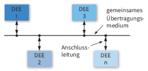
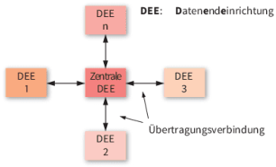

# LF3.2.1- Der Bauplan des Netzwerks - Topologien und Verkabelung

Als **Junior-Systemintegrator in der Planungsphase**

möchte ich verschiedene Netzwerktopologien und die Prinzipien der strukturierten Verkabelung kennenlernen,

damit ich für das Büro der "Innovate GmbH" einen sauberen und wartbaren physischen Netzwerkaufbau planen kann.

# Celebration Criteria

- Wir können die Stern-Topologie zeichnen und ihre Vorteile gegenüber der Bus-Topologie (Ausfallsicherheit, Performance) erläutern.
- Wir können die wichtigsten Kupferkabel-Kategorien (z.B. Cat 6, Cat 7) und ihre Leistungsfähigkeit unterscheiden.
- Wir können den Signalweg eines Datenpakets vom PC über die Datendose und das Patchpanel zum Switch nachzeichnen.

# Wissens-Briefing

## Netzwerktopologie

Beschreibt die physische oder logische Anordnung von Geräten und Leitungen in einem Netzwerk.

- **Bus-Topologie:** Alle Geräte an einem zentralen Kabel. Veraltet, da anfällig für Komplettausfälle.  
    
- **Stern-Topologie:** Alle Geräte sind mit einem zentralen Verteiler (Switch) verbunden. **Heutiger** Standard **im LAN.** Hohe Ausfallsicherheit, da der Ausfall einer Leitung nur ein Gerät betrifft.  
    

## Übertragungsmedien (Kabel)

- **Twisted-Pair-Kabel:** Standard-Kupferkabel für LANs. Besteht aus verdrillten Adernpaaren.
    - **Schirmung:** Schützt vor elektromagnetischen Störungen. Gängige Typen sind U/UTP (ungeschirmt), F/UTP (Folienschirm) und S/FTP (Geflecht- und Folienschirm).
    - **Kategorien (Cat):** Definieren die Leistungsfähigkeit (Frequenz, Datenrate). **Cat 7** gilt als zukunftssicherer Standard für Neuinstallationen (bis 10 Gbit/s).
- **Glasfaserkabel (LWL):** Übertragen Daten als Lichtimpulse. Unempfindlich gegen Störungen, für hohe Geschwindigkeiten und große Distanzen.

## Strukturierte Verkabelung

Ein standardisiertes und herstellerunabhängiges Konzept für die Gebäudeverkabelung. Ziel ist eine langlebige und flexible Infrastruktur.

### Komponenten

- **Netzwerkschrank:** Zentraler Punkt, in dem die aktiven und passiven Komponenten zusammenlaufen.
- **Verlegekabel:** Starre Kabel, die fest in Wänden/Kabelkanälen verlegt werden.
- **Anschlussdose:** Die "Netzwerk-Steckdose" in der Wand.
- **Patchpanel:** Verteilerfeld im Schrank, an dem die Verlegekabel ankommen.
- **Patchkabel:** Flexible Kabel, die Geräte mit der Anschlussdose oder das Patchpanel mit dem Switch verbinden.

# Aufgaben

1.  **Planungsaufgabe:** Zeichnet auf dem bereitgestellten Büro-Grundriss der "Innovate GmbH" die Verkabelungswege von den 5 Arbeitsplätzen zum zentralen Technikraum. Entscheidet euch für eine Kabelkategorie (z.B. Cat 7) und begründet eure Wahl im Hinblick auf Zukunftssicherheit.
2.  **Kollaborative Recherche:** Erstellt in einem Online-Whiteboard eine Gegenüberstellung der Vor- und Nachteile von Kupferkabeln und Glasfaserkabeln für die LAN-Verkabelung in einem Büro. Berücksichtigt dabei Kosten, Installationsaufwand und maximale Geschwindigkeit/Distanz.
3.  **Praktische Übung:** Wenn ein Demonstrations-Netzwerkschrank verfügbar ist (real oder virtuell über Bilder/Videos), identifiziert die Komponenten: Patchpanel, Switch, Patchkabel. Erklärt euch gegenseitig den Signalfluss vom PC zum Switch.

# Quellen & Vertiefung

- **IT-Handbuch**
    - **Kap. 5.1.4 "Topologien" (S. 193-195)**
    - **Kap. 5.3 "Übertragungsmedien" (S. 205-220)**
    - **Kap. 5.4 "Strukturierte Verkabelung" (S. 222-228).**
- Westermann Tabellenbuch
    - S. 576-577 "Topologien"
    - S. 581-584 "Übertragungsmedien"
    - S. 585-587 "Strukturierte Verkabelung".
- Vertiefung (Wikipedia): [Netzwerktopologie](https://de.wikipedia.org/wiki/Netzwerktopologie)
- Vertiefung (Wikipedia): [Strukturierte Verkabelung](https://de.wikipedia.org/wiki/Strukturierte_Verkabelung)