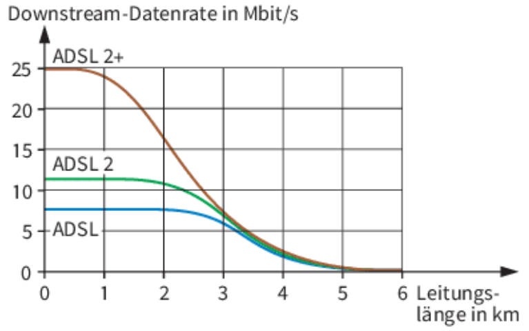
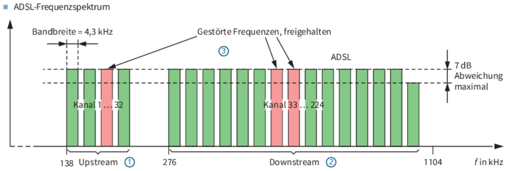
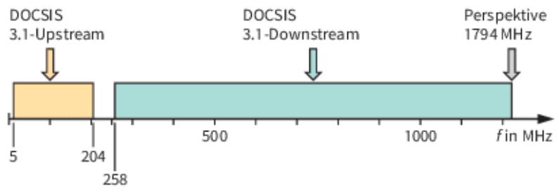
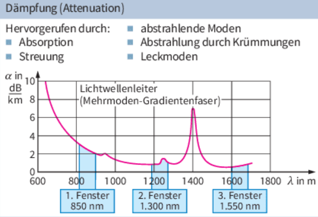
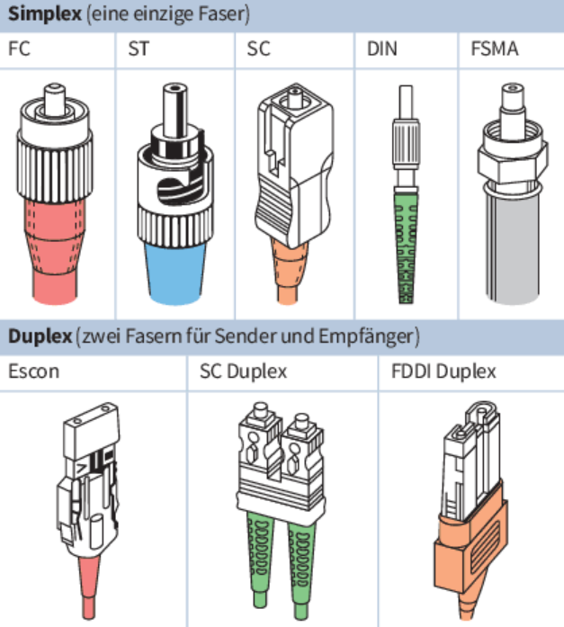
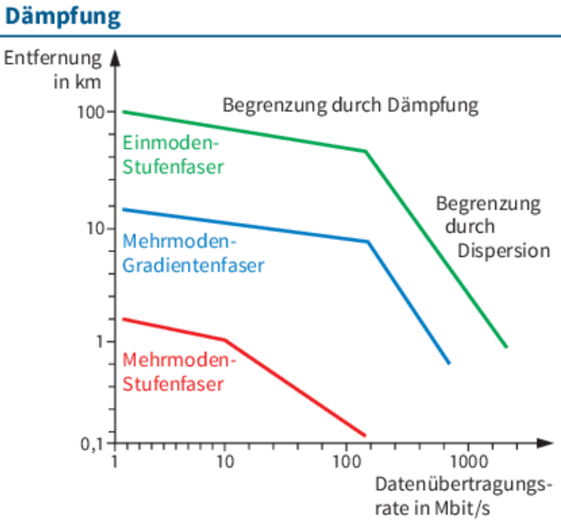
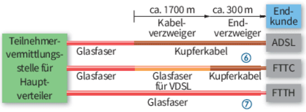

# LF3.2.3- Der Weg ins Internet - Technologien der -letzten Meile-

Als **IT-Systemkaufmann in der Angebotsphase**

möchte ich die gängigen Anschlusstechnologien für den Internetzugang verstehen,

damit ich für die "Innovate GmbH" eine fundierte Empfehlung für einen zukunftsfähigen Breitbandanschluss abgeben kann.

# Celebration Criteria

- Wir können die Begriffe DSL, DOCSIS (Kabel-Internet) und Glasfaser (FTTx) als Technologien für die "letzte Meile" erklären.
- Wir können die verschiedenen Ausbaustufen von Glasfasernetzen (FTTN, FTTB, FTTH) unterscheiden.
- Wir können die technischen Vor- und Nachteile der Technologien vergleichen (Bandbreite, Latenz, Störanfälligkeit).
- Wir können begründen, warum Glasfaser (insbesondere FTTH) als die mittelfristig überlegene Technologie gilt.

# Wissens-Briefing

**Die "letzte Meile":** Bezeichnet den physischen Leitungsabschnitt vom Verteilerkasten des Anbieters bis zum Hausanschluss des Kunden.

## Anschlusstechnologien

- **DSL (Digital Subscriber Line):** Nutzt die vorhandenen Kupfer-Telefonleitungen. Die Geschwindigkeit ist stark von der Leitungslänge zum Verteilerkasten abhängig. Meist **asymmetrisch** (Downloadrate > Uploadrate).+++ columnContainer +++  
    +++ column xs:12 md:4 lg:4 +++  
     +++ end:column ++++++ column xs:12 md:8 lg:8 +++  
     +++ end:column +++  
    +++ end:columnContainer +++
- 

**DOCSIS** (Internet **via TV-Kabel):** Nutzt das Koaxialkabel-Netz des Fernsehens. Funktioniert als "Shared Medium", d.h., die Bandbreite wird mit den Nachbarn im selben Segment geteilt.

- **Glasfaser (LWL):** Datenübertragung per Licht. Bietet die höchsten, meist **symmetrischen** Bandbreiten (Downloadrate ≈ Uploadrate), geringste Latenz und ist unempfindlich gegenüber Störungen. Gilt als zukunftssicherste Technologie.+++ columnContainer +++  
    +++ column xs:12 md:4 lg:4 +++  
     +++ end:column ++++++ column xs:12 md:4 lg:4 +++  
     +++ end:column ++++++ column xs:12 md:4 lg:4 +++  
     +++ end:column +++  
    +++ end:columnContainer +++

### Glasfaser-Ausbaustufen (FTTx - Fiber to the x)

- **FTTN (Fiber to the Node):** Glasfaser bis zum Verteilerkasten. Der Restweg zum Haus erfolgt über Kupfer (VDSL).
- **FTTB (Fiber to the Building):** Glasfaser bis in den Keller des Gebäudes.
- **FTTH (Fiber to the Home):** Glasfaser direkt bis in die Wohnung des Kunden. Die leistungsfähigste und zukunftsfähigste Variante.

# Aufgaben

1.  **Recherche & Empfehlung (Szenario-Bezug):** Recherchiert online, welche Internetanbieter am fiktiven Standort der "Innovate GmbH" welche Anschlusstechnologien anbieten. Vergleicht die Kosten und die angebotenen Bandbreiten (Up- & Download). Formuliert eine klare Empfehlung für die Geschäftsführung und begründet, warum ein Glasfaseranschluss, falls verfügbar, die beste Investition ist.
2.  **Visualisierung (Kreativtechnik):** Erstellt eine Infografik, die FTTN, FTTB und FTTH grafisch darstellt und die Unterschiede auf einen Blick verständlich macht.
3.  **Diskussion:** Diskutiert in der Gruppe: Warum ist eine hohe Upload-Geschwindigkeit für ein kreatives Startup wie die "Innovate GmbH" (z.B. Austausch großer Mediendateien mit Kunden) besonders wichtig? Welche der Technologien erfüllt diese Anforderung am besten?

# Quellen & Vertiefung

- **IT-Handbuch, Kapitel 5.10 "Wide Area Networks (WANs)" (insb. S. 317-319).**
- Vertiefung (Wikipedia): [Digital Subscriber Line (DSL)](https://de.wikipedia.org/wiki/Digital_Subscriber_Line)
- Vertiefung (Wikipedia): [Fiber to the x (FTTx)](https://www.google.com/search?q=https://de.wikipedia.org/wiki/Fiber_to_the_x)