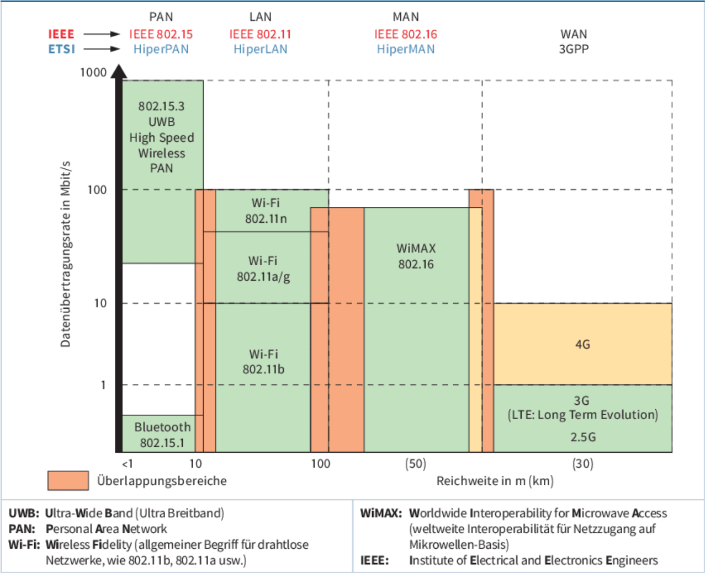

# LF3.3.4- Freiheit für Alle - WLAN-Komponenten

Als **IT-Administrator mit Fokus auf Mobility**

möchte ich die verschiedenen WLAN-Komponenten und -Konzepte verstehen,

damit ich für die "Innovate GmbH" eine stabile und flächendeckende drahtlose Netzwerkanbindung für Mitarbeiter und Gäste planen kann.

# Celebration Criteria

- Wir können die unterschiedlichen Rollen von WLAN-Router, Access Point und Repeater erklären.
- Wir können das Konzept eines Mesh-WLAN-Systems beschreiben und seine Vorteile gegenüber einem einzelnen Router mit Repeatern nennen.
- Wir können erklären, warum es sinnvoll ist, ein separates Gäste-WLAN einzurichten.

# Wissens-Briefing

- **WLAN-Standards (IEEE 802.11):** Definieren die Technik für drahtlose Netzwerke. Aktuelle Standards wie **Wi-Fi 6 (802.11ax)** bieten höhere Geschwindigkeiten und bessere Effizienz in Umgebungen mit vielen Geräten.
- **WLAN-Komponenten:**
    - **Access Point (AP):** Das Herzstück eines WLANs im Infrastruktur-Modus. Er bildet eine Brücke zwischen dem kabelgebundenen LAN und den drahtlosen Clients.
    - **WLAN-Router:** Ein Kombi-Gerät, das die Funktionen von Router, Switch und Access Point in einem Gehäuse vereint. Typisch für Heim- und Kleinbüronetze.
    - **Repeater (Range Extender):** Empfängt ein bestehendes WLAN-Signal und sendet es verstärkt weiter, um die Reichweite zu erhöhen. Halbiert dabei jedoch die theoretisch verfügbare Bandbreite.
- **WLAN-Architekturen:**
    - **Mesh-WLAN:** Ein System aus mehreren intelligenten Knoten, die zusammen ein einziges, großes und nahtloses WLAN aufspannen. Sie optimieren die Datenwege untereinander und bieten eine bessere Leistung und Abdeckung als ein Router mit Repeatern.
    - **Gäste-WLAN:** Ein separates, vom internen Firmennetzwerk isoliertes Funknetz für Besucher. Eine essenzielle Sicherheitsmaßnahme, um den Zugriff auf interne Ressourcen zu verhindern.

# Aufgaben

1.  **Lösungsdesign:** Das Büro der "Innovate GmbH" hat eine ungünstig geschnittene Ecke, in der der WLAN-Empfang des Hauptrouters schlecht ist. Diskutiert die Vor- und Nachteile des Einsatzes eines Repeaters gegenüber einem kleinen Mesh-System mit zwei Knoten. Welche Lösung würdet ihr der Geschäftsführung empfehlen und warum?
2.  **Konfiguration & Sicherheit:** Skizziert die Konfigurationsschritte zur Einrichtung eines Gäste-WLANs auf einem typischen SOHO-Router. Welche Sicherheitsoptionen (z.B. "Client-Isolation", "Bandbreitenbegrenzung", "Portal mit Nutzungsbedingungen") sind dabei besonders wichtig?
3.  **Peer-Teaching:** Erklärt euch gegenseitig in einfachen Worten den Unterschied zwischen einem Access Point und einem Repeater, indem ihr eine Analogie verwendet (z.B. AP = neue Glühbirne an die Decke hängen vs. Repeater = einen Spiegel aufstellen, um das Licht um die Ecke zu lenken).

# Quellen & Vertiefung

- **IT-Handbuch, Kapitel 5.6 "Wireless LAN (WLAN)" (S. 256-269).**
- Vertiefung (Wikipedia): [Wireless Local Area Network (WLAN)](https://de.wikipedia.org/wiki/Wireless_Local_Area_Network)
- Vertiefung (Wikipedia): [Wireless Mesh Network](https://www.google.com/search?q=https://de.wikipedia.org/wiki/Wireless_Mesh_Network)