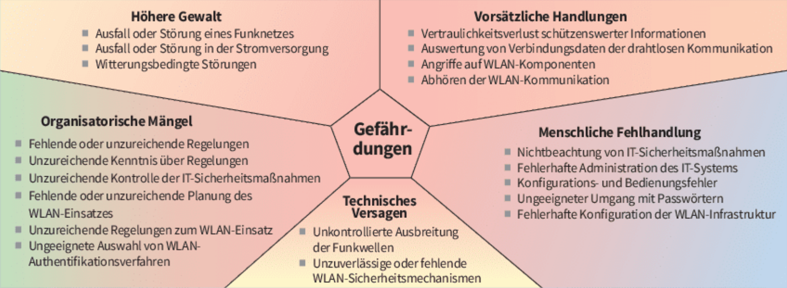

# LF3.4.2- Die Festungsmauer - Netzwerksicherheit und Stromversorgung

Als **angehender IT-Security-Beauftragter**

möchte ich grundlegende Mechanismen der Netzwerksicherheit und der ausfallsicheren Stromversorgung kennen,

damit ich das Netzwerk der "Innovate GmbH" vor unbefugtem Zugriff und den Folgen eines Stromausfalls schützen kann.

# Celebration Criteria

- Wir können die grundlegende Funktion einer Firewall als Regelwerk für ein- und ausgehenden Netzwerkverkehr erklären.
- Wir können mindestens drei Maßnahmen zur Absicherung eines WLANs nennen (z.B. WPA3, starkes Passwort, SSID nicht senden).
- Wir können die Notwendigkeit einer USV (Unterbrechungsfreie Stromversorgung) für Server und Switch begründen.
- Wir können den Begriff "Green IT" erläutern und zwei Beispiele für energieeffizienten IT-Betrieb nennen.

# Wissens-Briefing

- **Schutzziele der IT-Sicherheit:**
    - **Vertraulichkeit:** Nur autorisierte Personen dürfen auf Daten zugreifen.
    - **Integrität:** Daten müssen korrekt und unverändert sein.
    - **Verfügbarkeit:** Systeme und Daten müssen bei Bedarf zur Verfügung stehen.
- **Sicherheitskomponenten:**
    - **Firewall:** Überwacht und filtert den ein- und ausgehenden Netzwerkverkehr basierend auf einem vordefinierten Regelwerk. Sie ist die primäre Barriere zwischen dem internen LAN und dem unsicheren Internet.
    - **WLAN-Sicherheit:** Essenzielle Maßnahmen umfassen die Verwendung einer starken Verschlüsselung (**WPA3** ist der aktuelle Standard), ein sicheres, langes Passwort (Passphrase) und die Einrichtung eines isolierten Gäste-WLANs.
- **Verfügbarkeitskomponenten:**
    - **USV (Unterbrechungsfreie Stromversorgung):** Ein Gerät mit einem Akku, das bei einem Stromausfall kritische Geräte (Server, Switch) für eine kurze Zeit weiterbetreibt. Dies ermöglicht ein sicheres Herunterfahren der Systeme und verhindert Datenverlust.
- **Green IT:** Bezeichnet Bestrebungen, die IT-Nutzung umwelt- und ressourcenschonend zu gestalten. Dazu gehört der Einsatz energieeffizienter Hardware (z.B. "80 Plus"-zertifizierte Netzteile), die Virtualisierung von Servern zur besseren Auslastung und ein bewusstes Abschalten nicht genutzter Geräte.

# Aufgaben

1.  **Sicherheits-Checkliste:** Erstellt eine Sicherheits-Checkliste für die Konfiguration des Routers der "Innovate GmbH". Listet mindestens fünf Punkte auf, die bei der Ersteinrichtung beachtet werden müssen (z.B. Standardpasswort des Administrators ändern, WLAN mit WPA3 und starkem Passwort sichern, unnötige Dienste deaktivieren).
2.  **Recherche & Dimensionierung:** Recherchiert online die Leistungsaufnahme (in Watt) eines typischen NAS-Servers und eines 8-Port-Switches. Sucht nach einer passenden USV und ermittelt, wie lange diese die beiden Geräte bei einem Stromausfall versorgen könnte ("Überbrückungszeit").
3.  **Diskussion:** Sammelt in der Gruppe Ideen, wie die "Innovate GmbH" im IT-Betrieb Energie sparen und ressourcenschonend agieren kann. Berücksichtigt dabei sowohl die Anschaffung als auch den täglichen Betrieb. Präsentiert eure Top-3-Vorschläge.

# Quellen & Vertiefung

- **Primärquelle: IT-Handbuch**
    - **Kap. 5.6.6 "WLAN-Sicherheit" (S. 266-269)**
    - **Kap. 7.6 "Unterbrechungsfreie Stromversorgung" (S. 392-393)**
    - **Kap. 7.7.1 "Firewall" (S. 396-399) und 6.1.4 "Green IT" (S. 331).**
- Vertiefung (BSI für Bürger): [WLAN sicher einrichten](https://www.google.com/search?q=https://www.bsi.bund.de/DE/Themen/Verbraucherinnen-und-Verbraucher/Informationen-und-Empfehlungen/WLAN-sicher-einrichten/wlan-sicher-einrichten_node.html)
- Vertiefung (Wikipedia): [Unterbrechungsfreie Stromversorgung](https://de.wikipedia.org/wiki/Unterbrechungsfreie_Stromversorgung)