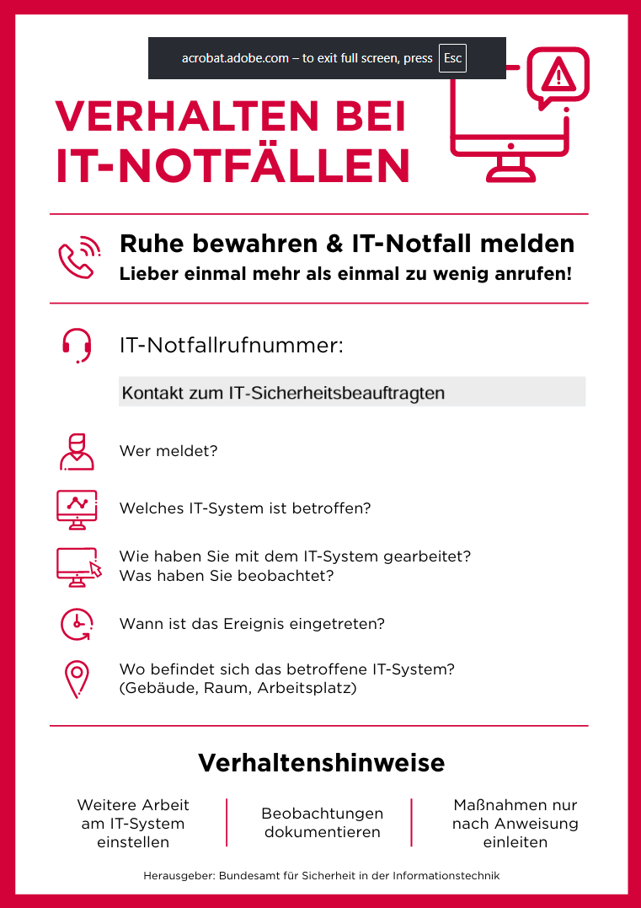

# 🐝 Philipp

Als Mitglied eines Incident-Response-Teams

möchte ich die grundlegenden Schritte im Umgang mit Schutzverletzungen kennen,

damit ich im Ernstfall schnell, strukturiert und korrekt handeln kann, um den Schaden zu minimieren.

# Celebration Criteria

- Wir können die Phasen eines typischen Incident-Response-Prozesses (z.B. Vorbereitung, Identifikation, Eindämmung, Beseitigung, Wiederherstellung, Lessons Learned) benennen.
- Wir können erklären, warum eine umgehende Meldung eines Sicherheitsvorfalls entscheidend ist.
- Wir können mindestens drei Sofortmaßnahmen nennen, die bei einer akuten Ransomware-Infektion an einem Arbeitsplatz ergriffen werden sollten.
- Wir können die Bedeutung der "Lessons Learned"-Phase für die zukünftige Verbesserung der IT-Sicherheit erklären.

# Wissens-Briefing

Trotz bester Vorsorge kann es zu einem Sicherheitsvorfall (Incident) kommen. Dann ist ein schnelles und planvolles Vorgehen entscheidend. Der Prozess der Reaktion wird als **Incident Response** bezeichnet.

## Typische Phasen nach einem Sicherheitsvorfall

1. **Vorbereitung (Preparation):** Diese Phase findet vor dem Vorfall statt. Hier werden Notfallpläne erstellt, Verantwortlichkeiten festgelegt und Mitarbeiter geschult.
2. **Identifikation (Identification):** Ein Vorfall wird erkannt und gemeldet. Es wird analysiert, um was für einen Vorfall es sich handelt (z.B. Malware, unautorisierter Zugriff).
3. **Eindämmung (Containment):** Die Ausbreitung des Schadens wird verhindert. Das betroffene System wird z.B. sofort vom Netzwerk getrennt.
4. **Beseitigung (Eradication):** Die Ursache des Vorfalls wird entfernt, z.B. wird die Schadsoftware vom System gelöscht.
5. **Wiederherstellung (Recovery):** Die betroffenen Systeme werden wieder in den Normalbetrieb überführt, z.B. durch das Einspielen eines sauberen Backups.
6. **Lessons Learned (Post-Incident Activity):** Nach dem Vorfall wird analysiert, was passiert ist, was gut und was schlecht gelaufen ist. Die Erkenntnisse fließen in die Verbesserung der Sicherheitsmaßnahmen und des Notfallplans ein.

Eine schnelle und ehrliche Kommunikation (intern an Mitarbeiter, extern an Kunden oder Behörden wie bei DSGVO-Verstößen) ist in allen Phasen kritisch für den Erfolg.

# Aufgaben

1. **Prozess visualisieren:** Erstellt einen einfachen Flowchart (Ablaufdiagramm) mit den 6 Phasen des Incident-Response-Prozesses. Nutzt dazu ein Online-Tool eurer Wahl.
2. **Rollenspiel "Ransomware-Alarm":** Simuliert folgende Situation als Rollenspiel: Ein Mitarbeiter der "KreativKopf GmbH" ruft panisch im IT-Helpdesk an, weil auf seinem Bildschirm eine Lösegeldforderung erschienen ist. Ein Teammitglied ist der Mitarbeiter, ein anderes der Helpdesk-Agent. Spielt das Gespräch durch. Welche drei Anweisungen muss der Helpdesk-Agent dem Mitarbeiter _sofort_ geben, um die Eindämmung (Containment) zu starten?
  1. Arbeit einstellen und nicht eigenmächtig Lösungen suchen, sowie Ruhe bewahren
  2. System isolieren (vom Netz nehmen) → Netzwerkkabel ziehen oder WiFi ausschalten
  3. Gerät nicht ausschalten
3. **Lessons Learned:** Bezieht euch auf das ursprüngliche Phishing-Szenario der "KreativKopf GmbH". Was wären die wichtigsten "Lessons Learned" aus diesem Vorfall? Listet mindestens drei konkrete Punkte auf, die in den Notfallplan oder die Sicherheitsrichtlinien des Unternehmens aufgenommen werden sollten.
  1. Mitarbeiterschulung!! und Sensibilisierung
  2. Einführung MFA → damit gestohlene Login-Daten nicht missbraucht werden können
  3. Phishing-Filter verbessern → Ursache bekämpfen, damit gar nicht erst Phishing Mails ankommen
4. **Recherche Meldepflicht:** Recherchiert, innerhalb welcher Frist ein relevanter Datenschutzvorfall nach DSGVO an die zuständige Aufsichtsbehörde gemeldet werden muss.→ Binnen **72 Std**. muss eine Meldung erfolgen

# Quellen und Vertiefung

**IT-Notfallkarte (BSI)**

- **Primärquelle:** Rheinwerk IT-Handbuch, Kapitel 22.7 "Incident Response – Reaktion auf Sicherheitsvorfälle"
- **Online-Ressource:** [BSI-Standard 200-4: Notfallmanagement](https://www.google.com/search?q=https://www.bsi.bund.de/SharedDocs/Downloads/DE/BSI/Grundschutz/BSI-Standards/BSI-Standard_200-4.pdf%3F__blob%3DpublicationFile).
- https://www.allianz-fuer-cybersicherheit.de/SharedDocs/Downloads/Webs/ACS/DE/Notfallkarte/One-Pager_Einstieg_ins_IT-Notfallmanagement_KMU.pdf?__blob=publicationFile&v=5