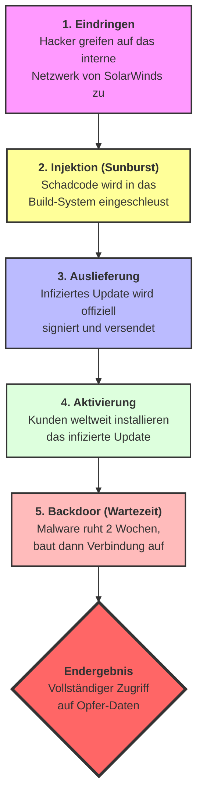

# Olena

Als Softwareentwickler

möchte ich die Mechanismen von Supply-Chain-Angriffen verstehen,

damit ich bei der Auswahl von externen Bibliotheken und Diensten die Risiken bewerten und sichere Entwicklungspraktiken anwenden kann.

# Celebration Criteria

- Wir können das Konzept eines Supply-Chain-Angriffs erklären.
- Wir können die Angriffe auf die Software-Lieferkette (z.B. kompromittierte Bibliothek) von Angriffen auf Dienstleister (z.B. kompromittierter IT-Dienstleister) unterscheiden.
- Wir können anhand eines realen Beispiels (SolarWinds oder Log4j) die immense Tragweite eines solchen Angriffs erläutern.
- Wir können den Zweck eines "Software Bill of Materials" (SBOM) als Abwehrmaßnahme erklären.

# Wissens-Briefing

Bei einem **Supply-Chain-Angriff** greift der Angreifer nicht sein eigentliches Ziel direkt an, sondern ein schwächeres Glied in dessen Lieferkette. Das Ziel ist es, das Vertrauensverhältnis zwischen dem Ziel und seinem Lieferanten auszunutzen, um so unbemerkt in die Systeme des Ziels zu gelangen.

**Zwei Haupttypen:**

1. **Angriff auf die Software-Lieferkette:** Der Angreifer schleust bösartigen Code in eine weit verbreitete Software-Komponente (z.B. eine Open-Source-Bibliothek) ein. Alle Entwickler, die diese kompromittierte Komponente in ihre eigene Software einbauen, verteilen unwissentlich die Schadsoftware an ihre eigenen Kunden.
  - **Beispiel Log4j (2021):** Eine extrem weit verbreitete Java-Bibliothek hatte eine kritische Sicherheitslücke, die es Angreifern erlaubte, aus der Ferne Code auf Servern auszuführen.
2. **Angriff auf Dienstleister:** Der Angreifer kompromittiert einen IT-Dienstleister (z.B. ein Systemhaus, einen Managed Service Provider), der Zugriff auf die Netzwerke vieler seiner Kunden hat. Über diesen vertrauenswürdigen Kanal kann der Angreifer dann in die Systeme der Kunden eindringen.
  - **Beispiel SolarWinds (2020):** Angreifer haben die Build-Umgebung der Firma SolarWinds kompromittiert und eine Backdoor in deren weit verbreitete Netzwerk-Management-Software "Orion" eingeschleust. Über ein reguläres Software-Update wurde diese Backdoor an tausende hochrangige Kunden (u.a. US-Ministerien) verteilt.

**Abwehrmaßnahmen:** Eine wichtige Maßnahme ist der **Software Bill of Materials (SBOM)**. Das ist eine "Stückliste" aller Software-Komponenten, aus denen eine Anwendung besteht. Im Falle einer neuer Schwachstelle wie bei Log4j kann ein Unternehmen so sofort prüfen, welche seiner Systeme betroffen sind.

# Aufgaben

**Diskussion:** Warum sind Supply-Chain-Angriffe so gefährlich und schwer zu erkennen? Brainstormt Gründe.  
 Digitale Signatur: Der Schadcode ist oft mit dem echten Zertifikat des Herstellers signiert. Er sieht also absolut legitim aus.

Versteckter Code: Die Manipulation passiert tief im „ der Software, nicht in der fertigen Oberfläche, die der Nutzer sieht.

Zeitverzögerung: Viele Angriffe (wie bei SolarWinds) haben eine „Schlafphase“. Sie werden erst Wochen nach der Installation aktiv, was die Rückverfolgung extrem erschwert.

1. **SBOM in der Praxis:** Stellt euch vor, ihr nutzt eine Webanwendung, die aus 20 verschiedenen Open-Source-Komponenten besteht. Eine Warnung über eine kritische Lücke in Komponente "X" wird veröffentlicht. Beschreibt, wie euch ein vorhandener SBOM bei der Reaktion auf diesen Vorfall helfen würde.  
   Was bringt ein SBOM?  
  Es ist wie eine Zutatenliste. Man sieht sofort, ob die betroffene Komponente "X" in der eigenen Software steckt, ohne den Code manuell durchsuchen zu müssen.  
   Eine SBOM (Software Bill of Materials) ist ein entscheidendes Werkzeug für das Risikomanagement. Im Falle einer Schwachstelle hilft sie uns wie folgt:  
  Sofortige Identifikation: Anstatt die Anwendung manuell zu analysieren, ermöglicht die SBOM einen automatisierten Abgleich mit Schwachstellen-Datenbanken. Wir stellen in Echtzeit fest, ob unsere Software betroffen ist.  
  Transparenz bei Abhängigkeiten: Viele Komponenten nutzen selbst wieder andere Bibliotheken. Eine SBOM macht diese "versteckten" Abhängigkeiten sichtbar. Wir sehen also, ob Komponente "X" tief in unserem System steckt.  
  Effiziente Risikobewertung: Sobald wir wissen, dass Komponente "X" vorhanden ist, können wir prüfen: Wird diese Funktion in unserer App überhaupt aktiv genutzt? Wenn ja, können wir gezielt einen Patch einspielen oder die Komponente vorübergehend deaktivieren.  
  Dokumentation: Wir können unseren Kunden oder Behörden sofort nachweisen, dass wir das Problem erkannt haben und bereits an einer Lösung arbeiten. Das schafft Vertrauen.

# Quellen und Vertiefung

- **Online-Ressource:** [BSI - Cyber-Sicherheitslagebild zur Software-Lieferkette (2022)](https://www.google.com/search?q=https://www.bsi.bund.de/SharedDocs/Downloads/DE/BSI/Lageberichte/Lagebild_Software_Lieferkette.pdf%3F__blob%3DpublicationFile)
- **Online-Ressource:** [Heise.de - Dossier zur Log4Shell-Sicherheitslücke](https://www.google.com/search?q=https://www.heise.de/thema/Log4Shell)