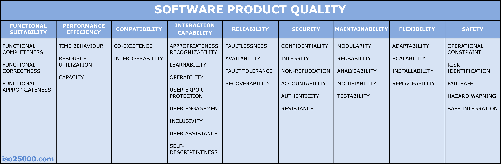

# LF5.1.3: Categorizing & Resolving Conflicts

Briefing

## 👤 User Story

> As a Requirements Engineer,  
> I want to classify extracted requirements and manage stakeholder conflicts,  
> so that I can structure them according to ISO/IEC 25010 and ensure all quality characteristics are met.

## 🥳 Celebration Criteria (Learning Objectives)

- I can **classify** requirements into Functional, Non-Functional, and Constraints. (K2)
- I **know how to apply** the ISO/IEC 25010 quality model to Non-Functional Requirements. (K3)
- I can **identify** conflicts between different requirement types. (K2)

## 🧠 Knowledge Briefing

Once extracted, requirements must be categorized.

### Requirement Categories:

- **Functional (FR):** Actions the system must perform (e.g., calculating, storing data).
- **Non-Functional (NFR):** Quality attributes of the system.
- **Constraints:** Non-negotiable limits (e.g., budget, specific OS, laws).

### Structuring NFRs (ISO/IEC 25010 Model):

- Performance Efficiency (Speed, resources)
- Compatibility (Co-existence)
- Usability (Learnability, user error protection)
- Reliability (Availability, fault tolerance)
- Security (Confidentiality, integrity)
- Maintainability (Modularity, testability)

### Conflicts:

Constraints (e.g., small budget) often clash with NFRs (e.g., high performance). These must be resolved early.

## ⚠️ Common Pitfalls

- Confusing Constraints with Non-Functional Requirements. A Constraint is forced upon you (e.g., "Must be written in Python"), while an NFR is a quality goal (e.g., "Must be easily readable code").

## 🛠️ Mandatory Tasks (K1 - K3)

1. Define Functional, Non-Functional, and Constraint requirement types in your own words. (K1)
2. Assign the following 3 examples to the correct type: A) The system calculates tax. B) The budget is 5000€. C) The system encrypts passwords. (K2)
3. List the main quality characteristics according to ISO/IEC 25010. (K1)
4. Map the vague customer statement "The software must be safe" to a specific ISO 25010 sub-characteristic. (K3)
5. Describe a typical conflict between a performance requirement and a budget constraint. (K2)

## 🔥 Optional Tasks (K4 - K6)

1. Analyze a scenario where two stakeholders have directly contradicting requirements regarding data visibility. (K4)
2. Propose a systematic conflict resolution strategy (e.g., Win-Win negotiation) for competing IT requirements. (K5)
3. Evaluate the long-term impact of ignoring Non-Functional Requirements (like Maintainability) early in the SDLC. (K5)

## 🕸️ Web Search Term Liste

| Topic / Term | Recommended Platform | Exact Search Term |
| --- | --- | --- |
| Types of Requirements | Google / YouTube | "Functional vs Non-Functional Requirements examples" |
| ISO/IEC 25010 Quality Model | Google | "ISO/IEC 25010 software quality characteristics" |
| Requirement Conflicts | Google | "Requirements engineering conflict resolution strategies" |

### M1: Define Functional, Non-Functional, and Constraint requirement types in your own words. (K1)

**Functional requirements (FR):** This is **_WHAT_** the system does.

**Non-Functional (NFR):** This is **_HOW WELL_** the system does its function.

**Constraint: _Limitations_** due to for example budget or technical limits.

---

### M2: Assign the following 3 examples to the correct type: A) The system calculates tax. B) The budget is 5000€. C) The system encrypts passwords. (K2)

- **A:** FR
- **B:** Constraint
- **C:** FR, could be NFR if defined “how well/strong” the encryption should be.

---

### M3: List the main quality characteristics according to ISO/IEC 25010. (K1)

1. Functional Suitability
2. Performance Efficiency
3. Compatibility
4. Usability
5. Reliability
6. Security
7. Maintainability
8. Portability

---

### M4: Map the vague customer statement "The software must be safe" to a specific ISO 25010 sub-characteristic. (K3)

6. Safety → Confidentiality, Resistance, Authenticity and/or Integrity

---

### M5: Describe a typical conflict between a performance requirement and a budget constraint. (K2)

Client wants extremely high performance but the budget constraint doesn’t allow for it.

---

### O1: Analyze a scenario where two stakeholders have directly contradicting requirements regarding data visibility. (K4)

As a strategy to motivate the employees, a regional manager wants to make sales data for all stores visible to all staff members from all regions. The data privacy officer submits his concern that according to DSGVO-Compliance only staff of the corresponding region should have access to their specific data.  
Both parties deliver reasonable arguments. But in the end adhering to data privacy laws should always take priority.

---

### O2: Propose a systematic conflict resolution strategy (e.g., Win-Win negotiation) for competing IT requirements. (K5)

1. **Make the conflict visible:** Present the requirements conflict objectively to all participating parties. Attach first, brief analysis and perhaps first ideas towards a suitable compromise.
2. **Discussion & Analysis:** Having an open negotiation with all stakeholders could yield more insight and possible conflict solutions.
3. **Use proven schemas:** Schemas or systems like for example “MuSCoW-Methode (Must / Should / Could / Won't)” help to define the best possible path.

---

### O3: Evaluate the long-term impact of ignoring Non-Functional Requirements (like Maintainability) early in the SDLC (System Development Life Cycle). (K5)

This would most likely lead to an early “death” of the software. → Missing “x-bilites” cause massive problems.