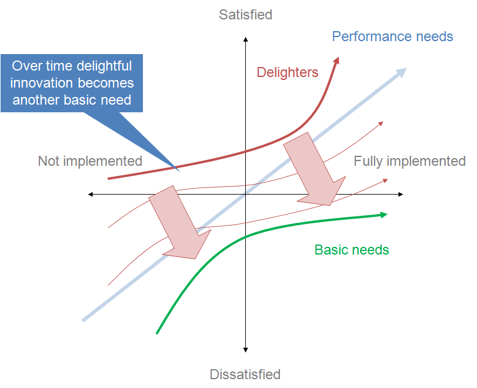

# LF5.1.5: Analog Mindmap & IREB Kano Model

Briefing

## 👤 User Story

> As a Product Owner,  
> I want to visualize requirements analogously and prioritize them using the Kano Model,  
> so that I can easily identify which features deliver the highest customer satisfaction.

## 🎉 Celebration Criteria (Learning Competencies)

- I can **define** the three main categories of the Kano Model. (K1)
- I **know how to draw** a structured analog mind map to visualize complex system areas. (K3)
- I can **prioritize** system features based on their impact on customer satisfaction. (K2)

## 🧠 Knowledge Briefing

Not all requirements are equally important. We need analog visualization and prioritization tools before digitizing.

### Analog mind mapping:

Using a whiteboard or paper allows for rapid, restriction-free brainstorming. It helps categorize chaotic thoughts into branches (e.g., Core -> User Roles -> Admin -> Permissions).

### The Kano Model:

Developed by Noriaki Kano, it categorizes features based on customer emotion:

- **Must-be (Basic):** Features taken for granted (e.g., brakes on a car). If missing, huge dissatisfaction. If present, no extra joy.
- **Performance (One-dimensional):** The more, the better (e.g., battery life). Directly proportional to satisfaction.
- **Excitement (Attractive):** Unexpected features (e.g., free chocolate in hotel room). If missing, no one cares. If present, huge joy.

## ⚠️ Common Pitfalls

- Assuming everything is a "Must-be" feature. If everything is top priority, nothing is top priority. Be ruthless in prioritizing.

## 🛠️ Mandatory Tasks (K1-K3)

1. Define the three main categories of the Kano Model (Basic, Performance, Excitement). (K1)
2. Draw a basic analog mind map structure outlining a simple software application (e.g., a calculator app). (K3)
3. Classify the feature "secure password login" within the Kano Model for a banking app. (K2)
4. Describe how drawing an analog mind map helps in breaking down complex topics visually compared to typing a list. (K2)
5. Construct a mind map branch specifically detailing "User Roles" for a generic e-commerce system. (K3)

## 🔥 Optional Tasks (K4-K6)

1. Analyze how a feature shifts from an "Excitement" factor to a "Basic" factor over time (e.g., Wi-Fi in hotels). (K4)
2. Evaluate the Kano Model's effectiveness in resolving backlog prioritization disputes between different stakeholders. (K5)
3. Design an interactive analog workshop concept using sticky notes to gather Kano feedback from real users. (K6)

## 🕸️ Web Search Term Liste

| Topic / Term | Recommended Platform | Exact Search Term |
| --- | --- | --- |
| Kano Model | YouTube | "Kano Model of Customer Satisfaction explained" |
| mind mapping Techniques | YouTube | "How to Mind Map for study and brainstorming":user |

:::warning
➕ Accurate classification of secure login as a Basic Factor.

➖ You structured your mindmap using a fully digital diagram-editor with perfect straight lines. The learning objective (K3) explicitly required drawing an _analog_ structure (using paper or a whiteboard) to practice physical, non-linear brainstorming and hand-to-brain cognitive learning.
:::

### M1: Define the three main categories of the Kano Model (Basic, Performance, Excitement). (K1)

**Basic / Must-be:** Functions/features that are expected from the customer. Their absence will cause dissatisfaction, while their existence will not necessarily bring satisfaction, as they are expected.

**Performance:** Functions/features that increase satisfaction proportionally to their quality and vice-versa.

**Excitement:** Unexpected functions/features that no one would miss. But their presence can raise satisfaction immensely.

---

### M2: Draw a basic analog mind map structure outlining a simple software application (e.g., a calculator app). (K3)

---

### M3: Classify the feature "secure password login" within the Kano Model for a banking app. (K2)

**Without a doubt → Basic / Must-be**

The customer would naturally expect for the banking to be secure and be outraged if they found out it wasn’t/isn’t.

---

### M4: Describe how drawing an analog mind map helps in breaking down complex topics visually compared to typing a list. (K2)

This form of visualization helps to already structure the ideas and elements as well as forming associations between them.

---

### M5: Construct a mind map branch specifically detailing "User Roles" for a generic e-commerce system. (K3)

---

### O1: Analyze how a feature shifts from an "Excitement" factor to a "Basic" factor over time (e.g., Wi-Fi in hotels). (K4)

Any “Exciter” will eventually become a “Basic need” within its lifetime, as long as it stays relevant that is. This process evolves quicker with more intense usage of said feature. “_The shiny new thing will end up being the next basis._” An almost natural process that’s found all over human society.

---

### O2: Evaluate the Kano Model's effectiveness in resolving backlog prioritization disputes between different stakeholders. (K5)

As the Kano Model bases its priority on **customer satisfaction**, different stakeholders can argue, analyse and discuss within this mutual framework.

---

### O3: Design an interactive analog workshop concept using sticky notes to gather Kano feedback from real users. (K6)

**Slip into the role of your customer and evaluate the features according to the Kano Model → Basic, Performance, Excitement**