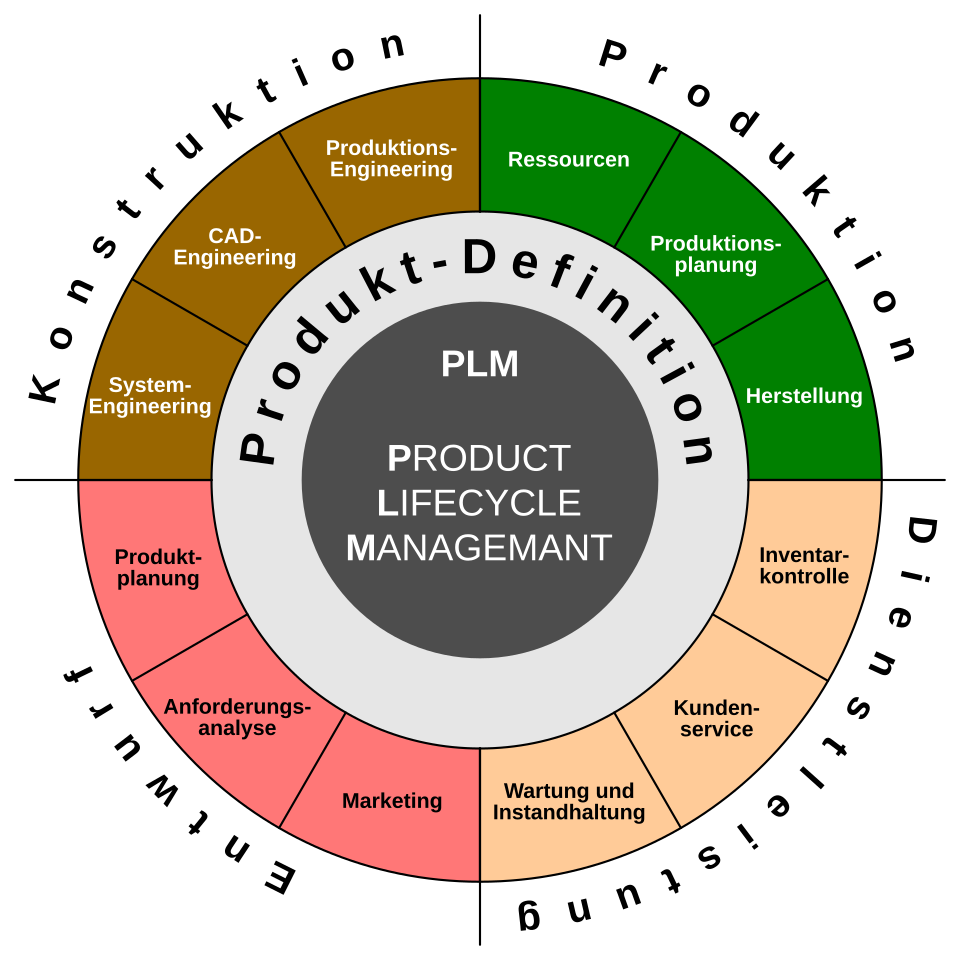

# LF6.3.1- Grundlagen des IT-Lebenszyklus

:::success
**Feedback**  
➕ Deine Rechnung in Aufgabe 2verdeutlicht gut, dass die Anschaffungskosten oft weniger als die Hälfte der Gesamtkosten ausmachen.

➕ Du hast den Unterschied zwischen technischer und wirtschaftlicher Lebensdauer genau erklärt.

❗Du hast „Updates/Patches“ der Phase Optimierung zugeordnet. In der IT-Praxis gehören reguläre Patches und die Wartung zum Betrieb. Die Optimierung bezieht sich eher auf größere Upgrades oder strukturelle Änderungen, um das System an neue Anforderungen anzupassen.
:::

Briefing

**Schätzung:** 5 SP

## 👤 User Story

**Als IT-Planer_in möchte ich das Konzept des IT-Lebenszyklus verstehen, damit ich den Einsatz von Ressourcen von der Planung bis zur Aussonderung wirtschaftlich steuern kann.**

## ✅ Celebration Criteria (Lernziele)

- Ich kann den Begriff "IT-Lebenszyklus" mit eigenen Worten erläutern. (K2)
- Ich kann die strategischen Phasen eines IT-Produktlebenszyklus beschreiben. (K2)
- Ich kann die Notwendigkeit eines Lebenszyklus-Managements für Unternehmen begründen. (K2)

## 🧠 Wissens-Briefing

- **Definition:** Der IT-Lebenszyklus umfasst die gesamte Zeitspanne, in der eine IT-Ressource für ein Unternehmen existiert.
- **Kernphasen:**
  1. **Planung/Analyse:** Bedarfsermittlung und Budgetierung.
  2. **Beschaffung:** Auswahl von Lieferanten und Kauf/Leasing.
  3. **Implementierung:** Vorbereitung und Rollout.
  4. **Betrieb:** Nutzung, Support und Wartung.
  5. **Optimierung:** Anpassung an neue Anforderungen.
  6. **Aussonderung:** Erneuerung und fachgerechte Entsorgung.
- Via Wikipedia (PLM):

## ⚠️ Typische Fallstricke & Impulsfragen

- **TCO-Blindheit:** Fokus nur auf den Kaufpreis. Oft werden Betriebskosten (Strom, Support, Entsorgung) unterschätzt. -> _Impuls:_ Was kostet ein PC über 3 Jahre wirklich, wenn man die Arbeitszeit der IT mit einrechnet?
- **Starre Planung:** Ein Lebenszyklus wird auf 5 Jahre geplant, obwohl die Software nach 2 Jahren höhere Hardware-Anforderungen stellt. -> _Impuls:_ Wie flexibel muss ein Lebenszyklus-Modell sein?

## 🛠️ Pflichtaufgaben (Training)

1. Erstelle eine Mindmap zum IT-Lebenszyklus für einen Server. (K3)  
  
  
  
    
  
2. Erläutere den Unterschied zwischen technischer und wirtschaftlicher Lebensdauer. (K2)  
  Wie die Bezeichnungen bereits erahnen lassen, beschreibt zum einen die technische Lebensdauer die Periode der (physikalischen) Funktionalität und zum anderen beschreibt die wirtschaftliche Lebensdauer die Phase der Rentabilität, also wie lange ein Produkt “Gewinn” erzielt.  
  
3. Ordne 5 Tätigkeiten (z. B. Preisvergleich, Software-Patch) den Lebenszyklus-Phasen zu. (K3)  
  1\. Planung und Analyse: → bspw. Lastenheft und Bedarfsermittlung  
  2\. Beschaffung: → bspw. Preisvergleiche  
  3\. Inbetriebnahme: → bspw. Anschluss, Einrichtung, Installation. (Alles irgendwie Synonyme)  
  4\. Optimierung: → bspw. Updates, Patches  
  5\. Aussonderung: → bspw. Recycling, sichere Datenvernichtung  
  
4. Beschreibe die Rolle des Datenschutzes am Ende des Lebenszyklus. (K2)  
  Der Datenschutz spielt bei der Aussonderung eine extrem wichtige Rolle! Da spbald ein System, welches u.U. sensible Daten führt aussortiert werden soll, so ist es möglich, dass diese Daten an unbefugte Dritte gelangen, falls diese nicht ordnungsgemäß und endgültig gelöscht werden.  
  
5. Liste 3 Gründe auf, warum ein Lebenszyklus vorzeitig enden könnte. (K2)  
  1\. Laufende Kosten steigen unerwartet oder sind im Laufe der Zeit im Verhältnis zu hoch geworden, so erreichen wir u.U. das Ende der wirtschaftlichen Lebensdauer.  
  2\. Das Gerät verliert seine Funktionalität durch einen Defekt oder mangelhafte Wartung.  
  3\. Eine unzureichende Planung und Analyse lässt das System ger nicht erst implementieren.

## ⭐ Freiwillige Zusatzaufgaben (Expertise)

1. Analysiere die Auswirkungen von "Green IT" auf den Lebenszyklus. (K4)  
  Geringerer Stromverbrauch und gesteigerte Effizienz halten die TCO niedriger und verlängern so den wirtschaftlichen Lebenszyklus.  
  Weiterhin ist natürlich eine längere Lebensdauer wünschenswert, um Ressourcen zu schonen.  
  
2. Berechne die TCO (Total Cost of Ownership) für einen Laptop über 4 Jahre. (K4)  
  Annahme: Ein Business-Laptop kostet **1.000 €** in der Anschaffung.
  
  | Kostenstelle | Jährliche Kosten | 4 Jahre | Summe |
  | --- | --- | --- | --- |
  | Anschaffung | Einmalig | 1.000 € | 1.000 € |
  | Software/Lizenzen | 150 € | 150 € × 4 | 600 € |
  | Support/IT-Admin | 200 € | 200 € × 4 | 800 € |
  | Strom/Energie | 50 € | 50 € × 4 | 200 € |
  | GESAMT (TCO) |     |     | 2.600 € |
  
3. Bewerte das Leasing-Modell im Vergleich zum Kauf hinsichtlich des Lebenszyklus. (K6)  
  Leasing ist problematisch, weil es zu unnötig frühen Neuanschaffungen anreizt, obwohl die technische Lebensdauer noch lange nicht am Ende ist. Hier ist m.M.n. der Anwendungszweck absolut ausschlaggebend und entscheidend. Wenn neue Hardware(-Innovationen) eine essenzielle Rolle spielen, so kann ein Leasing-Modell vorteilhaft sein oder sogar mit den üblichen 3 Jahren zu lang bemessen ist, wenn man immer an der “Bleeding-Edge” arbeitet. Am Ende bleibt nur zu hoffen, dass die “Altgeräte” ein zweites Leben bekommen.  
  

## 🔗 Quellen & Referenzen

### 📖 Literatur (Westermann, Rheinwerk)

- **Westermann LF6:** Kapitel 1.1 "Servicearten und Anforderungen".
- **Rheinwerk IT-Handbuch:** Kapitel "IT-Management und Organisation".

### 🔍 Web (Suchwortliste)

- **Lebenszyklus:** `IT Produktlebenszyklus Phasen`
- **Wirtschaftlichkeit:** `Total Cost of Ownership IT berechnen`