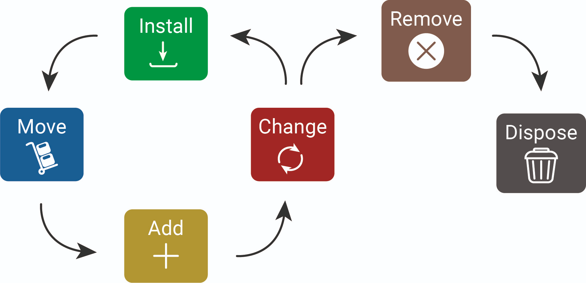

# LF6.3.2- Das IMAC-RD-Modell

:::warning
**Feedback**

➕ Deine Unterscheidung zwischen Imaging und Scripting/Autopilot ist fachlich auf einem sehr aktuellen Stand.

❗ Deine Liste ist ein guter Start. Denke bitte bei einem "Abteilungsumzug" aber auch an Details: Werden die Kabel beschriftet? Passt die Tischhöhe am neuen Ort? Werden die Monitore sicher in Boxen transportiert?

➖ Das Einfügen eines Links zu einer fremden Webseite ersetzt nicht die eigene Erstellung einer Visualisierung. In der Prüfung wird erwartet, dass du Informationen selbst aufbereitest.
:::

Briefing

**Schätzung:** 5 SP

## 👤 User Story

**Als IT-Techniker_in möchte ich das IMAC/RD-Modell operativ anwenden, damit alle Änderungen am Arbeitsplatz standardisiert dokumentiert werden.**

## ✅ Celebration Criteria (Lernziele)

- Ich kann die Abkürzung IMAC/RD vollständig auflösen und die Phasen erklären. (K2)
- Ich kann für jede Phase eine praktische Checkliste erstellen. (K3)
- Ich kann eine Serviceanfrage einer IMAC/RD-Phase zuordnen. (K3)

## 🧠 Wissens-Briefing

- **I (Install):** Erstinstallation.
- **M (Move):** Standortwechsel.
- **A (Add):** Hardware- oder Software-Erweiterung.
- **C (Change):** Konfigurationsänderung oder Austausch.
- **R (Remove):** Abbau und Rücknahme.
- **D (Dispose):** Datenlöschung und Entsorgung.

## ⚠️ Typische Fallstricke & Impulsfragen

- **Dokumentationsstau:** "M" (Move) wird durchgeführt, aber das Asset-System erst Tage später aktualisiert. -> _Impuls:_ Welche Folgen hat ein veralteter Standort in der CMDB für den Support?
- **Gefährliches "D":** Hardware wird entsorgt (Dispose), ohne dass die Löschung der Datenträger zertifiziert wurde. -> _Impuls:_ Wer haftet bei Datenverlust durch unsachgemäße Entsorgung?

## 🛠️ Pflichtaufgaben (Training)

1. Erstelle ein Plakat, das die IMAC/RD Phasen visualisiert. (K3)[https://orangecomputer.de/wp-content/uploads/2024/10/IT-Lifecycle-Management-IMAC-RD-Service-Modern-Workpla](https://orangecomputer.de/wp-content/uploads/2024/10/IT-Lifecycle-Management-IMAC-RD-Service-Modern-Workplace-OrangeComputer.jpg)
2. [ce-OrangeComputer.jpg](https://orangecomputer.de/wp-content/uploads/2024/10/IT-Lifecycle-Management-IMAC-RD-Service-Modern-Workplace-OrangeComputer.jpg)  
  
3. Entwirf eine Checkliste für die "Move"-Phase eines Abteilungs-Umzugs. (K3)  
  \- **Vorbereitung:** Identifikation aller Assets am alten, sowie u.U. am neuen Standort.  
  \- **Zielort-Check:** Sind am neuen Standort ausreichend Anschlüsse und Platz vorhanden?  
  \- **Transport:** Sicherer Abbau und verpackter Transport.  
  
4. Beschreibe den Prozessschritt "Datenlöschung" innerhalb der "Dispose"-Phase. (K2)  
  Bei der Datenlöschung ist es wichtig einige Dinge zu beachten (BSI-Richtlinie) und somit eine zertifizierte Löschung durchzuführen. Ein einfaches Löschen ist i.d.R. nicht ausreichend.  
  
5. Simuliere einen "Add"-Request für ein RAM-Upgrade: Welche Schritte sind nötig? (K3)  
  Bedarfsprüfung und Kompatibilitätscheck → Beschaffung → Einbau → Inbetriebnahme/Testen  
  
6. Erkläre, warum die "Remove"-Phase nicht das Ende des Prozesses ist. (K2)  
  Naja, wenn ich ein Gerät lediglich aus dem laufenden System/Kreislauf “entferne”, so ist es physisch noch vorhanden. Entweder wählt man anschließend Recycling, Repurposing oder Entsorgung.  
  

## ⭐ Freiwillige Zusatzaufgaben (Expertise)

1. Untersuche die Schnittstellen zwischen IMAC/RD und der Bestandsdatenbank (CMDB). (K4)  
  CMDB = Configuration Management Database = Bestandsdatenbank ist das Herzstück eines gut laufenden ITSM (IT-Service-Management). Hier muss alles dokumentiert werden, um Nachvollziehbarkeit und zuverlässiges Arbeiten zu gewährleisten.
  
  | IMAC/RD Phase | Aktion in der CMDB |
  | --- | --- |
  | Install | **Neues Configuration Item (CI)** wird angelegt (Seriennummer, Modell, Besitzer, Standort). |
  | Move | **Attribut „Standort“** wird im bestehenden CI aktualisiert. |
  | Add/Change | **Attribute** (z.B. RAM-Größe) **werden angepasst** oder eine **Beziehung** zu einer neuen Software-Lizenz wird **verknüpft**. |
  | Remove/Dispose | **Status** des CIs wird auf „**Inaktiv**“, „Ausgesondert“, „Gelöscht“, o.ä. gesetzt. |
  
2. Entwickle ein Konzept zur Automatisierung der "Install"-Phase. (K5)  
  _Nötige Bausteine:_  
  \- **PXE-Boot (Network Boot):** Der neue PC wird ans Netzwerk angeschlossen und zieht sich das Betriebssystem direkt von einem Server.\- **Software-Verteilung:** Ein System erkennt das neue Gerät und spielt automatisch die benötigte Software darauf, je nachdem, in welcher Abteilung der Nutzer arbeitet.\- **Imaging vs. Scripting:** _Imaging:_ Ein fertiges "Abbild" eines vorkonfigurierten PCs wird auf alle anderen kopiert. _Scripting/Autopilot:_ Ein unkonfiguriertes OS wird installiert und Skripte konfigurieren es im Nachhinein individuell.  
   _Konzeption/Schritte:_  
  \- **Basis-Image:** Enthält nur das Nötigste - Betriebssystem, Sicherheits-Updates und evtl. notwendige Treiber.\- **Automatisierungsschicht:** Sobald der Rechner bootet, erkennt ein System, in welcher Abteilung der Nutzer arbeitet.\- **Pakete:** Scripts oder Software-Verteilungstools "feuern" dann die spezifische Software ab – die Buchhaltung bekommt ihr ERP-System, das Marketing die Adobe Cloud.  
  
3. Beurteile das Risiko, wenn die "Remove"-Phase ohne Dokumentation erfolgt. (K6)  
  Dokumentationsloses “Entfernen” birgt zahlreiche Risiken. Die Nachvollziehbarkeit und Transparenz erlischt, was juristisch und legal fragwürdige Taten ermöglichen würde. Aber auch eine Verletzung des Datenschutzes stellt ein Risiko dar und aufgrund der mangelhaften oder fehlenden Dokumentation haftet man komplett und ausschließlich für die Strafe und den Schaden.  
  Weiterhin stört eine nicht ordnungsgemäß aktualisierte CMDB den Betriebsablauf erheblich. “Wir haben ja noch 10 Laptops! Aber wo sind sie?”

## 🔗 Quellen & Referenzen

### 📖 Literatur (Westermann, Rheinwerk)

- **Westermann LF6:** Kapitel 1.3 "Serviceanfragen entgegennehmen".
- **Rheinwerk:** Sektion "IT-Service-Management Prozesse".

### 🔍 Web (Suchwortliste)

- **Standard:** `IMAC/R/D Prozess Definition IT-Service`
- **Sicherheit:** `BSI Leitfaden Datenlöschung Hardware`