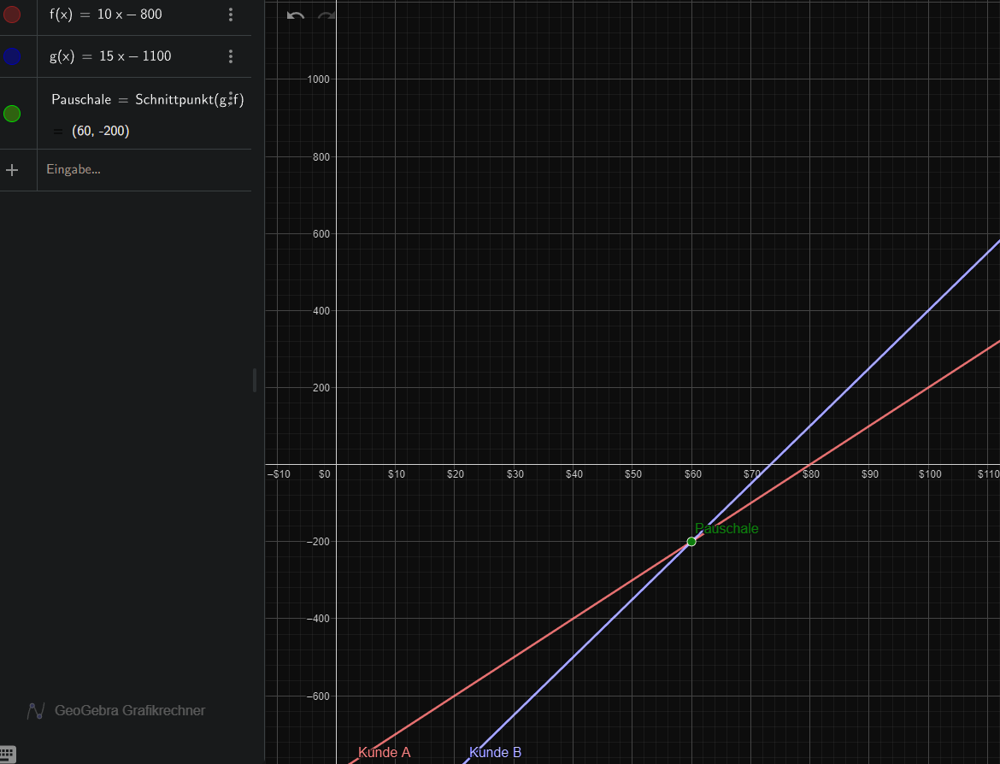

# M1.2.2- Lineare Gleichungssysteme verstehen

**Als** angehender Fachinformatiker

**möchte ich** die drei grundlegenden Lösungsverfahren für LGS (Einsetzung, Addition, Grafik) verstehen,

**um** Probleme mit zwei Unbekannten, wie Tarifvergleiche oder Hardware-Kalkulationen, systematisch angehen zu können.

# Celebration Criteria

1.  Wir können einem anderen Team die grundlegende Idee jedes der drei Lösungsverfahren erklären.
2.  Wir können das uns zugewiesene "Experten-Verfahren" auf die Beispielaufgabe anwenden und die Schritte nachvollziehbar präsentieren.

# Wissens-Briefing

- **Lineares Gleichungssystem (LGS):** Mindestens zwei lineare Gleichungen mit mindestens zwei gemeinsamen Unbekannten.

## Lösungsverfahren

- **Einsetzungsverfahren:** Eine Gleichung nach einer Variable auflösen und den resultierenden Term in die andere Gleichung einsetzen.
- **Additionsverfahren:** Die Gleichungen so umformen, dass bei Addition (oder Subtraktion) der beiden Gleichungen eine Variable wegfällt.
- **Grafisches Verfahren:** Beide Gleichungen als Geraden in ein Koordinatensystem zeichnen. Der Schnittpunkt ist die Lösung.

# Aufgaben

**Gemeinsame Problemstellung:**

Ein IT-Dienstleister berechnet seine Preise wie folgt: Die Einrichtung eines Netzwerks kostet eine einmalige Pauschale plus einen Betrag pro angeschlossenem Gerät.

- Kunde A zahlt für die Einrichtung und 10 Geräte insgesamt 800 €.  
    800 = y + 10x  
    y = 10x - 800
- Kunde B zahlt für die Einrichtung und 15 Geräte insgesamt 1.100 €.  
    1100 = y + 15x  
    y = 15x - 1100

Findet heraus, wie hoch die einmalige Pauschale und der Preis pro Gerät sind.

**Gruppenaufträge:**

- **Gruppe 1:** Löst das Problem mit dem **Einsetzungsverfahren**.Kunde A 10 Geräte 800€Kunde B 15 Geräte 1100€

x + 10y= 800

x = 800 - 10 y

2\. Gleichung einsetzen

(800 -10y) + 15y = 1100

800 + 5y = 1100

5y = 300

y= 300 / 5

y= 60€

x = 800 - 10 × 60

x = 800 - 600

x = 200€

Geräte = y =60€

Pauschale = x = 200€

- **Gruppe 2:** Löst das Problem mit dem **Additionsverfahren**.  
    E + 10G = 800  
    E + 15G = 1100  
    (E + 15G) - (E + 10G) = 1100 - 800  
    E + 15G - E - 10G = 300  
    15G - 10G = 300  
    5 G = 300  
    G = 60  
    —--------------------------------------------------------------------------------  
    E + 10G = 800  
    E + 10\*60 = 800  
    E = 800 - 600  
    E = 200  
    Antwort: Einrichtung kostet 200 Euro, Anschluss des Geräts kostet 60 Euro  
     
- **Gruppe 3:** Löst das Problem **grafisch**. Zeichnet die Geraden und findet den Schnittpunkt.  
    _In GeoGebra einsetzen:_ https://www.geogebra.org/

_Manuelle Methode:_

1.  Für eine Gleichung 2 verschiedene Werte für x einsetzen
2.  Nach y bzw. f(x) auflösen
3.  Die erhaltenen Punkte (x|y) im Koordinatensystem eintragen
4.  Die Punkte mit einer Linie verbinden
5.  Schritte 1-4 für den zusätzlichen Graphen bzw. Gleichung wiederholen

**Ziel:** Jede Gruppe stellt ihren Lösungsweg vor.

# Quellen & Vertiefung

- **Primärquelle:** Kersken, Sascha (2025). _IT-Handbuch für Fachinformatiker_ (12. Aufl.). Rheinwerk Verlag. (Kapitel 2.2.2, S. 65-67)
- **Sekundärquelle:** Wikipedia-Artikel zum Thema "[Lineares Gleichungssystem](https://de.wikipedia.org/wiki/Lineares_Gleichungssystem)"