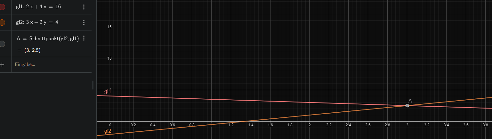

# M1.2.3- Lineare Gleichungssysteme anwenden

**Als** angehender Fachinformatiker

**möchte ich** für verschiedene Problemstellungen das am besten geeignete Lösungsverfahren für LGS auswählen und anwenden können,

**um** effizient und sicher die richtige Lösung zu finden.

# Celebration Criteria:

1.  Wir können unsere Wahl für ein bestimmtes Lösungsverfahren bei einer Aufgabe nachvollziehbar begründen.
2.  Wir können eine Textaufgabe, die zu einem LGS führt, vollständig lösen und einen Antwortsatz formulieren.

# Wissens-Briefing

## Wann welches Verfahren?

- **Einsetzungsverfahren:** Ideal, wenn eine Gleichung bereits nach einer Variable aufgelöst ist (z.B. `y = 2x + 3`).
- **Additionsverfahren:** Ideal, wenn die Koeffizienten einer Variable gleich oder entgegengesetzt sind (z.B. `3x` und `-3x`).
- **Grafisches Verfahren:** Gut zur Veranschaulichung und für eine schnelle Schätzung, aber oft ungenau für exakte Werte.

# Aufgaben

1.  **Begründung**  
    Welches Verfahren eignet sich am besten, um das folgende LGS zu lösen? Begründet kurz. I. `y = 4x - 5` II. `2y + 3x = 10`  
    _Einsetzungsverfahren eignet sich am besten, da “y” bereits vordefiniert ist:_  
    $2(4x - 5) + 3x = 10$$8x-10+3x=10$ | +10 | zsm.$11x = 20$ | ÷11$x = 1,81$  
    
2.  **Textaufgabe**  
    Zwei Server-Festplatten (eine SSD und eine HDD) haben zusammen eine Speicherkapazität von 3 TB (3000 GB). Die SSD hat 500 GB weniger Speicher als die HDD. Wie groß ist jede Festplatte? Löst die Aufgabe mit einem Verfahren eurer Wahl.x = SSDy = HDD

X + Y = 3000

X = Y - 500

( Y- 500) + Y = 3000

2y - 500 = 3000

2y = 3500

y = 1750

X = Y - 500 = 1750 - 500 = 1250

x = 1250 SSD

y = 1750 HDD

1.  **Freie Wahl**  
    Löst das folgende Gleichungssystem: I. `2x + 4y = 16` II. `3x - 2y = 4`

x = 3; y = 2,5

# Quellen & Vertiefung

- **Primärquelle:** Kersken, Sascha (2025). _IT-Handbuch für Fachinformatiker_ (12. Aufl.). Rheinwerk Verlag. (Kapitel 2.2.2, S. 65-67)
- **Sekundärquelle:** Lernvideo auf YouTube von "[Lehrer Schmidt](https://www.google.com/search?q=https://www.youtube.com/watch%3Fv%3D__g_v_55kM4)" zum Thema: Welches Verfahren wann nutzen?