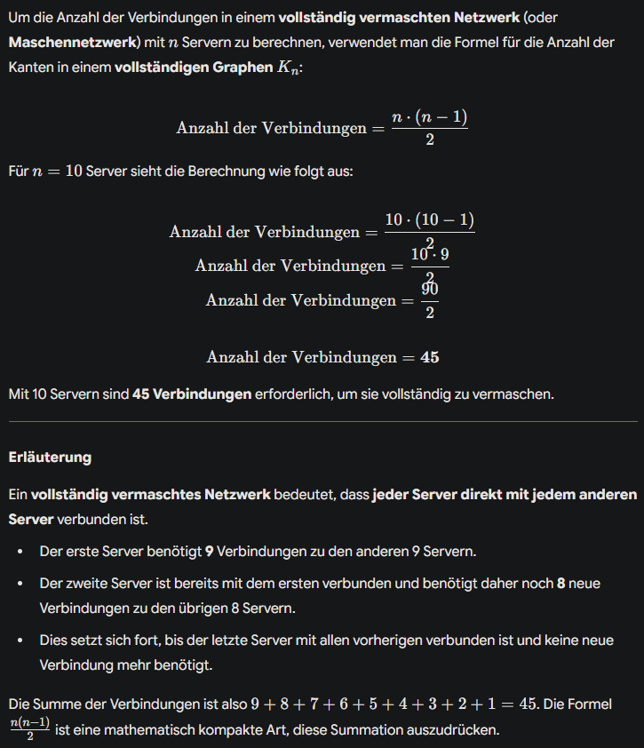

# Epic - Bearbeitung

**Als** angehende Fachinformatiker bei "Innovatec Solutions"

**möchten wir** quadratische Zusammenhänge erkennen und die entsprechenden Gleichungen sicher lösen können,

**um** physikalische Planungen wie die optimale Raumaufteilung oder die Analyse von Netzwerktopologien durchzuführen.

# Szenario

"Innovatec Solutions" baut ein neues Rechenzentrum. Ihr seid für die technische Planung mitverantwortlich. Der Serverraum soll eine Fläche von 24 m² haben, wobei eine Wand 2 Meter länger sein muss als die andere. Das Kernnetzwerk soll vollvermascht sein und benötigt exakt 66 Verbindungen.

# **Celebration Criteria**

1.  Wir können die exakten Maße für den neuen Serverraum berechnen, wenn die Gesamtfläche und ein bestimmtes Seitenverhältnis vorgegeben sind.
2.  Wir können die Anzahl der Knoten (Switches) in unserem neuen Netzwerk bestimmen, wenn die Gesamtzahl der Verbindungen bekannt ist.
3.  Wir können unsere Berechnung für die Raumplanung mit dem Satz von Vieta überprüfen und dem Team erklären, warum es zwei mathematische Lösungen gibt, aber nur eine im Kontext der Aufgabe sinnvoll ist.

# Abschlussaufgabe

## Planung einer Testumgebung

Ihr sollt eine neue, abgetrennte Testumgebung für Software-Entwickler planen.  
**PQ-Formel:** $x₁,₂ = -p/2 ± √((p/2)² - q)$

1.  **Raumaufteilung**  
    Für die Testumgebung wird ein rechteckiger Bereich mit einer Fläche von 35 m² benötigt. Aus baulichen Gründen muss die Längsseite des Bereichs 2 Meter länger sein als die Breitseite. Berechnet die genauen Abmessungen des Bereichs.  
     $x × (x+2) = 35$  
    $x²+2x+0=35$ **|-35**  
    $x²+2x-35=0$ ← **Normalform**  
    $x_1,\_2=-(2/2)\\pm\\sqrt{((2/2)²+35)}$  
    $x_1= -1-6 = -7$  
    $x_2=-1+6 = 5$  
     Antwort: _Die Lösungsmengen sind -7 und 5. Da eine Raumseite nicht negativ sein kann, ist die Lösung: Eine Raumseite_ **_7m lang_** _und die andere_ **_5m lang_**_. (7m×5m=35m²)_  
    
2.  **Netzwerkknoten**  
    Innerhalb dieser Umgebung sollen alle Test-Server über ein vollvermaschtes Netz direkt miteinander verbunden werden. Ein Kollege hat bereits 45 Netzwerkkabel bestellt, die dafür genau ausreichen sollen. Berechnet, wie viele Test-Server (Knoten) ihr in der Umgebung aufstellen könnt. (Formel: `Anzahl Verbindungen = (x² - x) / 2`).
    - Erläuterung: _Vollvermascht bedeutet, dass jeder Punkt mit jedem verbunden ist. Für die Formel heißt das: x = Server bzw. Knotenpunkt; → x × x bzw._ **_x²_** _verbindet_ **_jeden_** _Server_ **_mit jedem_**_. Allerdings auch mit sich selbst, daher müssen wir diese Verbindung abziehen, also →_ **_x² - x_**_. Allerdings wird noch_ **_JEDE_** _Verbindung “doppelt gezählt”:_ **_A zu B; und B zu A_**_; usw. → Also teilen wir durch 2. ⇒_ `(x² - x) ÷ 2`  
         $(x²-x) \\div 2 = 45$ **|×2**  
        $x²-x=90$ **|-90**  
        $x²-x-90=0$ **← Normalform**  
        $x_1,\_2=0,5 \\pm \\sqrt{(0,25+90)}$  
        $x_1= 0,5+9,5 = 10$  
        $x_2= 0,5- 9,5 =-9$  
         _Antwort: Die Lösungsmengen sind 10 und -9. -9 ist zwar mathematisch korrekt, für den Kontext aber irrelevant. Also können wir sagen, dass wir_ **_10 Server (Knoten)_** _mit genau 45 Verbindungen_ **_vollvermaschbar_** _sind._  
         _Optionale/weitere Erklärung (von Gemini):_  
        
3.  **Kontrolle**  
    Überprüft eure Berechnung aus Teil 1 mit dem Satz von Vieta und erklärt, warum eine der beiden rechnerischen Lösungen für die Seitenlänge physikalisch unmöglich ist.  
     $x_1=-7$; $x_2=5$  
    Normalform: $x²+2x-35=0$  
     $\-p=-7+5=-2→-(-)2=2$✅  
    $q=-7 \\cdot 5 = -35$✅_Antwort: Wie schon in Aufgabe 1 beschrieben,_ **_kann eine Wand bzw. Seitenlänge eines physikalischen Raumes nicht negativ (-7) sein_**_. Also nutzen wir einfach die_ **_Gegenzahl: 7_**_. Mit ihr geht die Rechnung für die Raumfläche dann auch im physikalischen Sinne auf._