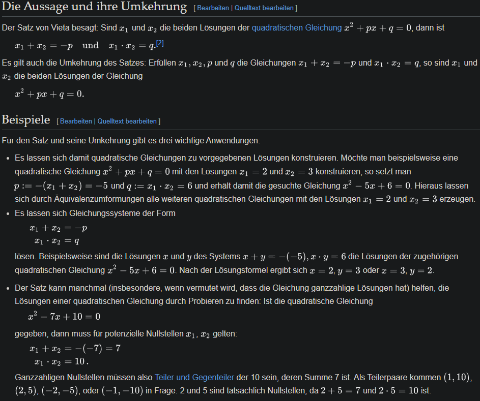

# Bearbeitung - Philipp

**Als** angehender Fachinformatiker

**möchte ich** den Satz von Vieta anwenden können,

**um** meine Lösungen zu überprüfen und einfache Gleichungen schneller zu lösen und meine Rechenwege abzusichern und ein tieferes Verständnis für die Struktur von quadratischen Gleichungen zu entwickeln.

# Celebration Criteria:

1.  Wir können mit dem Satz von Vieta überprüfen, ob eine berechnete Lösung für eine quadratische Gleichung korrekt ist.
2.  Wir können aus zwei gegebenen Lösungen die zugehörige quadratische Gleichung in Normalform konstruieren.

# Wissens-Briefing

## Satz von Vieta

Gilt für die Normalform `x² + px + q = 0`.

- `x₁ + x₂ = -p`
- `x₁ * x₂ = q`  
    

## Anwendung 1 (Probe)

Man rechnet die Lösung mit p-q-Formel aus und prüft, ob die Summe und das Produkt der Lösungen zu -p und q passen.

## Anwendung 2 (Konstruktion)

Gegeben sind `x₁=2` und `x₂=3`.

- `-p = 2 + 3 = 5` => `p = -5`
- `q = 2 * 3 = 6`
- Die Gleichung lautet: `x² - 5x + 6 = 0`

# Aufgaben

1.  Die Lösungen einer Gleichung sind `x₁=4` und `x₂=5`. Wie lautet die Gleichung in Normalform?  
     $-p = 4 + 5 = -9$  
    $q = 4 × 5 = 20$  
     $x^2-9x+20 = 0$  
    
2.  Überprüfe mit dem Satz von Vieta, ob `x₁=2` und `x₂=-7` die Lösungen für `x² + 5x - 14 = 0` sind.  
    
    +++ columnContainer +++
    +++ column +++
    $-p = 2+(-7)$  
    $-5=2-7 -> -5 =-p=5=p$✅
    +++ end:column +++
    
    +++ column xs:12 md:0 lg:0 +++
    $q = 2 × (-7)$  
    $-14= 2 × (-7)$✅
    +++ end:column +++
    +++ end:columnContainer +++
    
      
    
3.  Finde die Lösungen für `x² - 7x + 10 = 0` durch "scharfes Hinsehen" (Kopfrechnen) mit dem Satz von Vieta.  
     
    
    +++ columnContainer +++
    +++ column xs:12 md:0 lg:0 +++
    $7=x1+x2$
    +++ end:column +++
    
    +++ column xs:12 md:0 lg:0 +++
    $10=x1×x2$
    +++ end:column +++
    +++ end:columnContainer +++
    

x1 = 2  
x2 = 5

# Quellen & Vertiefung

- **Primärquelle:** Kersken, Sascha (2025). _IT-Handbuch für Fachinformatiker_ (12. Aufl.). Rheinwerk Verlag. (Kapitel 2.2.3, S. 68)
- **Sekundärquelle:** Wikipedia-Artikel zum Thema "[Satz von Vieta](https://de.wikipedia.org/wiki/Satzgruppe_von_Vieta)"