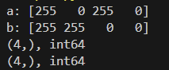

# M5.1.1: Daten mappen (Der Vektorraum)

<details>
<summary>Briefing</summary>

**Schätzung:** 3 SP

## 👤 User Story

> Als angehende\*\_r Data Scientist\*\_in  
> möchte ich reale Objekte in mathematische Vektoren übersetzen,  
> damit ich diese computergestützt verarbeiten kann."

## 🎉 Celebration Criteria (Lernziele)

- Ich kenne die Definition des Vektorraums $\\mathbb{R}^n$ und den Unterschied zu einer einfachen Python-Liste (K2).
- Ich kann Anwendungsdaten (Bilder, Attribute) korrekt in Spaltenvektoren überführen (Feature Engineering) (K3).
- Ich verstehe, warum die Dimension $n$ und die Reihenfolge der Komponenten für die Bedeutung des Vektors entscheidend sind (K2).

## 🧠 Wissens-Briefing

In der Informatik ist ein Vektor ein Element des Vektorraums $\\mathbb{R}^n$ , also eine geordnete Liste von $n$ reellen Zahlen.

- **Notation:** $\\vec{v} \\in \\mathbb{R}^n$ . Ein Vektor $\\vec{x} = (x_1, ..., x_n)^T$ repräsentiert einen Datenpunkt.
- **Semantik:** Jede Dimension (Komponente) steht für ein "Feature" (Merkmal).
  - _Beispiel Kunde:_ Dimension 1 = Alter, Dimension 2 = Umsatz. $\\vec{k} = (30, 500)^T$ .
  - _Beispiel Bild:_ Dimension 1 bis $n$ \= Pixel-Helligkeitswerte.
- **Python:** Wir nutzen Listen oder `numpy.array`. Wichtig: Ein Vektor hat mathematische Eigenschaften (Rechenregeln), die eine Liste nicht hat.

## ⚠️ Typische Fallstricke

- **Dimension Mismatch:** Versuchen, Vektoren unterschiedlicher Länge (z.B. $\\mathbb{R}^3$ und $\\mathbb{R}^4$ ) zu vergleichen – das ist mathematisch nicht definiert.
- **Einheiten-Mix:** Wenn Dimension 1 "Jahre" und Dimension 2 "Euro" sind, ist der Vektor geometrisch schwer zu interpretieren (Skalierungsproblem).
- **Listen vs. Arrays:** In Python addiert `+` bei Listen die Elemente aneinander (Konkatenation), statt mathematisch zu addieren.

## 🛠️ Pflichtaufgaben (Bloom K2 & K3)

1. **Objekt-Analyse (Analog):** Wähle ein beliebiges Alltags-Objekt (z.B. eine Immobilie). Definiere einen Vektor mit 3 Dimensionen ( $x_1, x_2, x_3$ ), der dieses Objekt beschreibt (K3). Nenne die Bedeutung, die Einheit und den Wertebereich für jede Dimension schriftlich (K2).
2. **Modellierung (Analog):** Stelle dir ein simples Schwarz-Weiß-Icon der Größe 2x2 Pixel vor. Oben ist alles weiß, unten alles schwarz. Modelliere dies als Vektor $\\vec{b} \\in \\mathbb{R}^4$ (mit Werten 0 und 255) und notiere ihn in korrekter mathematischer Spaltenschreibweise (K3).
3. **Python-Check:** Implementiere eine Python-Funktion `create_data_vector(feature_list)`, die aus einer beliebigen Liste von Zahlen einen Vektor (als Liste) zurückgibt (K3). Prüfe in der Funktion mittels `isinstance`, ob alle Einträge wirklich Zahlen (`int` oder `float`) sind (K4).
4. **Encoding (Analog):** Transformiere die Wochentage "Montag" bis "Sonntag" mittels des "One-Hot-Encoding"-Verfahrens in Vektoren des $\\mathbb{R}^7$ (K3). Schreibe den Vektor für "Mittwoch" konkret auf (K2).
5. **Analyse (Analog):** Betrachte die Vektoren $\\vec{a} = (1, 5)^T$ und $\\vec{b} = (5, 1)^T$ in einem fiktiven Kontext "Berufserfahrung in Jahren" vs. "Anzahl Zertifikate". Erkläre schriftlich den qualitativen Unterschied zwischen Person A und Person B (K4).

## 🔥 Freiwillige Zusatzaufgaben (Bloom K3-K5)

1. Recherchiere den Begriff "Sparse Vector" (dünnbesetzter Vektor) im Kontext von großen Empfehlungssystemen (z.B. Netflix) und erkläre, warum diese Speicherform effizienter ist (K4).
2. Nutze die Python-Bibliothek `numpy`, um die Vektoren aus Aufgabe 2 technisch korrekt zu instanziieren, und gib deren Attribute `.shape` und `.dtype` auf der Konsole aus (K3).
3. Berechne theoretisch, wie viele Dimensionen ein Vektorraum haben müsste, um ein Full-HD Farbbild (1920x1080 Pixel, 3 Farbkanäle RGB) vollständig als einen einzigen Vektor abzubilden (K4).

## 📚 Quellen & Referenzen

**8.1 Buch:** IT-Handbuch, Kap. "Mathematische Grundlagen" (Abschnitt Lineare Algebra / Vektorrechnung).

**8.2 Web:**

| Thema | Suchbegriff (Google/Studyflix/Wikipedia) |
| --- | --- |
| Grundlagen | Vektorraum Definition Informatik |
| Modellierung | Feature Vector Machine Learning |
| Encodierung | One Hot Encoding Erklärung |

</details>

### P1: Objekt-Analyse (Analog)

Wähle ein beliebiges Alltags-Objekt (z. B. eine Immobilie). Definiere einen Vektor mit 3 Dimensionen ( $x_1, x_2, x_3$ ), der dieses Objekt beschreibt (K3). Nenne die Bedeutung, die Einheit und den Wertebereich für jede Dimension schriftlich (K2).

| Objekt | Dimension | Beschreibung | Einheit | Wertebereich |
| --- | --- | --- | --- | --- |
| Datenzentrum | $x_1$ | Bauzeit | In Monaten | $\\mathbb{N}$ |
| $x_2$ | Stromverbrauch | Kilowattstunden | $\\mathbb{Q}$ (nicht erst ab 0, da rein theoretisch mittels Solar o.ä. ein negativer Stromverbrauch entstehen KÖNNTE) |
| $x_3$ | “Leistung” | Gigabit | $\\mathbb{N}\_0$ |

Beispiel: “Zentrum-X”

$\\vec{v} = \\begin{pmatrix} x_1 \\\\ x_2 \\\\ x_3 \\end{pmatrix}$ $\\vec{v}\_{ZenX} = \\begin{pmatrix} 8 \\\\ 15000 \\\\ 900 \\end{pmatrix}$

---

### P2: Modellierung (Analog)

Stelle dir ein simples Schwarz-Weiß-Icon der Größe 2x2 Pixel vor. Oben ist alles weiß, unten alles schwarz. Modelliere dies als Vektor $\\vec{b} \\in \\mathbb{R}^4$ (mit Werten 0 und 255) und notiere ihn in korrekter mathematischer Spaltenschreibweise (K3).

$\\vec{b} \\in \\mathbb{R}^4 = (x_1, x_2, x_3, x_4)^T=(255, 255, 0, 0)^T$

---

### P3: Python-Check

Implementiere eine Python-Funktion `create_data_vector(feature_list)`, die aus einer beliebigen Liste von Zahlen einen Vektor (als Liste) zurückgibt (K3). Prüfe in der Funktion mittels `isinstance`, ob alle Einträge wirklich Zahlen (`int` oder `float`) sind (K4).

```python
def create_data_vector(feature_list):
    for x in feature_list:
        if not isinstance(x, (int, float)):
            print(f"Ungültiger Datensatz. Nur int oder float erlaubt. Gefunden: {x} = {type(x)}")
            return "Fehler: Kein Vektor erstellt."
    return feature_list

a = [1, 2, 8, 14, "10"]
b = [3, 4]
print(create_data_vector(a + b))
```

---

### P4: Encoding (Analog)

Transformiere die Wochentage "Montag" bis "Sonntag" mittels des "One-Hot-Encoding"-Verfahrens in Vektoren des $\\mathbb{R}^7$ (K3). Schreibe den Vektor für "Mittwoch" konkret auf (K2).

Reihenfolge: Mo, Di, Mi, Do, Fr, Sa, So

$\\vec{v}\_{Mi} = (0, 0, 1, 0, 0, 0, 0)^T$

---

### P5: Analyse (Analog)

Betrachte die Vektoren $\\vec{a}=(1,5)^T$ und $\\vec{b}=(5,1)^T$ in einem fiktiven Kontext "Berufserfahrung in Jahren" vs. "Anzahl Zertifikate". Erkläre schriftlich den qualitativen Unterschied zwischen Person A und Person B (K4).

Bei gleicher Gewichtung der zwei Merkmale, herrscht hier ein Equilibrium, da die Beträge beider Vektoren identisch sind.  
Durch die Vektorisierung der Daten kann allerdings “sogar eine Maschine” evaluieren, welche Person für welche Stelle wohl besser geeignet ist. Person A hat zwar nur 1 Jahr Erfahrung, zeigt aber viel Potenzial und Lernbereitschaft mit den 5 Zertifikaten → Junior Position mit Luft nach oben; Person B ist weitaus erfahrener und spezialisierter mit 5 Jahren Praxis und einem Zertifikat → Senior Position mit Fokus auf Praxis.

---

### Z1: Sparse Vector Recherche

Recherchiere den Begriff "Sparse Vector" (dünnbesetzter Vektor) im Kontext von großen Empfehlungssystemen (z. B. Netflix) und erkläre, warum diese Speicherform effizienter ist (K4).

Riesige Datenmengen (Tausende Produkte) mit kleinen Samplings (Kunde kauft nur bestimmtes, weniges) → es entstünden extrem viele Nullen, die alle gespeichert werden müssten. Daher gibt man dem System bloß die Positionen an denen KEINE Null steht.

---

### Z2: NumPy Umsetzung

Nutze die Python-Bibliothek `numpy`, um die Vektoren aus Aufgabe 2 technisch korrekt zu instanziieren, und gib deren Attribute `.shape` und `.dtype` auf der Konsole aus (K3).

```python
import numpy as np

# Aus aufg. 2 - 255 weiß, 0 schwarz
a = np.array([255, 0, 255, 0])
print("a:", a)
b = np.array([255, 255, 0, 0])
print("b:", b)

print(f"{a.shape}, {a.dtype}")
print(f"{b.shape}, {b.dtype}")
```



---

### Z3: Dimensionale Berechnung

Berechne theoretisch, wie viele Dimensionen ein Vektorraum haben müsste, um ein Full-HD Farbbild (1920x1080 Pixel, 3 Farbkanäle RGB) vollständig als einen einzigen Vektor abzubilden (K4).

$1920×1080×3=6220800$ ca. 2Mio Pixel, die mit 3 Farbkanälen gefüttert werden müssen.

---