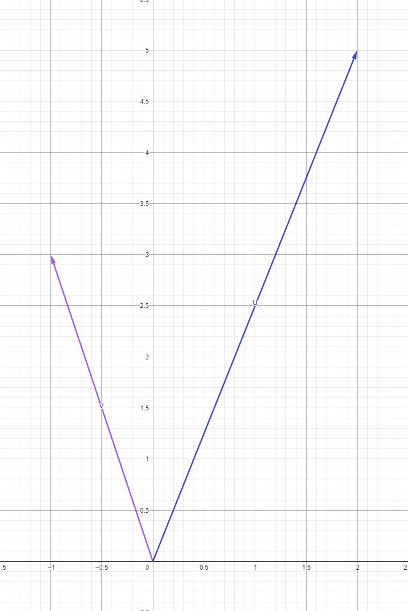

# M5.1.2- Rechnen im Raum

<details>
<summary>Briefing</summary>

Schätzung:3 SP

## 👤 User Story

> Als Entwickler\*in  
> möchte ich Vektoren mathematisch addieren und skalieren,  
> um Datensätze zu mischen oder zu gewichten.

## 🎉 Celebration Criteria

- Ich kann die Vektoraddition und die S-Multiplikation (Skalierung) sicher berechnen (K3).
- Ich kann die geometrische Bedeutung (Verschiebung, Streckung, Richtungsumkehr) visualisieren (K3).
- Ich kann diese Operationen in Python algorithmisch (ohne Libraries) umsetzen (K3).

## 🧠 Wissens-Briefing

- **Addition:** $\\vec{a} + \\vec{b}$ erfolgt komponentenweise. Geometrisch entspricht dies dem Aneinanderhängen von Pfeilen (Kräfteparallelogramm).
  - _Anwendung:_ Überlagerung von Signalen oder Mischung von Farbwerten.
- **Skalare Multiplikation:** $\\lambda \\cdot \\vec{a}$ . Jede Komponente wird mit der Zahl $\\lambda$ multipliziert.
  - _Anwendung:_ Lautstärke erhöhen (Skalierung > 1), Dämpfung (Skalierung < 1), Invertierung (Skalierung < 0).

## ⚠️ Typische Fallstricke

- **Verwechslung:** Skalarprodukt (Vektor mal Vektor) vs. S-Multiplikation (Zahl mal Vektor).
- **Vorzeichenfehler:** Beim Multiplizieren mit negativen Skalaren (\$\\lambda < 0\$) wird oft vergessen, dass sich die Richtung des Vektors umdreht (Punktspiegelung am Ursprung).

## 🛠️ Pflichtaufgaben (Bloom K2-K3)

1. **Rechnen (Analog):** Berechne handschriftlich das Ergebnis der Linearkombination $2 \\cdot \\vec{u} - \\vec{v}$ für die Vektoren $\\vec{u} = (2, 5)^T$ und $\\vec{v} = (-1, 3)^T$ (K3). Gib jeden Zwischenschritt an (K2).
2. **Zeichnen (Analog):** Zeichne die Vektoren $\\vec{u}$ und $\\vec{v}$ aus Aufgabe 1 sowie den Ergebnisvektor der einfachen Addition $\\vec{u} + \\vec{v}$ maßstabsgetreu in ein rechtwinkliges Koordinatensystem (Kopf-an-Fuß-Regel) (K3).
3. **Algorithmus (Python):** Entwickle eine Python-Funktion `vec_add(v1, v2)`, die zwei Listen gleicher Länge empfängt, sie komponentenweise addiert und eine Fehlermeldung (`ValueError`) wirft, falls die Längen nicht übereinstimmen (K3).
4. **Transfer (Analog):** Berechne das mathematische Misch-Ergebnis zweier RGB-Lichtquellen. Licht A ist definiertes Rot $\\vec{a}=(100, 0, 0)^T$ , Licht B ist Dunkelgrün $\\vec{b}=(0, 50, 0)^T$ . Notiere den Ergebnisvektor (K3).
5. **Interpretation (Analog):** Ein Objekt bewegt sich in einer 3D-Simulation mit dem Geschwindigkeitsvektor $\\vec{v}$ . Beschreibe in Worten, was physikalisch mit der Bewegung passiert, wenn der Vektor mit dem Skalar $\-0.5$ multipliziert wird (Bezug auf Richtung und Tempo) (K4).

## 🔥 Freiwillige Zusatzaufgaben (Bloom K3-K5)

1. Löse das inverse Problem (Linearkombination): Finde durch Probieren oder Rechnen die Zahlen $x$ und $y$ , sodass $x \\cdot (1,0)^T + y \\cdot (0,1)^T = (3,4)^T$ ergibt (K4).
2. Implementiere die Funktion `vec_scale(scalar, vector)` in Python rein nativ (ohne Numpy), die eine neue skalierte Liste zurückgibt (K3).
3. Beweise formal unter Nutzung der Rechenregeln für reelle Zahlen, dass für die Vektoraddition das Kommutativgesetz gilt: $\\vec{a} + \\vec{b} = \\vec{b} + \\vec{a}$ (K5).

## 📚 Quellen & Referenzen

**8.1 Buch:**

- IT-Handbuch, Kap. "Mathematische Grundlagen" (Vektoroperationen).

**8.2 Web:**

| Thema | Suchbegriff (Google/Studyflix/Wikipedia) |
| --- | --- |
| Operationen | Vektoraddition Rechenregeln |
| Geometrie | Vektoren skalieren grafisch |
| Physik | Kräfteparallelogramm Vektoren |

</details>

### P1: Rechnen (Analog)

Berechne handschriftlich das Ergebnis der Linearkombination $2 \\cdot \\vec{u} - \\vec{v}$ für die Vektoren $\\vec{u} = \\begin{pmatrix} 2 \\\\ 5 \\end{pmatrix}$ und $\\vec{v} = \\begin{pmatrix} -1 \\\\ 3 \\end{pmatrix}$ (K3). Gib jeden Zwischenschritt an (K2).

$2× \\begin{pmatrix} 2 \\\\ 5 \\end{pmatrix}= \\begin{pmatrix} 4 \\\\ 10 \\end{pmatrix}$

$\\begin{pmatrix} 4 \\\\ 10 \\end{pmatrix} - \\begin{pmatrix} -1 \\\\ 3 \\end{pmatrix} = \\begin{pmatrix} 5 \\\\ 7 \\end{pmatrix}$

---

### P2: Zeichnen (Analog)

Zeichne die Vektoren $\\vec{u}$ und $\\vec{v}$ aus Aufgabe 1 sowie den Ergebnisvektor der einfachen Addition $\\vec{u} + \\vec{v}$ maßstabsgetreu in ein rechtwinkliges Koordinatensystem (Kopf-an-Fuß-Regel) (K3).



---

### P3: Algorithmus (Python)

Entwickle eine Python-Funktion `vec_add(v1, v2)`, die zwei Listen gleicher Länge empfängt, sie komponentenweise addiert und eine Fehlermeldung (`ValueError`) wirft, falls die Längen nicht übereinstimmen (K3).

```python
def vec_add(v1, v2):
    if len(v1) != len(v2):
        raise ValueError("Vektoren müssen die gleiche Länge haben.")
    return [a + b for a, b in zip(v1, v2)]
    
if __name__ == "__main__":
    v1 = [2, 5]
    v2 = [-1, 3]
    result = vec_add(v1, v2)
    print(result)
```

---

### P4: Transfer (Analog)

Berechne das mathematische Misch-Ergebnis zweier RGB-Lichtquellen. Licht A ist definiertes Rot $\\vec{a} = \\begin{pmatrix} 100 \\\\ 0 \\\\ 0 \\end{pmatrix}$, Licht B ist Dunkelgrün $\\vec{b} = \\begin{pmatrix} 0 \\\\ 50 \\\\ 0 \\end{pmatrix}$. Notiere den Ergebnisvektor (K3).

Lichtfarben wie hier nutzen im Gegenzug zu CMYK (Druckfarben) das additive Farbmischsystem. Demnach werden die Vektoren einfach addiert:

$\\vec{a}+\\vec{b} = \\begin{pmatrix} 100 \\\\ 50 \\\\ 0 \\end{pmatrix}$ → Licht C (Braun)

---

### P5: Interpretation (Analog)

Ein Objekt bewegt sich in einer 3D-Simulation mit dem Geschwindigkeitsvektor $\\vec{v}$. Beschreibe in Worten, was physikalisch mit der Bewegung passiert, wenn der Vektor mit dem Skalar -0.5 multipliziert wird (Bezug auf Richtung und Tempo) (K4).

Das Objekt ändert seine Richtung in die entgegengesetzte Richtung (180°) und bewegt sich nur noch mit halber Geschwindigkeit.

---

### Z1: Löse das inverse Problem (Linearkombination)

Finde durch Probieren oder Rechnen die Zahlen $x$ und $y$, sodass $x \\cdot \\begin{pmatrix} 1 \\\\ 0 \\end{pmatrix} + y \\cdot \\begin{pmatrix} 0 \\\\ 1 \\end{pmatrix} = \\begin{pmatrix} 3 \\\\ 4 \\end{pmatrix}$ ergibt (K4).

Ist auf den ersten Blick erkennbar: $x=3$und $y=4$

---

### Z2: Implementiere die Funktion vec_scale

Implementiere die Funktion `vec_scale(scalar, vector)` in Python rein nativ (ohne Numpy), die eine neue skalierte Liste zurückgibt (K3).

```python
def vec_scale(v, scalar):
    return [scalar * a for a in v]
```

---

### Z3: Beweise formal

Beweise formal unter Nutzung der Rechenregeln für reelle Zahlen, dass für die Vektoraddition das Kommutativgesetz gilt: $\\vec{a} + \\vec{b} = \\vec{b} + \\vec{a}$ (K5).

$\\begin{pmatrix} a_1 + b_1 \\\\ a_2 + b_2 \\end{pmatrix} = \\begin{pmatrix} b_1 + a_1 \\\\ b_2 + a_2 \\end{pmatrix}$\=> $\\begin{pmatrix} 2 + 3 \\\\ 1 + 4 \\end{pmatrix} = \\begin{pmatrix} 3 + 2 \\\\ 4 + 1 \\end{pmatrix} = \\begin{pmatrix} 5 \\\\ 5 \\end{pmatrix}$

---