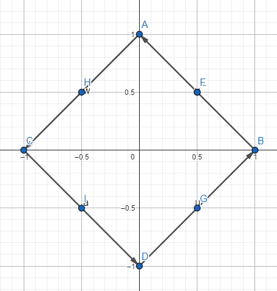

# M5.1.3- Distanz messen

<details>
<summary>Briefing</summary>

**Schätzung:** 5 SP

## 👤 User Story

> Als KI-Entwickler\*in  
> möchte ich berechnen können, wie weit zwei Datenpunkte voneinander entfernt sind,  
> um Ähnlichkeiten oder Fehler zu quantifizieren.

## 🎉 Celebration Criteria (Lernziele)

- Ich kenne den Unterschied zwischen Euklidischer Norm (L2) und Manhattan Norm (L1) (K2).
- Ich kann den Abstand zweier Vektoren mittels des Differenzvektors berechnen (K3).
- Ich verstehe die Anwendung der Distanzmessung in Algorithmen (z.B. K-Nearest-Neighbor) (K2).

## 🧠 Wissens-Briefing

Die "Länge" eines Vektors heißt **Norm**. Der Abstand zweier Punkte $\\vec{a}$ und $\\vec{b}$ ist die Norm ihres Verbindungsvektors $(\\vec{a} - \\vec{b})$ .

- **Euklidisch (**$L_2$ **):** $\\sqrt{\\sum x_i^2}$ . Der direkte Weg (Luftlinie). Standard in der Physik und Geometrie.
- **Manhattan (**$L_1$ **):** $\\sum |x_i|$ . Der Weg im Raster (wie ein Taxi in Manhattan, das nur Blocks fahren kann). Robuster gegen Ausreißer in hochdimensionalen Daten.

## ⚠️ Typische Fallstricke

- **Wurzel vergessen:** Bei der Euklidischen Norm wird am Ende oft vergessen, die Wurzel aus der Summe der Quadrate zu ziehen (Varianz vs. Standardabweichung).
- **Differenzbildung:** Um den Abstand zu berechnen, muss man erst subtrahieren, dann die Norm bilden: $||\\vec{a} - \\vec{b}||$ . Nicht $||\\vec{a}|| - ||\\vec{b}||$ !

## 🛠️ Pflichtaufgaben (Bloom K2-K3)

1. **Rechnen (Analog):** Berechne die Euklidische Länge (L2-Norm) des Vektors $\\vec{v} = (3, 4)^T$ . Schreibe die Formel auf und zeige den Rechenweg (K3). Erläutere kurz den Zusammenhang zum Satz des Pythagoras (K2).
2. **Vergleich (Analog):** Gegeben sind ein Referenzpunkt $R=(100, 30)$ und zwei Datenpunkte $A=(120, 32)$ sowie $B=(80, 25)$ . Berechne schriftlich die Euklidischen Distanzen $d(R, A)$ und $d(R, B)$ (K3). Welcher Punkt liegt näher (K4)?
3. **Skizze (Analog):** Zeichne ein Koordinatensystem. Markiere alle Punkte, die vom Ursprung $(0,0)$ bezüglich der **Manhattan-Norm** (L1) genau den Abstand 1 haben (K3). Verbinde die Punkte und benenne die geometrische Form (K2).
4. **Implementierung (Python):** Schreibe eine Python-Funktion `euclidean_dist(v1, v2)`, welche die Bibliothek `math` importiert, den Differenzvektor bildet und davon die Norm berechnet (K3).
5. **Analyse (Analog):** Betrachte den "Root Mean Squared Error" (RMSE). Erkläre schriftlich, warum eine Abweichung von 10 Einheiten durch die Quadrierung ( $10^2=100$) viel stärker ins Gewicht fällt als zwei Abweichungen von je 5 Einheiten ( $5^2+5^2=50$) (K4). Was bedeutet das für das Bestrafen von "großen Fehlern" (K4)?

## 🔥 Freiwillige Zusatzaufgaben (Bloom K3-K6)

1. Führe eine Normalisierung des Vektors $\\vec{v} = (2, 0)^T$ durch, sodass er die Länge 1 hat (Einheitsvektor), und gib die Rechnung an (K3).
2. Nutze `numpy.linalg.norm`, um die L1- und L2-Norm eines beliebigen Vektors zu berechnen, und vergleiche die Ergebnisse (K3).
3. Recherchiere das Phänomen "Curse of Dimensionality" und erkläre kurz, warum Distanzmaße in sehr hohen Dimensionen an Aussagekraft verlieren (K4).

## 📚 Quellen & Referenzen

### 8.1 Buch

- IT-Handbuch, Kap. "Mathematische Grundlagen" (Abstandsmaße).

### 8.2 Web

| Thema | Suchbegriff (Google/Studyflix/Wikipedia) |
| --- | --- |
| Normen | Euklidische Norm Formel |
| Vergleich | Manhattan Distance vs Euclidean Distance |
| Algorithmen | K-Nearest Neighbor Funktionsweise |

</details>

### P1: Rechnen (Analog)

Berechne die Euklidische Länge (L2-Norm) des Vektors$\\vec{v} = \\begin{pmatrix} 3 \\\\ 4 \\end{pmatrix}$. Schreibe die Formel auf und zeige den Rechenweg (K3). Erläutere kurz den Zusammenhang zum Satz des Pythagoras (K2).

$|\\vec{v}| = \\sqrt{3^2 + 4^2} = \\sqrt{25} = 5$ entspricht der “Länge” des Vektors. Der Bezug zum Satz des Pythagoras liegt natürlich zum einen an der Struktur der Formel und zum anderen daran, dass man hier praktisch die Hypotenuse berechnen.

---

### P2: Vergleich (Analog)

Gegeben sind ein Referenzpunkt$R = (100, 30)$und zwei Datenpunkte$A = (120, 32)$sowie$B = (80, 25)$. Berechne schriftlich die Euklidischen Distanzen$d(R, A)$und$d(R, B)$(K3). Welcher Punkt liegt näher (K4)?

$R-A=(-20, -2)$

$R-B=(20, 5)$

Annahme: $A$ist näher an $R$

$|\\vec{d1}| = \\sqrt{-20^2 + -2^2} = \\sqrt{404} \\approx 20,1$

$|\\vec{d2}| = \\sqrt{20^2 + 5^2} = \\sqrt{425} \\approx 20,62$

Demnach bestätigt sich meine Annahme. Punkt A ist ein kleines Stückchen näher.

---

### P3: Skizze (Analog)

Zeichne ein Koordinatensystem. Markiere alle Punkte, die vom Ursprung$(0,0)$bezüglich der Manhattan-Norm (L1) genau den Abstand 1 haben (K3). Verbinde die Punkte und benenne die geometrische Form (K2).

“Markante” Punkte: $(1,0)\\quad(0,1)\\quad(-1,0)\\quad(0,-1)\\quad(0.5,0.5)\\quad(0.5,-0.5)\\quad(-0.5,0.5)\\quad(-0.5,-0.5)$

Annahme: Wenn man diese Punkte miteinander verbindet erhält man ein Quadrat, das zu 45° geneigt ist. Sämtliche Punkte auf der Linie sind theoretisch ermittelbar und ergeben einen Gesamtbetrag von genau $1$.



---

### P4: Implementierung (Python)

Schreibe eine Python-Funktion `euclidean_dist(v1, v2)`, welche die Bibliothek `math` importiert, den Differenzvektor bildet und davon die Norm berechnet (K3).

```python
import math as m

def modify_vector_input(v1, v2):
    v1_mod = v1.copy()
    v2_mod = v2.copy()
    if len(v1) > len(v2):
        for i in range(len(v1) - len(v2)):
            v2_mod.append(0)
    elif len(v2) > len(v1):
        for i in range(len(v2) - len(v1)):
            v1_mod.append(0)
    print(f"Vektoren angepasst - Zuvor: {v1} & {v2} | Neu: {v1_mod} & {v2_mod}")
    v1[:] = v1_mod
    v2[:] = v2_mod
    
def euclidean_distance(v1, v2):
    if len(v1) != len(v2):
        modify_vector_input(v1, v2)
    sum_of_squares = 0
    for i in range(len(v1)):
        sum_of_squares += (v1[i] - v2[i]) ** 2
    return m.sqrt(sum_of_squares)

if __name__ == "__main__":
    v1 = [100, 0, 0]
    v2 = [0, 50]
    distance = euclidean_distance(v1, v2)
    print(f"Die euklidische Distanz zwischen {v1} und {v2} beträgt: {distance:.3f}")
```

---

### P5: Analyse (Analog)

Betrachte den "Root Mean Squared Error" (RMSE). Erkläre schriftlich, warum eine Abweichung von 10 Einheiten durch die Quadrierung ($10^2 = 100$) viel stärker ins Gewicht fällt als zwei Abweichungen von je 5 Einheiten ($5^2 + 5^2 = 50$) (K4). Was bedeutet das für das Bestrafen von "großen Fehlern" (K4)?

Die Antwort liegt praktisch schon in der Aufgabe; große Abweichungen, fallen durch die Quadrierung stärker auf. Um das Beispiel in der Aufgabenstellung aufzugreifen, bedürfe es 4 Fehler der 5er Einheiten, um mit dem einzelnen Fehler der 10er Einheit “gleichzuziehen”. Dies ist besonders hilfreich, um Grenzwerte und hohe Ausschläge zu definieren und auszuwerten. Ein Algorithmus kann also entsprechend überproportional auf solche starke Ausreißer reagieren und diese vermeiden, während im Gegenzug “viele kleine Fehler” zulässiger sind. - Stichwort: _“Ausreißerempfindlichkeit”_

---

### Z1: Normalisierung

Führe eine Normalisierung des Vektors$\\vec{v} = \\begin{pmatrix} 2 \\\\ 0 \\end{pmatrix}$durch, sodass er die Länge 1 hat (Einheitsvektor), und gib die Rechnung an (K3).

Um einen Vektor zu normalisieren (auf Länge 1 bringen), muss man zunächst seine aktuelle Länge berechnen und ihn anschließend durch diese teilen (bzw. mit dem Kehrwert multiplizieren (skalieren)).

$\\|\\vec{v}\\|=\\sqrt{2^2 + 0^2} = 2$ → Kehrwert: $\\frac{1}{2} = 0,5$

$\\begin{pmatrix} 2 \\\\ 0 \\end{pmatrix}\*0,5=\\begin{pmatrix} 1 \\\\ 0 \\end{pmatrix}$

---

### Z2: NumPy-Einsatz

Nutze `numpy.linalg.norm`, um die L1- und L2-Norm eines beliebigen Vektors zu berechnen, und vergleiche die Ergebnisse (K3).

---

### Z3: Recherche

Recherchiere das Phänomen "Curse of Dimensionality" und erkläre kurz, warum Distanzmaße in sehr hohen Dimensionen an Aussagekraft verlieren (K4).

Stellt man sich vor, dass jeder Eintrag in einem Wörterbuch für eine Dimension steht, so hat man tausende Dimensionen. Als Datensatz haben wir bspw. die Länge der Worte (Einträge) und die Länge ihrer Definitionen (in Worten). Wenn wir auf diesen riesigen Datensatz nun Distanzmaße anwenden, verschwimmt schnell dessen Bedeutung, da sich die “Extreme” immer weiter annähern bzw. ihre Gewichtung verlieren. Zudem wird es mit steigender Anzahl an Dimensionen zunehmend schwierig bestimmte Werte zu “_finden_”, da wir jede einzelne durchsuchen müssen. Analogie: auf einer Linie suchen ←→ in einem Raum mit tausenden Dimension (weiteren Räumen) suchen.

---