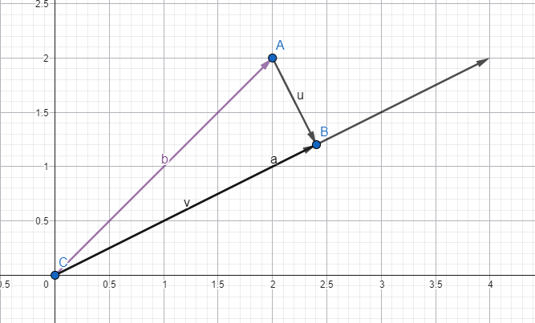

# M5.1.4- Winkel & Ähnlichkeit

<details>
<summary>Briefing</summary>

**Schätzung:** 8 SP

## 👤 User Story

> Als Data Scientist\*in  
> möchte ich den Winkel zwischen zwei Vektoren bestimmen,  
> um die inhaltliche Ähnlichkeit unabhängig von der absoluten Größe (Länge) zu messen.

## 🎉 Celebration Criteria (Lernziele)

- Ich beherrsche die Berechnung des Skalarprodukts (Dot Product) in algebraischer Form (K3).
- Ich kann mithilfe des Skalarprodukts prüfen, ob Vektoren orthogonal (senkrecht) aufeinander stehen (K4).
- Ich verstehe die "Kosinus-Ähnlichkeit" als Maß für die Orientierung von Vektoren (Winkel) (K2).

## 🧠 Wissens-Briefing

Das **Skalarprodukt** $\\vec{a} \\cdot \\vec{b} = \\sum a_i b_i$ ist fundamental für KI (Neuronale Netze).

- **Geometrie:** Es verknüpft Längen und Winkel: $\\vec{a} \\cdot \\vec{b} = |\\vec{a}| |\\vec{b}| \\cos(\\alpha)$ .
- **Orthogonalität:** Wenn das Produkt **0** ist, stehen die Vektoren senkrecht (keine Ähnlichkeit/Korrelation).
- **Kosinus-Ähnlichkeit:** $\\cos(\\alpha) = \\frac{\\vec{a} \\cdot \\vec{b}}{|\\vec{a}| |\\vec{b}|}$ . Ein Wert von 1 bedeutet "identische Richtung", 0 bedeutet "kein Zusammenhang", -1 bedeutet "Gegenteil".

## ⚠️ Typische Fallstricke

- **Ergebnis-Typ:** Das Ergebnis eines Skalarprodukts ist eine **Zahl** (Skalar), kein Vektor!
- **Kosinus vs. Winkel:** Die Formel liefert den Kosinus des Winkels (z.B. 0.5). Um den Winkel in Grad zu erhalten, muss man `arccos` anwenden. Für Ähnlichkeit reicht oft der Kosinus-Wert.

## 🛠️ Pflichtaufgaben (Bloom K2-K3)

1. **Rechnen (Analog):** Berechne das Skalarprodukt der Vektoren $\\vec{a}=(1, 2)^T$ und $\\vec{b}=(3, -1)^T$ (K3). Gib an, ob das Ergebnis positiv, negativ oder null ist (K2).
2. **Prüfung (Analog):** Prüfe rechnerisch mittels des Skalarprodukts, ob der Vektor $\\vec{u}=(1, 0)^T$ senkrecht auf dem Vektor $\\vec{v}=(0, 5)^T$ steht (K3). Formuliere einen Antwortsatz (K2).
3. **Interpretation (Analog):** In einem Empfehlungssystem repräsentieren Vektoren Benutzerinteressen. Was bedeutet es inhaltlich für zwei Benutzer A und B, wenn das Skalarprodukt ihrer Interessenvektoren exakt 0 ist (K3)?
4. **Implementierung (Python):** Implementiere eine Funktion `dot_product(v1, v2)`, die `zip()` und eine List Comprehension oder Schleife nutzt, um die Summe der Produkte zu bilden (K3).
5. **Winkel (Analog):** Stelle die Formel des Skalarprodukts nach $\\cos(\\alpha)$ um (K3). Berechne den Kosinus des Winkels zwischen $\\vec{x}=(1, 0)^T$ und $\\vec{y}=(1, 1)^T$ schriftlich (K3).

## 🔥 Freiwillige Zusatzaufgaben (Bloom K3-K6)

1. Zeichne die Projektion eines Vektors auf einen anderen auf Papier und erkläre, wie das Skalarprodukt als "Schattenwurf" interpretiert werden kann (K4).
2. Entwickle einen einfachen Suchalgorithmus in Python: Finde aus einer Liste von 3 Dokumenten-Vektoren denjenigen, der die höchste Kosinus-Ähnlichkeit zum Query-Vektor hat (K5).
3. Erkläre die Funktion eines künstlichen Neurons $f(\\vec{w} \\cdot \\vec{x} + b)$ und erläutere dabei die Rolle des Skalarprodukts für die Gewichtung der Eingaben (K4).

### 📚 Quellen & Referenzen

### 8.1 Buch

- IT-Handbuch, Kap. "Mathematische Grundlagen" (Skalarprodukt, Trigonometrie).

### 8.2 Web

| Thema | Suchbegriff (Google/Studyflix/Wikipedia) |
| --- | --- |
| Berechnung | Skalarprodukt berechnen |
| Bedeutung | Orthogonale Vektoren prüfen |
| Data Science | Cosine Similarity Recommender |

</details>

### P1: Rechnen (Analog)

Berechne das Skalarprodukt der Vektoren $\\vec{a} = \\begin{pmatrix} 1 \\\\ 2 \\end{pmatrix}$ und $\\vec{b} = \\begin{pmatrix} 3 \\\\ -1 \\end{pmatrix}$ (K3). Gib an, ob das Ergebnis positiv, negativ oder null ist (K2).

$3+(-2)=1$ Positives Ergebnis.

---

### P2: Prüfung (Analog)

Prüfe rechnerisch mittels des Skalarprodukts, ob der Vektor $\\vec{u} = \\begin{pmatrix} 1 \\\\ 0 \\end{pmatrix}$senkrecht auf dem Vektor $\\vec{v} = \\begin{pmatrix} 0 \\\\ 5 \\end{pmatrix}$steht (K3). Formuliere einen Antwortsatz (K2).

Das Skalarprodukt ist hier 0. Das bedeutet, dass die Vektoren senkrecht zueinander stehen.

---

### P3: Interpretation (Analog)

In einem Empfehlungssystem repräsentieren Vektoren Benutzerinteressen. Was bedeutet es inhaltlich für zwei Benutzer A und B, wenn das Skalarprodukt ihrer Interessenvektoren exakt 0 ist (K3)?

Das bedeutet inhaltlich, dass mindestens einer oder beide keinerlei Interesse (0) an den jeweiligen Daten-Punkten hat.

---

### P4: Implementierung (Python)

Implementiere eine Funktion `dot_product(v1, v2)`, die `zip()` und eine List Comprehension oder eine Schleife nutzt, um die Summe der Produkte zu bilden (K3).

“Lesbar”

```python
def dot_product(v1, v2):
    if len(v1) != len(v2):
        modify_vector_input(v1, v2)
    product = 0
    for i in range(len(v1)):
        product += v1[i] * v2[i]
    return product
```

Zeileneffizient

```python
def dot_product(v1, v2):
    return sum(a * b for a, b in zip(v1, v2))
```

---

### P5: Winkel (Analog)

Stelle die Formel des Skalarprodukts nach $\\cos(\\alpha)$um (K3). Berechne den Kosinus des Winkels zwischen $\\vec{x} = \\begin{pmatrix} 1 \\\\ 0 \\end{pmatrix}$und $\\vec{y} = \\begin{pmatrix} 1 \\\\ 1 \\end{pmatrix}$schriftlich (K3).

$\\cos(\\alpha) = \\frac{\\vec{x} \\cdot \\vec{y}}{|\\vec{x}| |\\vec{y}|} = \\frac{\\begin{pmatrix} 1 \\\\ 0 \\end{pmatrix} \\cdot \\begin{pmatrix} 1 \\\\ 1 \\end{pmatrix}}{|1| |1,41|} = \\frac{1}{1,41} \\approx 0,71$

---

### Z1: Zeichnung & Projektion

Zeichne die Projektion eines Vektors auf einen anderen auf Papier und erkläre, wie das Skalarprodukt als "Schattenwurf" interpretiert werden kann (K4).



Das Skalarprodukt entspricht der Länge des Vektors “auf den projiziert wird” (a) mal die Länge des Schattens (v) (von der Spitze des anderen Vektors (b) senkrecht zum eben erwähnten. Es muss also ein rechter Winkel entstehen zwischen “Lichtwurf” (u) und dem “Bodenvektor” (a).

---

### Z2: Suchalgorithmus (Python)

Entwickle einen einfachen Suchalgorithmus in Python: Finde aus einer Liste von 3 Dokumenten-Vektoren denjenigen, der die höchste Kosinus-Ähnlichkeit zum Query-Vektor hat (K5).

```python
import math as m
import numpy as np
from functools import wraps

def same_vector_dimension_check(func):
    @wraps(func)
    def wrapper(*vectors, **kwargs):
        if not vectors:
            return None
        len_first = len(vectors[0])
        if not all(len(v) == len_first for v in vectors):
            raise ValueError("Ungleiche Vektorlängen entdeckt! Daten prüfen.")
        return func(*vectors, **kwargs)
    return wrapper

@same_vector_dimension_check
def vector_add(*vectors): # "Gesamtweg": Hypotenuse
    return [sum(values) for values in zip(*vectors)]

@same_vector_dimension_check
def euclidean_distance(*vectors): # "Ähnlichkeit": Abstand zwischen den "Spitzen" der Vektoren
    return m.sqrt(sum((a - b) ** 2 for a, b in zip(*vectors)))

@same_vector_dimension_check
def dot_product(*vectors): # "Ausrichtung": Skalarprodukt, Winkel zwischen Vektoren (positiv = gleiche Richtung, negativ = entgegengesetzt, 0 = orthogonal)
    return sum(a * b for a, b in zip(*vectors))

def vector_scale(v: list, scalar: float | int) -> list: # "Richtung & Geschwindigkeit": Vektor mal Skalar
    return [scalar * a for a in v]

def vector_length(v: list): # Manhattan ("Raster") (L1), Euklidisch ("Luftlinie") (L2)
    l1 = np.linalg.norm(v, ord=1)
    l2 = np.linalg.norm(v, ord=2)
    return l1, l2

@same_vector_dimension_check
def cos_similarity(v1, v2): # "Richtung": Kosinusähnlichkeit, Winkel zwischen Vektoren (1 = gleiche Richtung, -1 = entgegengesetzt, 0 = "kein Zusammenhang"")
    dot_prod = dot_product(v1, v2)
    lengths = [vector_length(v)[1] for v in [v1, v2]] # L2-Norm
    if any(length == 0 for length in lengths):
        raise ValueError("Kosinusähnlichkeit ist undefiniert für Nullvektoren. Man kann nicht durch Null teilen.")
    return dot_prod / (lengths[0] * lengths[1])

@same_vector_dimension_check
def get_angle_between_vectors(*vectors) -> float: # "Winkel": Winkel zwischen zwei Vektoren in Grad
    cos_sim = cos_similarity(*vectors)
    angle_rad = m.acos(cos_sim)
    angle_deg = m.degrees(angle_rad)
    return angle_deg

@same_vector_dimension_check
def find_best_match(query, docs_dict: dict):
    best_docs = []
    best_match = -1.1
    for doc_name, vector in docs_dict.items():
        similarity = cos_similarity(query, vector)
        if similarity > best_match:
            best_match = similarity
            best_docs = [doc_name]
        elif similarity == best_match:
            best_docs.append(doc_name)
    return best_docs, best_match

if __name__ == "__main__":
    # Zusatzaufgabe: Suchalgorithmus für Vektoren
    # Mein Szenario: Es liegen Dokumente (Texte) vor. Diese behandeln zum Beipsiel das Thema "Künstliche Intelligenz". Gesucht sind bestimmte Begriffe, dessen Vorkommen durch Vektoren repräsentiert werden. 
    # Definierte Dimensionen (Begriffe): 1."Forschung", 2."Datenschutz", 3."Ethik"
    
    docs = {
        "Dokument 1": [10, 1, 4],
        "Dokument 2": [3, 5, 4],
        "Dokument 3": [3, 5, 4]
    }
    
    query = [1, 1, 1] # Suche nach Artikeln, die alle drei Begriffe in etwa gleicher Häufigkeit behandeln
    vectors = list(docs.values())
    
    best_docs, best_match = find_best_match(query, docs)
    print(f"Die besten Übereinstimmungen für die Anfrage {query} sind '{best_docs}' mit einer Kosinusähnlichkeit von {best_match:.2f}.\n(Hinweis: -1 = keine Ähnlichkeit, 0 = kein Zusammenhang, 1 = identisch)")
```

---

### Z3: Künstliche Neuronen

Erkläre die Funktion eines künstlichen Neurons $f(\\vec{w} \\cdot \\vec{x} + b)$und erläutere dabei die Rolle des Skalarprodukts für die Gewichtung der Eingaben (K4).

Mithilfe des Skalarprodukts einer Gewichtung ( $\\vec{w}$) und den Daten ( $\\vec{x}$) können eindeutige Präferenzen, Priorisierungen und Gewichtungen zugewiesen werden. Das $b$ ist in diesem Fall die Basis bzw. der Bias, der dem Skalarprodukt am Ende der Rechnung “angefügt” wird und somit eine Art Schwellenwert darstellt (Toleranz). Genauer gesagt:

- hoher (positiver) Bias ist eher “liberal, tolerant”
- niedriger (negativer) Bias ist eher “konservativ, streng”

So kann ein LLM mithilfe von unzähligen solcher “Entscheidungsneuronen” rechnerisch abwägen, welche Information Priorität hat.

Fiktives Beispiel - Rezeptanfrage:

Für den Vektor $\\vec{w}$ werden abgeleitete Gewichtungen aus der Anfrage zugewiesen: z.B. _\-10 = darf nicht vorkommen (negative Prio), 0 = irrelevant, 10 = höchste Gewichtung/Priorität_

Für den Vektor $\\vec{x}$ werden Daten eingebunden, wie zum Beispiel: _“Geschmack”, “Kosten”, “(Zeit)aufwand”, “Jeweilige Zutaten”_.

Der Bias $b$ definiert die Hürde, wie “tolerant” Rezepte ausgewählt werden. Bei einem niedrigen Wert müssen die Anforderungen an das Rezept wesentlich stärker passen. Ein hoher Wert hingegen, lässt auch Rezepte zu, die vielleicht nicht ganz den Anforderungen entsprechen.

Ein Prompt könnte dann folgendermaßen aussehen:

“Ich suche ein leckeres Rezept, welches vegetarisch ist und Tomaten verwendet.”

Somit wird abgeleitet, dass für den “Geschmackspunkt” im Vektor eine höhere Gewichtung abgeleitet wird (aufgrund von “lecker”). Kosten wären erstmal irrelevant, da hierzu nichts im Prompt erwähnt wird. “Aufwand” wird ebenfalls nicht erwähnt, also auch hier eine 0. Vegetarisch ist als Schlüsselwort und essenziell anzusehen, daher hier eine 10. Die Tomate soll im Rezept enthalten sein, daher ebenfalls höchste Gewichtung. Umgekehrt wäre ein Prompt mit “…keine Tomaten verwendet” eine negative Gewichtung. Zuletzt würde ich die Basis für einen solchen Prompt eher etwas höher oder neutral einschätzen, da es zwar klare Vorgaben gibt, aber keine extremen, eingrenzenden Schlüsselwörter wie etwa “nur”, “muss”, etc. enthalten sind.