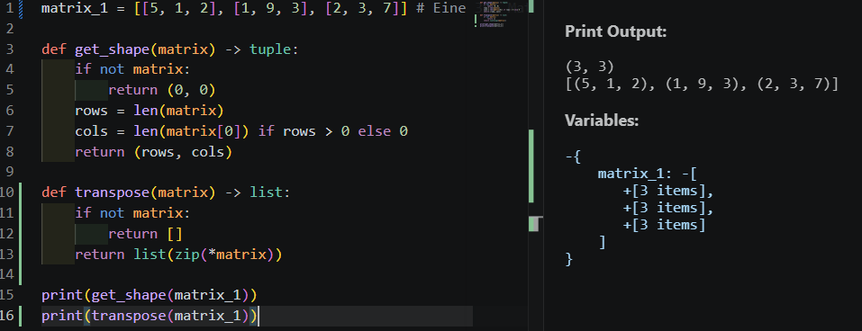
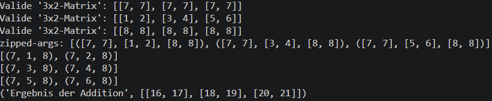

# M5.2.1- Die Matrix (Struktur & Grundlagen)

<details>
<summary>Briefing</summary>

**Schätzung:** 3 SP

## 👤 User Story

> Als Software-Entwickler\*in  
> möchte ich Daten in Tabellenform (Matrizen) strukturieren und grundlegende Operationen durchführen,  
> um Informationen kompakt zu speichern.

## 🎉 Celebration Criteria (Lernziele)

- Ich kann eine Matrix korrekt mit Zeilen ( $m$) und Spalten ( $n$) definieren und notieren (K1).
- Ich kann die Transponierte einer Matrix bilden (Zeilen und Spalten tauschen) (K2).
- Ich kann Matrizen addieren und mit einem Skalar multiplizieren (K3).

## 🧠 Wissens-Briefing

Eine Matrix $A \\in \\mathbb{R}^{m \\times n}$ ist ein rechteckiges Zahlenschema.

- **Indizes:** $a_{ij}$ steht für den Wert in Zeile $i$ und Spalte $j$ . (Merkspruch: "Zeile zuerst, Spalte später").
- **Transposition (**$A^T$ **):** Spiegelung an der Hauptdiagonalen. Aus einer $3 \\times 2$ Matrix wird eine $2 \\times 3$ Matrix.
- **Addition:** Geht nur, wenn beide Matrizen exakt gleich groß sind. Einfach elementweise addieren.
- **Python:** Eine Liste von Listen `[[1,2], [3,4]]` repräsentiert eine Matrix.

## ⚠️ Typische Fallstricke

- **Index-Verwirrung:** Verwechslung von $i$ (Zeile) und $j$ (Spalte).
- **Dimensionen bei Addition:** Versuch, eine $2 \\times 2$ Matrix zu einer $3 \\times 3$ Matrix zu addieren (nicht definiert!).

## 🛠️ Pflichtaufgaben (Bloom K2-K3)

1. **Modellierung (Analog):** Ein Unternehmen hat 3 Filialen (Zeilen) und verkauft 2 Produkte (Spalten). Filiale 1 verkauft 10x A und 5x B. Filiale 2: 0x A, 8x B. Filiale 3: 4x A, 4x B. Stelle dies als Matrix $M \\in \\mathbb{R}^{3 \\times 2}$ auf (K3).
2. **Transponieren (Analog):** Bilde die Transponierte $M^T$ aus Aufgabe 1. Welche Bedeutung haben nun die Zeilen und Spalten? (K2).
3. **Rechnen (Analog):** Gegeben $A = \\begin{pmatrix} 1 & 2 \\\\ 3 & 4 \\end{pmatrix}$ und $B = \\begin{pmatrix} 1 & 0 \\\\ 0 & 1 \\end{pmatrix}$ . Berechne $A + 3 \\cdot B$ (K3).
4. **Python-Check:** Implementiere eine Funktion `get_shape(matrix)`, die für eine übergebene Liste von Listen (z.B. `[[1,2], [3,4], [5,6]]`) die Dimensionen als Tupel `(rows, cols)` zurückgibt (K3).
5. **Spezialfall (Analog):** Was ist eine "Quadratische Matrix"? Gib ein Beispiel an und nenne die Elemente der "Hauptdiagonalen" (K2).

## 🔥 Freiwillige Zusatzaufgaben

1. Schreibe eine Python-Funktion `transpose(matrix)`, die eine Matrix ohne NumPy transponiert (nutze verschachtelte Loops oder `zip`) (K4).
2. Recherchiere den Begriff "Symmetrische Matrix". Welche Eigenschaft gilt für sie in Bezug auf ihre Transponierte? (K2).
3. Implementiere die Matrix-Addition in Python mit Prüfung der Dimensionen (K3).

### 📚 Quellen & Referenzen

### 8.1 Buch

- IT-Handbuch, Kap. "Lineare Algebra" (Matrizen Grundlagen).

### 8.2 Web

| Thema | Suchbegriff (Google/Studyflix) |
| --- | --- |
| Grundlagen | Matrix Definition Mathe |
| Operationen | Matrix transponieren |
| Typen | Quadratische Matrix Diagonalmatrix |

</details>

### P1: Modellierung (Analog): Ein Unternehmen hat 3 Filialen (Zeilen) und verkauft 2 Produkte (Spalten). Filiale 1 verkauft 10x A und 5x B. Filiale 2: 0x A, 8x B. Filiale 3: 4x A, 4x B. Stelle dies als Matrix $M \\in \\mathbb{R}^{3 \\times 2}$ auf (K3).

$M = \\begin{pmatrix} 10 & 5 \\\\ 0 & 8 \\\\ 4&4 \\end{pmatrix}$ Zeile = Filiale; Spalte = Produkt

---

### P2: Transponieren (Analog): Bilde die Transponierte $M^T$ aus Aufgabe 1. Welche Bedeutung haben nun die Zeilen und Spalten? (K2).

$M^T = \\begin{pmatrix} 10 & 0 & 4 \\\\ 5 & 8 & 4 \\end{pmatrix}$ Zeile = Produkt; Spalte = Filiale

---

### P3: Rechnen (Analog): Gegeben $A = \\begin{pmatrix} 1 & 2 \\\\ 3 & 4 \\end{pmatrix}$ und $B = \\begin{pmatrix} 1 & 0 \\\\ 0 & 1 \\end{pmatrix}$ . Berechne $A + 3 \\cdot B$ (K3).

$A + 3 \\cdot B = \\begin{pmatrix} 1 & 2 \\\\ 3 & 4 \\end{pmatrix} + \\begin{pmatrix} 3 & 0 \\\\ 0 & 3 \\end{pmatrix} = \\begin{pmatrix} 4 & 2 \\\\ 3 & 7 \\end{pmatrix}$

---

### P4: Python-Check: Implementiere eine Funktion `get_shape(matrix)`, die für eine übergebene Liste von Listen (z.B. `[[1,2], [3,4], [5,6]]`) die Dimensionen als Tupel (rows, cols) zurückgibt (K3).

```python
list_of_lists = [[1, 2], [3, 4], [5, 6]] # Eine 3x2 Matrix

def get_shape(lol) -> tuple:
    if isinstance(lol, list):
        for item in lol:
            if isinstance(item, list):
                return (len(lol), len(item))
    return (len(lol),)

print(get_shape(list_of_lists)) # Ausgabe: (3, 2) (rows, cols)
```

```python
def get_shape(matrix) -> tuple:
    if not matrix:
        return (0, 0)
    rows = len(matrix)
    cols = len(matrix[0]) if rows > 0 else 0
    return (rows, cols)
```

---

### P5: Spezialfall (Analog): Was ist eine "Quadratische Matrix"? Gib ein Beispiel an und nenne die Elemente der "Hauptdiagonalen" (K2).

$M = \\begin{pmatrix} \\color{red}{1} & 2 \\\\ 3 & \\color{red}{4} \\end{pmatrix}$ Hier ein Beispiel einer quadratischen Matrix. Die Bedingung: $m$ und $n$ sind gleich groß. In diesem Fall $2$. Die Elemente der “Hauptdiagonalen” sind im Beispiel rot markiert.

Die Hauptdiagonale bildet bspw. die “Spiegelachse” beim Transponieren. Weitere Eigenschaften und Rollen der HD (Auszug von Gemini):

> **_Die Einheitsmatrix (_**$I$**_):_** _Wie wir schon kurz besprochen haben, ist das die Matrix, die überall_ **_0_** _hat, außer auf der Hauptdiagonale – dort stehen nur_ **_1_**_en. Sie ist das "neutrale Element" der Matrixmultiplikation. Wenn du eine Matrix mit der passenden Einheitsmatrix multiplizierst, bleibt sie unverändert (_$A \\cdot I = A$_)._

> **_Die Spur (Trace):_** _Wenn man alle Zahlen auf der Hauptdiagonale addiert, erhält man die "Spur" einer Matrix. Das klingt simpel, ist aber eine wichtige Kennzahl in der Geometrie und Statistik, um Eigenschaften von Datensätzen zu beschreiben._

> **_Skalierung:_** _In der Computergrafik nutzt man sogenannte_ **_Diagonalmatrizen_** _(Zahlen nur auf der Hauptdiagonale), um Objekte zu vergrößern oder zu verkleinern. Eine Zahl an Position_ _\$a_{11}\$_ _skaliert zum Beispiel die Breite, während_ _\$a_{22}\$_ _die Höhe skaliert._

---

### Z1: Schreibe eine Python-Funktion `transpose(matrix)`, die eine Matrix ohne Numpy transponiert (nutze verschachtelte Loops oder zip) (K4).

```python
def transpose(matrix): # Input: [[1, 2], [3, 4], [5, 6]]
    if not matrix:
        return []
    return list(zip(*matrix)) # Ausgabe: [(1, 3, 5), (2, 4, 6)]
```

---

### Z2: Recherchiere den Begriff "Symmetrische Matrix". Welche Eigenschaft gilt für sie in Bezug auf ihre Transponierte? (K2).

`S = [[5, 1, 2], [1, 9, 3], [2, 3, 7]]` ← Beispiel für eine symmetrische Matrix. Ihre Transponierte ist exakt gleich, also $S = S^T$. Die Hauptdiagonale (hier \[5, 9, 7\]) ist die Spiegelachse und wird bei einer quadratischen Matrix, wie oben bereits erwähnt, beim Transponieren nicht verändert.



---

### Z3: Implementiere die Matrix-Addition in Python mit Prüfung der Dimensionen (K3).

```python
from functools import wraps
import statistics as st

def check_matrix(func):
    @wraps(func)
    def wrapper(*args, **kwargs):
        for matrix in args:
            if isinstance(matrix, list) and all(isinstance(row, list) for row in matrix):
                rows = [len(row) for row in matrix]
                expected = st.mode(rows)
                outliers = [(i, length) for i, length in enumerate(rows) if length != expected]
                if outliers:                    
                    print(f"Datenfehler in Matrix:\n{matrix}\nErwartete Zeilenlänge |{expected}|")
                    for idx, length in outliers:
                        print(f"Position {idx+1} hat Länge |{length}|")
                    return None
        return func(*args, **kwargs)
    return wrapper

@check_matrix
def get_shape(*args):
    if not args:
        return (0, 0)
    matrix_shapes = []
    for matrix in args:
        rows = len(matrix)
        cols = len(matrix[0]) if rows > 0 else 0
        print(f"Valide '{rows}x{cols}-Matrix': {matrix}")
        tuples = (rows, cols)
        matrix_shapes.append(tuples)
    return (matrix_shapes)

def add_matrices(*args):
    if not args:
        return []
    shapes = get_shape(*args)
    if len(set(shapes)) != 1: # >1 bedeutet, verschiedene "Formen" (Dimensionen)
        print("Addition aufgrund unterschiedlicher Dimensionen nicht möglich!")
        return []
    result = []
    print(f"zipped-args: {list(zip(*args))}")
    for rows in zip(*args): # zip fügt die Reihen der verschiedenen Matrizen zusammen
        print(list(zip(*rows)))
        result.append([sum(values) for values in zip(*rows)]) # zip führt die Elemente spaltenweise zusammen (1. Element=1. Spalte aller Matrizen, usw.)
    return "Ergebnis der Addition", result
    
def transpose(matrix) -> list:
    if not matrix:
        return []
    return list(zip(*matrix))


if __name__ == "__main__":
    matrix_1 = [[7, 7], [7, 7], [7, 7]]
    matrix_2 = [[1, 2], [3, 4], [5, 6]]
    matrix_3 = [[8, 8], [8, 8], [8, 8]]
    print(add_matrices(matrix_1, matrix_2, matrix_3))
    #print(get_shape(matrix_1, matrix_2))
    #print(transpose(matrix_2))
```

