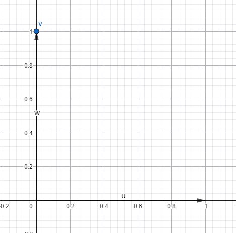

# M5.2.2- Matrix-Vektor-Multiplikation

<details>
<summary>Briefing</summary>

**Schätzung:** 5 SP

## 👤 User Story

> Als Data Scientist\*in  
> möchte ich Matrizen auf Vektoren anwenden,  
> um Transformationen (wie Preisberechnungen oder Koordinatenänderungen) durchzuführen.

## 🎉 Celebration Criteria (Lernziele)

- Ich verstehe, dass eine Matrix eine Funktion ist, die einen Vektor in einen neuen Vektor verwandelt (K2).
- Ich beherrsche das Rechenschema "Zeile mal Spalte" (Skalarprodukt) sicher (K3).
- Ich kann prüfen, ob eine Multiplikation aufgrund der Dimensionen überhaupt erlaubt ist (K4).

## 🧠 Wissens-Briefing

Die Multiplikation Matrix $A$ mal Vektor $\\vec{x}$ ergibt einen neuen Vektor $\\vec{b}$ : $A \\cdot \\vec{x} = \\vec{b}$

- **Regel:** Die Matrix muss so viele **Spalten** haben, wie der Vektor **Zeilen** (Einträge) hat.
  - $(m \\times n) \\cdot (n \\times 1) \\to (m \\times 1)$ .
- **Mechanik:** Für den ersten Eintrag des Ergebnisvektors nimmt man die **erste Zeile** der Matrix und bildet das Skalarprodukt mit dem Vektor. Für den zweiten Eintrag die zweite Zeile, usw.
- **Bedeutung:** Dies ist der Kern fast aller KI- und Grafik-Berechnungen.

## ⚠️ Typische Fallstricke

- **Reihenfolge:** $\\vec{x} \\cdot A$ funktioniert in der Standard-Notation meist nicht (Dimensionen passen nicht). Immer Matrix LINKS, Vektor RECHTS.
- **Rechenfehler:** Da man viele kleine Multiplikationen und Additionen im Kopf macht, passieren oft Flüchtigkeitsfehler.

## 🛠️ Pflichtaufgaben (Bloom K2-K3)

1. **Dimensions-Check (Analog):** Kann man eine $3 \\times 2$ Matrix mit einem Vektor aus dem $\\mathbb{R}^3$ multiplizieren? Begründe deine Antwort mit den Dimensionen (K4).
2. **Rechnen (Analog):** Berechne $\\begin{pmatrix} 2 &amp; 0 \\\\ 1 &amp; 3 \\end{pmatrix} \\cdot \\begin{pmatrix} 4 \\\\ 2 \\end{pmatrix}$ . Schreibe den Rechenweg (Zeile mal Spalte) ausführlich auf (K3).
3. **Anwendung Preis (Analog):** Eine Matrix speichert den Rohstoffbedarf für 2 Produkte (P1, P2) aus 3 Rohstoffen (R1, R2, R3). $M = \\begin{pmatrix} 2 & 1 \\\\ 0 & 5 \\\\ 3 & 2 \\end{pmatrix}$ (Zeilen=Rohstoffe, Spalten=Produkte). Ein Kunde bestellt $\\vec{x} = \\begin{pmatrix} 10 \\\\ 20 \\end{pmatrix}$ (10x P1, 20x P2). Berechne den Vektor der benötigten Rohstoffe $\\vec{y} = M \\cdot \\vec{x}$ (K3).
4. **Grafik-Transfer (Analog):** Die Einheitsmatrix ist $E = \\begin{pmatrix} 1 &amp; 0 \\\\ 0 &amp; 1 \\end{pmatrix}$ . Was passiert, wenn du sie mit einem beliebigen Vektor $\\vec{v}$ multiplizierst? Was passiert bei $S = \\begin{pmatrix} 2 &amp; 0 \\\\ 0 &amp; 2 \\end{pmatrix}$ ? (K2).
5. **Python-Logik:** Entwirf im Kopf (oder Pseudocode) einen Algorithmus: Wie viele Schleifen brauchst du, um $A \\cdot \\vec{x}$ zu berechnen? (Tipp: Eine für die Zeilen der Matrix, eine für das Skalarprodukt) (K3).

## 🔥 Freiwillige Zusatzaufgaben (Bloom K3-K6)

1. Implementiere `matrix_vector_mult(matrix, vector)` in Python (K4).
2. Betrachte die "Rotationsmatrix" für 90 Grad: $R = \\begin{pmatrix} 0 &amp; -1 \\\\ 1 &amp; 0 \\end{pmatrix}$ . Wende sie auf den Vektor $\\begin{pmatrix} 1 \\\\ 0 \\end{pmatrix}$ an. Wohin zeigt der neue Vektor? Zeichne beide (K4).
3. Warum wird ein Neuronales Netz oft als $f(W \\cdot x + b)$ geschrieben? Identifiziere Matrix, Vektor und Operation (K2).

## 📚 Quellen & Referenzen

### 8.1 Buch

- IT-Handbuch, Kap. "Lineare Algebra" (Matrix-Vektor-Multiplikation).

### 8.2 Web

| Thema | Suchbegriff (Google/Studyflix) |
| --- | --- |
| Mechanik | Matrix mal Vektor rechnen |
| Anwendung | Gozintograph Bedarfsrechnung |
| Grafik | Rotationsmatrix 2D |

</details>

### P1: Dimensions-Check (Analog): Kann man eine $3 \\times 2$ Matrix mit einem Vektor aus dem $\\mathbb{R}^3$ multiplizieren? Begründe deine Antwort mit den Dimensionen (K4).

Nein, denn es gilt: Eine solche Multiplikation ist nur dann möglich, wenn die **Matrix** genauso viele **Spalten (hier 2**) hat, wie der **Vektor Dimensionen (hier 3)**.

---

### P2: Rechnen (Analog): Berechne $\\begin{pmatrix} 2 & 0 \\\\ 1 & 3 \\end{pmatrix} \\cdot \\begin{pmatrix} 4 \\\\ 2 \\end{pmatrix}$ . Schreibe den Rechenweg (Zeile mal Spalte) ausführlich auf (K3).

Zeilenweise → Stellenweise: also erste Zeile der Matrix, und dann die erste Stelle mal die erste des Vektors PLUS die Zweite mal die Zweite usw.

Also:

Zeile 1: $2×4+2×0=8$

Zeile 2: $1×4+3×2=10$

Der neue Vektor lautet dann:

$\\begin{pmatrix} 8 \\\\ 10 \\end{pmatrix}$

---

### P3: Anwendung Preis (Analog): Eine Matrix speichert den Rohstoffbedarf für 2 Produkte (P1, P2) aus 3 Rohstoffen (R1, R2, R3). $M = \\begin{pmatrix} :::P1&P2\\\\R1:2 & 1 \\\\ R2:0 & 5 \\\\ R3:3 & 2 \\end{pmatrix}$ (Zeilen=Rohstoffe, Spalten=Produkte). Ein Kunde bestellt $\\vec{x} = \\begin{pmatrix} 10 \\\\ 20 \\end{pmatrix}$ (10x P1, 20x P2). Berechne den Vektor der benötigten Rohstoffe $\\vec{y} = M \\cdot \\vec{x}$ (K3).

$\\vec{y} = \\begin{pmatrix}2 & 1 \\\\ 0 & 5 \\\\ 3 & 2 \\end{pmatrix} \\cdot \\begin{pmatrix} 10 \\\\ 20 \\end{pmatrix} = \\begin{pmatrix} 2\*10+1\*20\\\\0\*10+5\*20\\\\3\*10+2\*20\\end{pmatrix} = \\begin{pmatrix} 40\\\\100\\\\70\\end{pmatrix}$ Das bedeutet für die Bestellung benötigen wir 40 Einheiten von Rohstoff 1, 100 von Rohstoff 2 und 70 von Rohstoff 3.

---

### P4: Grafik-Transfer (Analog): Die Einheitsmatrix ist $E = \\begin{pmatrix} 1 & 0 \\\\ 0 & 1 \\end{pmatrix}$ . Was passiert, wenn du sie mit einem beliebigen Vektor $\\vec{v}$ multiplizierst? Was passiert bei $S = \\begin{pmatrix} 2 & 0 \\\\ 0 & 2 \\end{pmatrix}$ ? (K2).

Bei $E$ bleibt der Vektor gleich und mit $S$ wird er verdoppelt. **Stichwort “Hauptdiagonale”**. → $\-1$ zur Spiegelung des Vektors.

---

### P5: Python-Logik: Entwirf im Kopf (oder Pseudocode) einen Algorithmus: Wie viele Schleifen brauchst du, um $A \\cdot \\vec{x}$ zu berechnen? (Tipp: Eine für die Zeilen der Matrix, eine für das Skalarprodukt) (K3).

Zwei Schleifen. Steht ja schon in der Frage…

```python
matrix = [(2,2), (3,1)]
vector = [4, 2]

if len(matrix[0]) == len(vector):
    result = []
    for i in range(len(matrix)):
        value = 0
        for j in range(len(vector)):
            value += matrix[i][j] * vector[j]
        result.append(value)
    print(result)
```

Äußere Schleife `i` – wählt die Zeile:

```
i = 0  →  row = [2, 2]
i = 1  →  row = [3, 1]

vector = [4, 2]
```

Innere Schleife `j` – multipliziert und summiert:

```
i=0, value=0
    j=0 → matrix[0][0] * vector[0] → 2*4=8  → value=8
    j=1 → matrix[0][1] * vector[1] → 2*2=4  → value=12
result = [12]
Value wird "resetted", nächste äußere Schleife startet und führt in die Innere.
i=1, value=0
    j=0 → matrix[1][0] * vector[0] → 3*4=12  → value=12
    j=1 → matrix[1][1] * vector[1] → 1*2=2 → value=14
result = [12, 14]
```

### Z1: Implementiere `matrix_vector_mult(matrix, vector)` in Python (K4).

```python
from functools import wraps
import statistics as st

def check_matrix(func):
    @wraps(func)
    def wrapper(*args, **kwargs):
        for matrix in args:
            if isinstance(matrix, list) and all(isinstance(row, list) for row in matrix):
                rows = [len(row) for row in matrix]
                expected = st.mode(rows)
                outliers = [(i, length) for i, length in enumerate(rows) if length != expected]
                if outliers:                    
                    print(f"Datenfehler in Matrix:\n{matrix}\nErwartete Zeilenlänge |{expected}|")
                    for idx, length in outliers:
                        print(f"Position {idx+1} hat Länge |{length}|")
                    raise ValueError
        return func(*args, **kwargs)
    return wrapper

@check_matrix
def is_valid_matrix(matrix):
    pass

@check_matrix
def get_shape(*args):
    if not args:
        return (0, 0)
    matrix_shapes = []
    for matrix in args:
        rows = len(matrix)
        cols = len(matrix[0]) if rows > 0 else 0
        print(f"Valide '{rows}x{cols}-Matrix': {matrix}")
        tuples = (rows, cols)
        matrix_shapes.append(tuples)
    return (matrix_shapes)

def add_matrices(*args):
    if not args:
        return []
    shapes = get_shape(*args)
    if len(set(shapes)) != 1: # >1 bedeutet, verschiedene "Formen" (Dimensionen)
        print("Addition aufgrund unterschiedlicher Dimensionen nicht möglich!")
        return []
    result = []
    print(f"zipped-args: {list(zip(*args))}")
    for rows in zip(*args): # zip fügt die Reihen der verschiedenen Matrizen zusammen
        print(list(zip(*rows)))
        result.append([sum(values) for values in zip(*rows)]) # zip führt die Elemente spaltenweise zusammen (1. Element=1. Spalte aller Matrizen, usw.)
    return "Ergebnis der Addition", result
    
def transpose(matrix) -> list:
    if not matrix:
        return []
    return list(zip(*matrix))

def zipmulti_matrix_vector(matrix, vector):
    is_valid_matrix(matrix)
    if len(matrix[0]) == len(vector):
        result = []
        for rows in matrix:
            value = sum(a * b for a, b in zip(rows, vector))
            result.append(value)
        return result
    else:
        raise ValueError("Spaltenanzahl der Matrix muss mit Vektor-Dimensionen übereinstimmen.")

if __name__ == "__main__":
    matrix_1 = [[7, 7], [7, 7], [7, 7]]
    matrix_2 = [[1, 2], [3, 4], [5, 6]]
    matrix_3 = [[8, 8], [8, 8], [8, 8]]
    vector = [2, 4]
    print(add_matrices(matrix_1, matrix_3))
    print(zipmulti_matrix_vector(matrix_2, vector))
    #print(get_shape(matrix_1, matrix_2))
    #print(transpose(matrix_2))
```

---

### Z2: Betrachte die "Rotationsmatrix" für 90 Grad: $R = \\begin{pmatrix} 0 & -1 \\\\ 1 & 0 \\end{pmatrix}$ . Wende sie auf den Vektor $\\vec{u}=\\begin{pmatrix} 1 \\\\ 0 \\end{pmatrix}$ an. Wohin zeigt der neue Vektor? Zeichne beide (K4).



---

### Z3: Warum wird ein Neuronales Netz oft als $f(W \\cdot x + b)$ geschrieben? Identifiziere Matrix, Vektor und Operation (K2).

Matrix $W$ enthält Gewichtungen (Priorisierung)

Vektor $x$ liefert die (Benutzer)daten.

Basis $b$ stellt den Schwellenwert bzw. die Toleranz dar.