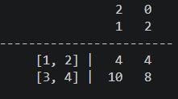
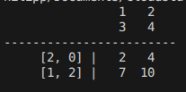
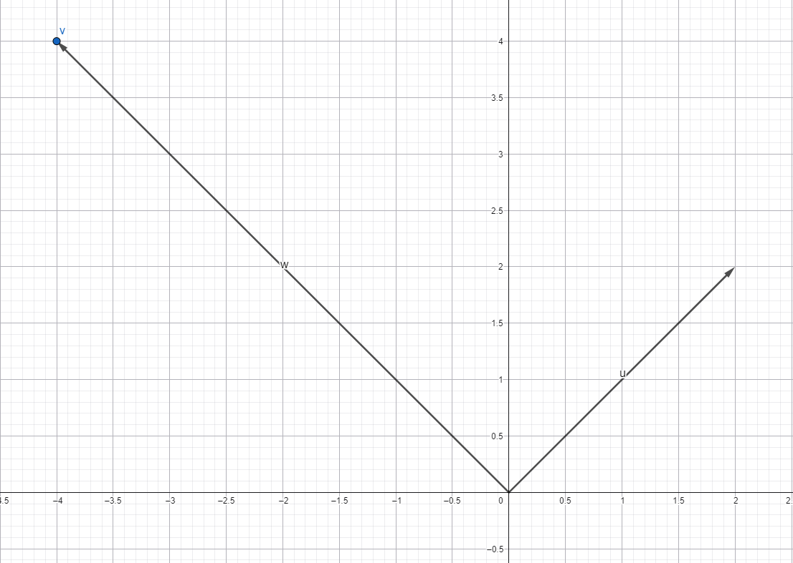

# M5.2.3- Matrix-Matrix-Multiplikation

<details>
<summary>Briefing</summary>

**Schätzung:** 8 SP

## 👤 User Story

> Als System-Architekt\*in  
> möchte ich mehrere Matrizen miteinander multiplizieren,  
> um komplexe Prozessketten zu einer einzigen Berechnung zusammenzufassen.

## 🎉 Celebration Criteria (Lernziele)

- Ich beherrsche das "Falk-Schema" zur manuellen Berechnung von Matrix-Produkten (K3).
- Ich weiß, dass Matrix-Multiplikation **nicht kommutativ** ist ($A \\cdot B \\neq B \\cdot A$) und kann dies an einem Beispiel zeigen (K4).
- Ich kann die Dimensionen der Ergebnismatrix vorhersagen ($(m \\times n) \\cdot (n \\times p) \\to (m \\times p)$) (K2).

## 🧠 Wissens-Briefing

Wenn man zwei Matrizen $A$ und $B$ multipliziert, wendet man quasi $B$ auf $A$ an (oder andersrum, je nach Sichtweise).

- **Falk-Schema:** Eine grafische Anordnungshilfe. Man schreibt Matrix A links hin, Matrix B rechts _darüber_. Im Kreuzungspunkt stehen die Ergebnisse.
- **Algorithmus:** "Zeile von A mal Spalte von B". Das Ergebnis an Stelle $c_{ij}$ ist das Skalarprodukt der $i$ \-ten Zeile von A mit der $j$ \-ten Spalte von B.
- **Warnung:** Die Reihenfolge ist extrem wichtig! Erst drehen, dann verschieben ist etwas anderes als erst verschieben, dann drehen.

## ⚠️ Typische Fallstricke

- **Dimensionen:** $(2 \\times 3) \\cdot (2 \\times 3)$ geht NICHT. Die "inneren" Zahlen müssen gleich sein ( $3 \\neq 2$).
- **Kommutativität:** Viele denken $A \\cdot B$ ist wie $3 \\cdot 5$ . Nein! In der Matrixwelt ist die Reihenfolge Gesetz.

## 🛠️ Pflichtaufgaben (Bloom K2-K3)

1. **Struktur (Analog):** Matrix A ist $(3 \\times 4)$ . Matrix B ist $(4 \\times 2)$ . Ist $A \\cdot B$ möglich? Wenn ja, wie groß ist das Ergebnis? Ist $B \\cdot A$ möglich? (K2).
2. **Rechnen (Analog):** Berechne das Produkt $C = A \\cdot B$ mit Hilfe des Falk-Schemas für: $A = \\begin{pmatrix} 1 &amp; 2 \\\\ 3 &amp; 4 \\end{pmatrix}, B = \\begin{pmatrix} 2 &amp; 0 \\\\ 1 &amp; 2 \\end{pmatrix}$ (K3).
3. **Beweis (Analog):** Berechne nun $B \\cdot A$ für die Matrizen aus Aufgabe 2. Vergleiche das Ergebnis mit $C$ . Was stellst du fest? (K3).
4. **Anwendung Kette (Analog):**
  - Prozess 1 (Rohstoff zu Baugruppe): $M_1$ .
  - Prozess 2 (Baugruppe zu Endprodukt): $M_2$ .
  - Um direkt von Rohstoff auf Endprodukt zu schließen, rechnet man $M_{ges} = M_1 \\cdot M_2$ (oder andersrum, je nach Definition der Zeilen/Spalten).
  - Beschreibe in Worten, warum diese "Verkettung" in der IT effizienter ist, als jeden Schritt einzeln zu rechnen (K3).
5. **Python-Challenge:** Schreibe Pseudocode für eine Funktion `mat_mult(A, B)`. Tipp: Du brauchst jetzt **drei** verschachtelte Schleifen ( $i$ über Zeilen A, $j$ über Spalten B, $k$ für das Skalarprodukt) (K3).

## 🔥 Freiwillige Zusatzaufgaben (Bloom K3-K6)

1. Implementiere die Matrix-Multiplikation in Python (K5).
2. Recherchiere: Was ist die "Inverse Matrix" $A^{-1}$ ? Was ergibt $A \\cdot A^{-1}$ ? (K3).
3. Transfer 3D: Eine Matrix skaliert, eine rotiert. Erstelle eine einzige Matrix, die beides gleichzeitig tut (K4).

## 📚 Quellen & Referenzen

### 8.1 Buch

- IT-Handbuch, Kap. "Lineare Algebra" (Matrizenmultiplikation).

### 8.2 Web

| Thema | Suchbegriff (Google/Studyflix) |
| --- | --- |
| Verfahren | Falk Schema Erklärung |
| Eigenschaften | Matrixmultiplikation nicht kommutativ |
| Anwendung | Materialverflechtung Matrizen |

</details>

### P1: Struktur (Analog): Matrix $A$ ist $3 \\times 4$ . Matrix $B$ ist $4 \\times 2$ . Ist $A \\cdot B$ möglich? Wenn ja, wie groß ist das Ergebnis? Ist $B \\cdot A$ möglich? (K2).

$A\*B$Ist möglich. Die neue Matrix ist dann $3×2$. Innere Elemente (Spalte A = 4 & Zeile B = 4) müssen übereinstimmen und “fallen dann nach der Rechnung weg”. Die neue Matrix hat dann die Größe der “äußeren” Elemente (3×2). $B\*A$ ist in diesem Fall nicht möglich, da $2 \\neq 3$.

---

### P2: Rechnen (Analog): Berechne das Produkt $C = A \\cdot B$ mit Hilfe des Falk-Schemas für: $A = \\begin{pmatrix} 1 & 2 \\\\ 3 & 4 \\end{pmatrix}, B = \\begin{pmatrix} 2 & 0 \\\\ 1 & 2 \\end{pmatrix}$ (K3).



$C = \\begin{pmatrix} 4 & 4 \\\\ 10 & 8 \\end{pmatrix}$

---

### P3: Beweis (Analog): Berechne nun $B \\cdot A$ für die Matrizen aus Aufgabe 2. Vergleiche das Ergebnis mit $C$ . Was stellst du fest? (K3).



$C' = \\begin{pmatrix} 2 & 4 \\\\ 7 & 10 \\end{pmatrix}$

Das Ergebnis ist ein anderes, da bei der Matrizenmultiplikation die Reihenfolge entscheidend ist.

---

### P4: Anwendung Kette (Analog): Prozess 1 (Rohstoff zu Baugruppe): $M_1$. Prozess 2 (Baugruppe zu Endprodukt): $M_2$. Um direkt von Rohstoff auf Endprodukt zu schließen, rechnet man $M_{ges} = M_1 \\cdot M_2$. Beschreibe in Worten, warum diese "Verkettung" in der IT effizienter ist, als jeden Schritt einzeln zu rechnen (K3).

Man spart sich einerseits natürlich den Zwischenschritt und andererseits wird nur eine Form des Inputs benötigt.

---

### P5: Python-Challenge: Schreibe Pseudocode für eine Funktion `mat_mult(A, B)`. Tipp: Du brauchst jetzt drei verschachtelte Schleifen (i über Zeilen A, j über Spalten B, k für das Skalarprodukt) (K3).

```python
matrix_a = [(2,2), (3,1)] 2x2
matrix_b = [(4,2,1), (2,1,2)] 2x3

Zum besseren Verständis:
rows_a, cols_a = len(matrix_a), len(matrix_a[0]) => 2,2
rows_b, cols_b = len(matrix_b), len(matrix_b[0]) => 2,3

if cols_a != rows_b:
  raise ValueError("Spalten von A müssen gleich Zeilen B sein!")

result = []
for i in range(rows_a): # 2-mal
  rows = []
  for j in range(cols_b): # 3-mal
    value = 0
    for k in range(cols_a): # 2-mal
      value += matrix_a[i][k] * matrix_b[k][j]
    rows.append(value)
  result.append(rows)
print(result)

Äußere Schleife i - wählt die Zeilen von matrix_a:

i=0 -> row=[2,2]
i=1 -> row=[3,1]

row = [] -> neue "leere" Reihe, hier kommt die erste Ergebnisreihe rein und muss danach resetted werden

Innere Schleife j - wählt die Spalten von matrix_b:

j=0 -> col=[4,2]
j=1 -> col=[2,1]
j=2 -> col=[1,2]

i=0 -> row=[2,2] 

Zweite Innere Schleife k - wählt die Spalten von matrix_a und führt die Rechnung aus: (6 Durchläufe j(3)xk(2), dann nächstes i(2) -> 12 insgesamt)

k=0 -> col=[2,3]
k=1 -> col=[2,1]

summe von matrix_a[i][k] * matrix_b[k][j]
"Erstes i":
matrix_a[0][0] * matrix_b[0][0] = 2 * 4 = 8
matrix_a[0][1] * matrix_b[1][0] = 2 * 2 = 4
matrix_a[0][0] * matrix_b[0][1] = 2 * 2 = 4
matrix_a[0][1] * matrix_b[1][1] = 2 * 1 = 2
matrix_a[0][0] * matrix_b[0][2] = 2 * 1 = 2
matrix_a[0][1] * matrix_b[1][2] = 2 * 2 = 4
[12,6,6] -> Reihe 1 vom Ergebnis
"Zweites i":
matrix_a[1][0] * matrix_b[0][0] = 3 * 4 = 12
matrix_a[1][1] * matrix_b[1][0] = 1 * 2 = 2
matrix_a[1][0] * matrix_b[0][1] = 3 * 2 = 6
matrix_a[1][1] * matrix_b[1][1] = 1 * 1 = 1
matrix_a[1][0] * matrix_b[0][2] = 3 * 1 = 3
matrix_a[1][1] * matrix_b[1][2] = 1 * 2 = 2
[14,7,5] -> Reihe 2 vom Ergebnis

Ergebnis 2x3 matrix_c = [(12,6,6)(14,7,5)]
```

---

### Z1: Implementiere die Matrix-Multiplikation in Python (K5).

Etwas schwieriger nachzuvollziehen, aber pythonischer:

```python
def zipmulti_matrix_matrix(matrix_a, matrix_b):
    rows_a, cols_a = len(matrix_a), len(matrix_a[0])
    rows_b, cols_b = len(matrix_b), len(matrix_b[0])

    if cols_a != rows_b:
        raise ValueError(f"Dimensionsfehler: A hat {cols_a} Spalten, B hat {rows_b} Zeilen. Müssen aber gleich sein.")

    transposed_b = transpose(matrix_b)
    result = [[sum(a*b for a,b in zip(row_a, col_b)) for col_b in transposed_b] for row_a in matrix_a]
    return result
```

---

### Z2: Recherchiere: Was ist die "Inverse Matrix" $A^{-1}$ ? Was ergibt $A \\cdot A^{-1}$ ? (K3).

Eine Inverse Matrix ist mathematisch im Grunde der “Kehrwert” einer Matrix und wird i.d.R dafür genutzt, lineare Gleichungen, die einer “Auflösung” einer Matrix bedürfen, zu lösen.

$A \\cdot A^{-1} = Einheitsmatrix E \\begin{pmatrix}1&0 \\\\ 0&1\\end{pmatrix}$

Voraussetzungen:

- Matrix muss quadratisch sein
- Determinante darf nicht 0 sein ($det(A) = a\*d - b\*c$, wenn $\\begin{pmatrix}a&b \\\\ c&d\\end{pmatrix}$

Berechnet wird die Inverse mit dem **Gauß-Jordan-Algorithmus** oder `numpy.linalg.inv()`

---

### Z3: Transfer 3D: Eine Matrix skaliert, eine rotiert. Erstelle eine einzige Matrix, die beides gleichzeitig tut (K4).

$M_{ges} = \\begin{pmatrix} 2 & 0 \\\\ 0 & 2 \\end{pmatrix} \\cdot \\begin{pmatrix} 0 & -1 \\\\ 1 & 0 \\end{pmatrix} = \\begin{pmatrix} (2\\cdot0+0\\cdot1) & (2\\cdot-1+0\\cdot0) \\\\ (0\\cdot0+2\\cdot1) & (0\\cdot-1+2\\cdot0) \\end{pmatrix} = \\mathbf{\\begin{pmatrix} 0 & -2 \\\\ 2 & 0 \\end{pmatrix}}$

Beispiel anhand eines Vektors $\\vec{u} = \\begin{pmatrix} 2 \\\\2 \\end{pmatrix}$, neu → $\\vec{w} = \\begin{pmatrix} -4 \\\\4 \\end{pmatrix}$

