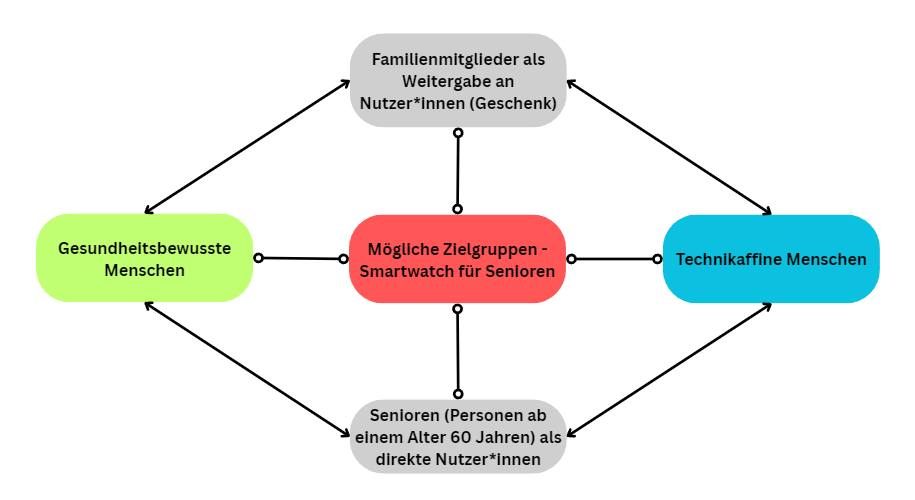

# W1.1.1- Marketinggrundlagen verstehen

Als angehender Fachinformatiker

möchte ich die Grundbegriffe des Marketings kennen,

damit ich die geschäftlichen Anforderungen meiner Firma besser verstehe und effektiver mit der Marketingabteilung kommunizieren kann.

# Celebration Criteria

- Wir können den Begriff "Markt" definieren und verschiedene Marktarten unterscheiden.Ein **vollkommener Markt** ist durch folgende Eigenschaften gekennzeichnet:  
     **_Gleichartigkeit der Güter_**  
    **_Markttransparenz_**  
    **_Fehlen von Präferenzen_**  
    **_Sofortige Reaktion auf Marktveränderungen_**  
    Sobald eine dieser Bedingungen fehlt, spricht man von einem **unvollkommenen Markt**. Abgesehen von Börse und Devisenmarkt, sind in der Realität alle Märkte unvollkommen.  
     Es wird zwischen Marktarten und Marktformen unterschieden.**Marktarten**  
    Jeder Markt kann einer Marktart zugeordnet werden. Hierbei unterscheidet man zwischen zwei Arten:  
     **Faktormärkte**  
    **Gütermärkte**  
    **Faktormärkte**  
    Unter dem Begriff Faktormarkt versteht man alle Märkte, welche die Produktionsfaktoren betreffen. Beispiele hierfür sind: Arbeitsmarkt, Kapitalmarkt und Immobilienmarkt.  
     **Gütermärkte**  
    Wie der Begriff schon sagt, handelt es sich bei einem Gütermarkt um einen Markt zum Austausch von Gütern (unabhängig von der Art der Güter). Dazu zählt zum Beispiel der Konsumgütermarkt und der Investitionsgütermarkt.
- Wir können erklären, was eine Zielgruppe ist und warum ihre Definition wichtig ist.
- Wir können die vier Phasen des Produktlebenszyklus beschreiben.

# Wissens-Briefing

- **Markt:** Der "Ort" des Zusammentreffens von Angebot und Nachfrage. _Beispiel: Der Markt für Cloud-Speicherlösungen für Privatkunden in Deutschland._
- **Zielgruppe:** Eine bestimmte Gruppe von Menschen, die ein Unternehmen mit seinen Marketingmaßnahmen erreichen möchte. _Beispiel: Studierende zwischen 18 und 25 Jahren, die intensiv digitale Lernwerkzeuge nutzen._
- **Produktlebenszyklus:** Beschreibt die "Lebensdauer" eines Produkts in vier Phasen: Einführung, Wachstum, Reife und Degeneration.

# Aufgaben

1.  Diskutiert in der Gruppe: Welche Märkte bedient ein Unternehmen wie Microsoft?  
    Marktarten (Unterscheidungen)  
     Es gibt verschiedene Kriterien, nach denen Märkte unterschieden werden können:  
     **Nach dem Gegenstand (was gehandelt wird) - Beispiel Microsoft:**  
     _Gütermarkt_ (z. B. Lebensmittel, Autos): - xBox-Konsole (Unterhaltung)  
     _Dienstleistungsmarkt_ (z. B. Friseurdienstleistungen, Software as a Service): - Windows (Betriebssystem), Cloud-Service  
     _Arbeitsmarkt_ (Angebot an Arbeitskräften vs. Nachfrage von Unternehmen): - Arbeits- bzw. Qualifikationszertifikate  
     _Kapital- und Finanzmarkt_ (z. B. Aktienhandel, Kreditvergabe): - Aktien, hohe Investitionsliquidität  
     **Nach dem Ort:**  
     Lokale Märkte (z. B. Wochenmarkt im Dorf)  
     Regionale Märkte (z. B. Immobilienmarkt in Bayern)  
     Nationale Märkte (z. B. deutscher Automarkt)  
     Internationale/Globale Märkte (z. B. Weltmarkt für Öl, IT)  
     **Nach der Marktstellung/Struktur (Anzahl Anbieter und Nachfrager):**  
     Polypol (viele Anbieter, viele Nachfrager → z. B. Bäckereien in einer Stadt)  
     Monopol (ein Anbieter, viele Nachfrager → z. B. Deutsche Bahn im Schienenverkehr)  
     Oligopol (wenige Anbieter, viele Nachfrager → z. B. Handy-Netzbetreiber, Automobilindustrie)  
     **Nach dem Wettbewerbsgrad:**  
     Freier Markt (kaum staatliche Eingriffe)  
     Regulierter Markt (starke staatliche Eingriffe, z. B. Gesundheitswesen, Energie)  
     
2.  Sucht euch ein bekanntes IT-Produkt und bestimmt seine aktuelle Phase im Produktlebenszyklus.https://studyflix.de/wirtschaft/produktlebenszyklus-1143_Beispiel:_ **_Microsoft Teams_**  
    _Befindet sich aktuell in der_ **_Reifephase_**
3.  Erstellt eine Mindmap zu den möglichen Zielgruppen für eine neue Smartwatch für Senioren.

https://www.canva.com/design/DAGzs-pOgkA/_UOciIiPuStjlZfK1FJXJw/edit?utm_content=DAGzs-pOgkA&utm_campaign=designshare&utm_medium=link2&utm_source=sharebutton

# Quellen & Vertiefung

- Westermann-Tabellenbuch, S. 36-39
- [Artikel: "Was ist Marketing?" (HubSpot)](https://blog.hubspot.de/marketing/was-ist-marketing)
- https://studyflix.de/wirtschaft/marktformen-1492