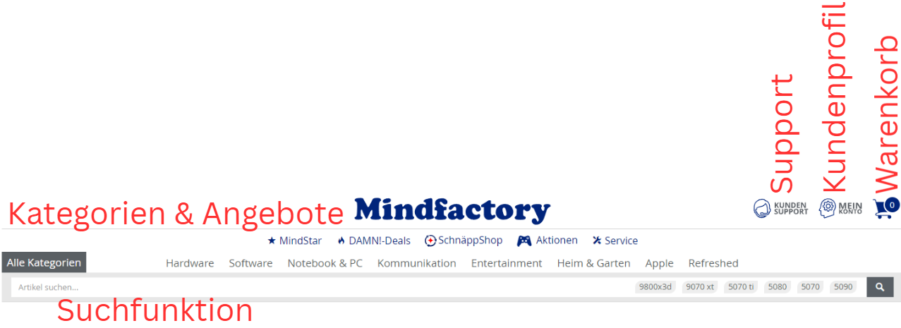

# W1.2.1- Die Welt des E-Commerce und Online-Marketings

Als Mitarbeiter in einem Start-up

möchte ich die Grundlagen von E-Commerce und die wichtigsten Online-Werbeformen verstehen,

damit ich bei der Planung unseres neuen Online-Shops mitreden kann.

# Celebration Criteria

- Wir können die Begriffe SEO und SEA erklären und voneinander abgrenzen.
- Wir können drei verschiedene Social-Media-Marketing-Maßnahmen nennen.
- Wir können die typischen Funktionen eines Online-Shop-Systems aufzählen.

# Wissens-Briefing

- **E-Commerce:** Der elektronische Handel, also der Kauf und Verkauf von Waren und Dienstleistungen über das Internet.
- **Online-Shop-System:** Die Software-Grundlage für einen Online-Shop. Sie verwaltet Produkte, Bestellungen und Kundendaten. _Beispiele: Shopify, Magento, Shopware._
- **SEO (Search Engine Optimization):** Suchmaschinenoptimierung. Alle Maßnahmen, um in den unbezahlten ("organischen") Suchergebnissen von Google & Co. möglichst weit oben zu erscheinen.
- **SEA (Search Engine Advertising):** Suchmaschinenwerbung. Das Schalten von bezahlten Textanzeigen, die über den organischen Suchergebnissen erscheinen.
- **Social Media Marketing:** Nutzung von sozialen Netzwerken (Instagram, TikTok, Facebook etc.) für Marketingzwecke, z.B. durch eigene Kanäle, Werbung oder Influencer-Kooperationen.

# Aufgaben

1.  Besucht einen bekannten Online-Shop (z.B. Zalando, Amazon). Identifiziert mindestens fünf typische Shop-Funktionen (z.B. Suchfunktion, Warenkorb, Kundenbewertungen).  
      
     
2.  Googelt nach "laufschuhe kaufen". Analysiert die erste Ergebnisseite: Welche Treffer sind organische Suchergebnisse (SEO) und welche sind bezahlte Anzeigen (SEA)? Woran erkennt man das?  
    Beispiel: Google-Suche „laufschuhe kaufen“  
    SEO:
    
    [Screenshot_2025-09-30_at_12.17.03.png](files/01999a20-73f2-73be-ace1-f3c68cd92a0f/Screenshot_2025-09-30_at_12.17.03.png)
    
      
    SEA:
    
    [Screenshot_2025-09-30_at_12.13.49.png](files/01999a1f-4a17-703b-85c4-68e604261431/Screenshot_2025-09-30_at_12.13.49.png)
    
      
    Philipp: [Mit vs ohne AdBlock](https://www.canva.com/design/DAG0cvRVs94/11reHEDVnLiEPsxKdjD8SQ/view?utm_content=DAG0cvRVs94&utm_campaign=designshare&utm_medium=link2&utm_source=uniquelinks&utlId=h3b2408e66d)  
    
3.  Sucht euch eine bekannte Marke auf Instagram oder TikTok. Welche Art von Inhalten postet sie, um für ihre Produkte zu werben? Diskutiert, warum diese Methode (nicht) erfolgreich ist.  
     Beispiel https://www.instagram.com/nike/  
    
    | Inhalte | Warum erfolgreich? | Warum manchmal nicht? |
    | --- | --- | --- |
    | Videos von Sportlern | Visuell ansprechend, Emotionen wecken, direkte Kauf-links | Zu viel Werbung kann abschrecken, fehlende Interaktion mit Followern |
    | Storys zu neuen Schuhen |
    | Tipps zum Training |
    | Influencer, die Produkte nutzen |
    
      
     

# Quellen & Vertiefung

- Westermann-Tabellenbuch, S. 52-57
- [Artikel: "SEO vs. SEA: Was ist der Unterschied?" (OMR)](https://www.google.com/search?q=https://omr.com/de/reviews/content/seo-vs-sea)