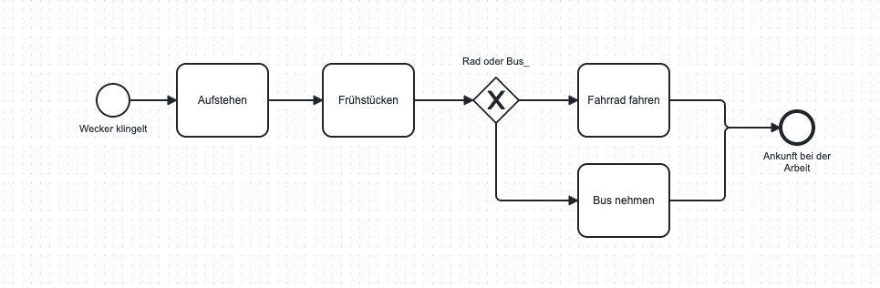

# W1.2.3- Geschäftsprozesse mit BPMN 2.0 modellieren

Als angehender Fachinformatiker für Daten- und Prozessanalyse möchte ich die Grundlagen der Prozessmodellierung mit BPMN 2.0 lernen, damit ich Geschäftsanforderungen visualisieren und als Basis für die Softwareentwicklung nutzen kann.

# Celebration Criteria

- Wir können die vier Grundelemente von BPMN (Ereignisse, Aktivitäten, Gateways, Sequenzflüsse) benennen und ihre Symbole zeichnen.
- Wir können einen einfachen, linearen Prozess mit BPMN modellieren.

# Wissens-Briefing

- **BPMN (Business Process Model and Notation):** ist eine grafische Spezifikationssprache zur Darstellung von Geschäftsprozessen. Sie bietet ein standardisiertes Set an Symbolen, das von allen Beteiligten (Fachabteilung & IT) verstanden wird.
- **Grundelemente:**
    - **Ereignis (Kreis):** Etwas, das passiert (z.B. Start, Ende, E-Mail empfangen).
    - **Aktivität (abgerundetes Rechteck):** Eine Aufgabe, die ausgeführt wird (z.B. "Rechnung prüfen").
    - **Gateway (Raute/Diamant):** Eine Verzweigung oder Zusammenführung des Prozessflusses (z.B. eine Ja/Nein-Entscheidung).
    - **Sequenzfluss (Pfeil):** Verbindet die Elemente und zeigt die Reihenfolge an.

# Aufgaben

1.  Zeichnet die vier Grundsymbole von BPMN und schreibt ihre Bedeutung daneben.
2.  Modelliert den Prozess "Morgens aufstehen und zur Arbeit gehen" mit den Grundsymbolen. Berücksichtigt eine Entscheidung (Gateway), z.B. "Fahre ich mit dem Rad oder dem Bus?".
3.  Öffnet das Online-Tool [bpmn.io](http://bpmn.io) und versucht, den in Aufgabe 2 gezeichneten Prozess digital nachzubauen.  
     
    
    [Screenshot_2025-09-30_at_13.15.05.png](files/01999a55-c0f5-7381-99e2-b2c6e89b5d18/Screenshot_2025-09-30_at_13.15.05.png)
    

# Quellen & Vertiefung

- Westermann-Tabellenbuch, S. 32-33
- [Online-Tool:](https://bpmn.io/) [bpmn.io](http://bpmn.io)
- [Artikel: "BPMN 2.0 - Eine kurze Einführung" (heise)](https://www.google.com/search?q=https://www.heise.de/developer/artikel/BPMN-2-0-Eine-kurze-Einfuehrung-2216503.html)
- https://www.signavio.com/de/bpmn-einfuehrung/